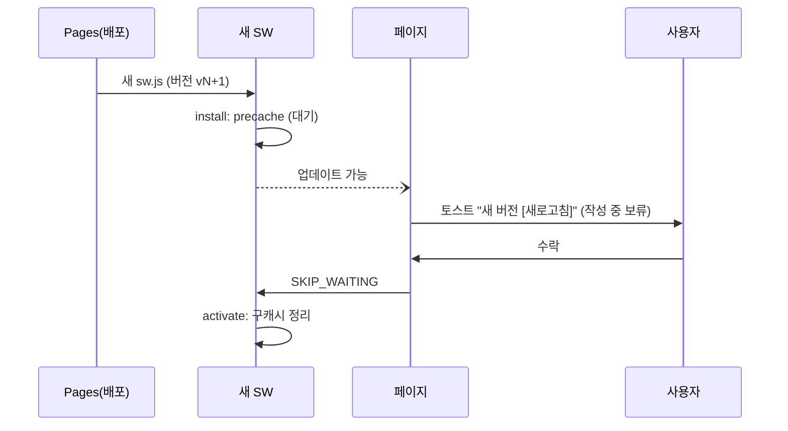

# PWA Spec — 서비스워커 · 매니페스트

> **문서 상태**: 📋 설계만 (v2.5 Technical Specification · 미구현)
> **관련 문서**: [CACHE_SPEC.md](CACHE_SPEC.md) · [OFFLINE_SYNC_SPEC.md](OFFLINE_SYNC_SPEC.md) · [DEPLOYMENT_SPEC.md](DEPLOYMENT_SPEC.md) · v1: `autodoc/sw.js`(무수정)
> **한 줄 목적**: v2 전용 PWA(스코프 `/autodoc/v2/`)의 SW 수명주기·매니페스트·업데이트 UX를 정의한다.

---

## 목차

1. [목적](#1-목적) · 2. [책임](#2-책임) · 3. [인터페이스](#3-인터페이스) · 4. [입력](#4-입력) · 5. [출력](#5-출력) · 6. [데이터 흐름](#6-데이터-흐름) · 7. [의존성](#7-의존성) · 8. [확장성](#8-확장성) · 9. [장점](#9-장점) · 10. [단점](#10-단점)

---

## 1. 목적

v2는 자체 SW(`autodoc/v2/sw.js`)와 매니페스트를 가진다 — v1 SW(스코프 `/autodoc/`)·BAZ CS SW(루트)와 **스코프 분리로 상호 무간섭**. 설치형 앱(홈 화면 추가)으로 현장 사용을 지원한다.

## 2. 책임

| 항목 | 정의 |
|---|---|
| 스코프 | `/autodoc/v2/` — 상위 스코프 침범 없음 |
| 매니페스트 | name "AutoDoc" · start_url `v2/index.html` · display standalone · 테마색 = 토큰 `--ui-primary` · 아이콘 세트(192/512) |
| precache | 앱 셸: index.html·app.html·css 2종·infra/core JS·문구 테이블 |
| 런타임 캐시 | [CACHE_SPEC.md](CACHE_SPEC.md) 정책표의 SW 층 실행 |
| 업데이트 | 캐시 버전 상수(`V2_CACHE_v{N}`) — 새 SW 설치 → **작성 중이 아니면** 새로고침 제안 토스트, 작성 중이면 완료 후 |
| 오프라인 폴백 | 네트워크 요청 실패 시 캐시 → 없으면 오프라인 안내(앱 셸은 항상 캐시에 있으므로 백지 화면 없음) |

## 3. 인터페이스

| 이벤트(SW 표준) | 처리 |
|---|---|
| `install` | precache 목록 적재 → skipWaiting은 **하지 않음**(작성 중 강제 교체 방지) |
| `activate` | 구버전 캐시(`V2_CACHE_v{N-1}` 외) 정리 |
| `fetch` | 경로별 전략 라우팅(§2) — API POST는 **패스스루**(캐시 금지) |
| `message` | 페이지→SW: `SKIP_WAITING`(사용자가 새로고침 수락 시) |

## 4. 입력

정적 자산 요청 · 배포된 새 SW 파일 · 페이지 메시지.

## 5. 출력

캐시 응답 · 업데이트 가능 통지(페이지로 postMessage) · 구캐시 정리.

## 6. 데이터 흐름

```
배포(main 병합 → Pages 반영, 캐시 버전 상수 상향)
  → 사용자 방문 → 새 SW install(대기 상태)
  → 페이지: "새 버전이 있어요 [새로고침]" (작성 중이면 보류)
  → 수락 → SKIP_WAITING → activate → 구캐시 정리 → 새 셸
```



## 7. 의존성

SW ↔ 캐시 정책([CACHE_SPEC.md](CACHE_SPEC.md)) · 배포 절차([DEPLOYMENT_SPEC.md](DEPLOYMENT_SPEC.md) — 캐시 버전 상향이 배포 체크리스트 항목) · 동기 큐는 SW 밖(페이지 컨텍스트 — [OFFLINE_SYNC_SPEC.md](OFFLINE_SYNC_SPEC.md) §7).

## 8. 확장성

- precache 목록 확장 = 목록 상수 갱신 + 버전 상향.
- Web Push(승인 알림 📋)·Background Sync API 채택은 차기 — 현행은 재연결 감지 방식으로 충분.

## 9. 장점

1. **3-SW 스코프 분리** — 루트 PWA·v1·v2가 서로의 캐시를 못 건드린다.
2. **작성 보호 업데이트** — 강제 새로고침이 입력을 날리는 사고를 정책으로 차단.
3. **백지 화면 부재** — 앱 셸 precache로 어떤 네트워크 상태에서도 UI는 뜬다.

## 10. 단점

1. **SW 디버깅 난도** — 캐시 꼬임은 재현이 어렵다. (→ 버전 상수 단일 관리 + 강제 초기화 진입로(설정 내 "캐시 재설정"))
2. **업데이트 지연** — skipWaiting 미사용은 신버전 반영을 늦춘다. (→ 의도된 트레이드오프 — 데이터 안전 우선)
3. **iOS 제약** — 일부 PWA API 제한. (→ 핵심 기능은 표준 캐시·IDB만 사용해 영향 최소)
