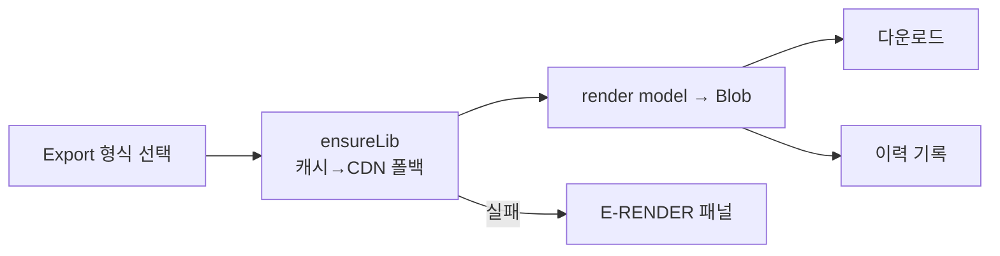

# Renderer Spec — PPT · Excel · PDF · Word 렌더러 인터페이스

> **문서 상태**: 📋 설계만 (v2.5 Technical Specification · 미구현)
> **관련 문서**: [DOCUMENT_ENGINE_SPEC.md](DOCUMENT_ENGINE_SPEC.md) · [PREVIEW_ENGINE_SPEC.md](PREVIEW_ENGINE_SPEC.md) · [LAYOUT_ENGINE_SPEC.md](LAYOUT_ENGINE_SPEC.md) · v1: [../../RENDERER_SPEC.md](../../RENDERER_SPEC.md)(무수정 재사용)
> **한 줄 목적**: 4종 렌더러(PPT/Excel/PDF/Word)의 공통 인터페이스와 v1 재사용·라이브러리 로딩·x2 확장 소비 규약을 정의한다.

---

## 목차

1. [목적](#1-목적) · 2. [책임](#2-책임) · 3. [인터페이스](#3-인터페이스) · 4. [입력](#4-입력) · 5. [출력](#5-출력) · 6. [데이터 흐름](#6-데이터-흐름) · 7. [의존성](#7-의존성) · 8. [확장성](#8-확장성) · 9. [장점](#9-장점) · 10. [단점](#10-단점)

---

## 1. 목적

렌더러는 DocumentModel을 특정 파일 포맷으로 직렬화한다. v1 렌더러 4종([../../RENDERER_SPEC.md](../../RENDERER_SPEC.md))을 무수정 재사용하며, v2는 공통 인터페이스 준수와 x2 확장(배지 인쇄 등) 선택적 소비만 규정한다.

## 2. 책임

| 렌더러 | 라이브러리 | MVP 노출 | 비고 |
|---|---|---|---|
| PptRenderer | PptxGenJS | ✅ | v1 재사용 |
| ExcelRenderer | ExcelJS(+SheetJS 폴백) | ✅ | v1 재사용 |
| PdfRenderer | jsPDF 계열 | ✅ | v1 재사용 |
| WordRenderer | docx 계열 | ❌(존재하나 미노출) | [../ui/MVP_SCOPE.md](../ui/MVP_SCOPE.md) §8 |

**공통 계약 (v1 계승)**: 렌더러는 문서 의미(주간보고/회의록)를 모르고, 서로 의존하지 않으며, DocumentModel만 입력받는다. `x2` 확장 필드는 **모르면 무시**(v1 렌더러 무수정 성립 근거 — [../DOCUMENT_MODEL.md](../DOCUMENT_MODEL.md) §2).

## 3. 인터페이스

| 연산(개념) | 서명 | 비고 |
|---|---|---|
| 렌더 | `render(documentModel) → Blob` | 공통 — 포맷별 구현 |
| 능력 | `capabilities() → { format, pageSpec[], features[] }` | Export 분기가 조회 |
| 라이브러리 | `ensureLib() → ready` | CDN 다중 폴백 지연 로드(v1 패턴) |
| x2 소비(선택) | `render(model, { overlays })` | 배지 등 — 미구현 렌더러는 무시 |

## 4. 입력

DocumentModelV2 (절대좌표 확정 — [LAYOUT_ENGINE_SPEC.md](LAYOUT_ENGINE_SPEC.md)) · 형식별 옵션 · 렌더 라이브러리(캐시/CDN).

## 5. 출력

파일 Blob(다운로드) · 렌더 실패 오류(E-RENDER — [ERROR_SPEC.md](ERROR_SPEC.md)).

## 6. 데이터 흐름

```
Export → 형식 선택 → renderer.ensureLib()(캐시 우선, 없으면 CDN 폴백)
  → render(model) → Blob → 브라우저 다운로드
  → history.record(파일 메타) → document.generated
실패: 라이브러리 로드 실패/렌더 예외 → E-RENDER → 실패 패널(입력·Draft 보존 고지)
```



## 7. 의존성

renderers(Core) → 렌더 라이브러리(외부 CDN — [CACHE_SPEC.md](CACHE_SPEC.md) SW 캐시) · document-model(입력). Document Engine이 호출. 렌더러 간 상호 의존 **절대 금지**.

## 8. 확장성

- **새 형식** = 렌더러 1개 추가(공통 인터페이스 구현) + Export 분기 등록 + capabilities. 기존 렌더러·모델 무수정.
- Word 노출 = MVP 형식 목록에 추가(토글 수준 — 렌더러는 이미 존재).
- x2 오버레이 인쇄는 렌더러별 점진 채택 (미채택도 정상 동작).

## 9. 장점

1. **v1 4종 무수정 편입** — 검증된 생성 로직 재사용, 재작성 리스크 0.
2. **포맷 독립** — 새 형식 추가가 다른 형식·모델에 영향 없음.
3. **다중 CDN 폴백** — 단일 CDN 장애에 강함(v1 패턴).

## 10. 단점

1. **픽셀 완전 일치 불가** — 포맷 엔진별 폰트·줄바꿈 차이. (→ "구조 100%, 시각 근사" — [PREVIEW_ENGINE_SPEC.md](PREVIEW_ENGINE_SPEC.md) §10)
2. **CDN 라이브러리 크기** — 초기 로드·오프라인 캐시 부담. (→ 지연 로드 + SW 캐시 + prime)
3. **브라우저 메모리** — 대형 문서 렌더 시 메모리 압박. (→ 페이지 스트리밍은 라이브러리 한계 내에서만)
