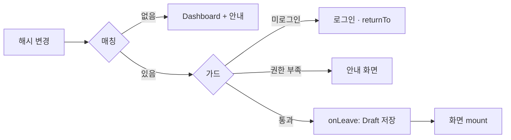

# Routing Spec — 화면 라우팅

> **문서 상태**: 📋 설계만 (v2.5 Technical Specification · 미구현)
> **관련 문서**: [FILE_STRUCTURE.md](FILE_STRUCTURE.md) · [AUTH_SPEC.md](AUTH_SPEC.md) · [../ui/NAVIGATION.md](../ui/NAVIGATION.md) · [../ui/SCREEN_STRUCTURE.md](../ui/SCREEN_STRUCTURE.md)
> **한 줄 목적**: 단일 셸(app.html) + 해시 라우팅으로 UI 화면 인벤토리(S1~S7)를 서빙하는 규칙 — 가드·파라미터·이탈 보호를 정의한다.

---

## 목차

1. [목적](#1-목적) · 2. [책임](#2-책임) · 3. [인터페이스](#3-인터페이스) · 4. [입력](#4-입력) · 5. [출력](#5-출력) · 6. [데이터 흐름](#6-데이터-흐름) · 7. [의존성](#7-의존성) · 8. [확장성](#8-확장성) · 9. [장점](#9-장점) · 10. [단점](#10-단점)

---

## 1. 목적

정적 호스팅(Pages)에서 서버 라우팅 없이 화면 전환을 구현한다. 선택: **해시 라우팅**(`app.html#/catalog`) — 새로고침·북마크·오프라인에서 안전하고 서버 설정이 불필요하다.

## 2. 책임

### 라우트 테이블

| 라우트 | 화면(UI 문서) | 가드 | 파라미터 |
|---|---|---|---|
| `index.html` | S1 Dashboard | 로그인 | — |
| `#/catalog` | S2 Catalog | 로그인 | `?cat=&q=` 필터 |
| `#/edit/:templateId` | S3 Editor | 로그인+양식 권한 | `?draft=` 이어서 작성 |
| `#/done/:docId` | S4 완료 | 로그인 | — |
| `#/docs` · `#/docs/:docId` | S5 내 문서 | 로그인 | — |
| `#/admin` · `#/admin/approvals` · `#/admin/learning` · `#/admin/templates` · `#/admin/kb` | S6 계열 | **관리자** | — |
| `#/admin/import` · `#/admin/import/:jobId` | S6-2 마법사 | 관리자 | 단계 상태 복원 |
| `#/settings` | S7 | 로그인(회사 구역은 관리자) | — |
| (예약) `#/workflow` `#/audit` | S8·S9 — MVP 제외 | — | 등록하지 않음 |

### 라우터 책임

진입 가드(인증·권한 — [AUTH_SPEC.md](AUTH_SPEC.md)) · 화면 모듈 지연 로드 · 이탈 훅(Draft 저장 — 차단 모달 금지) · 미지정 라우트 → Dashboard + 안내.

## 3. 인터페이스

| 연산(개념) | 서명 |
|---|---|
| 등록 | `register(path, { screen, guard, title })` |
| 이동 | `go(path, params?)` — 히스토리 push |
| 현재 | `current() → { path, params }` |
| 이탈 훅 | `onLeave(handler) → 저장 후 진행` (반환값으로 차단 불가 — 정책상 항상 진행) |

## 4. 입력

URL 해시 변경 이벤트 · `go()` 호출 · 브라우저 히스토리 이동.

## 5. 출력

화면 모듈 마운트/언마운트 · 문서 제목 갱신(`화면명 · AutoDoc`) · `route.changed` 이벤트(내부).

## 6. 데이터 흐름

```
해시 변경 → 라우트 매칭
  → 가드: 미로그인 → 로그인 화면(returnTo 보존) / 권한 부족 → 안내 화면
  → 현재 화면 onLeave(Draft 저장) → 언마운트
  → 대상 화면 모듈 동적 import → mount(params)
```



## 7. 의존성

`router`(Infra) → `auth`(가드) · 화면 모듈(`ui/screens/*`)은 router에 등록될 뿐 router를 모른다(역참조는 `go()` 공개 Interface만).

## 8. 확장성

- 새 화면 = 라우트 1행 + screens 파일 1개. MVP 제외 라우트는 예약만(등록 안 함) — 활성화 시 등록 한 줄.
- 딥링크 공유(모바일 "PC에서 이어서" — [../ui/AI_IMPORT_UX.md](../ui/AI_IMPORT_UX.md) §8)는 `#/admin/import/:jobId`가 담당.

## 9. 장점

1. **정적 호스팅 궁합** — 서버 재작성 규칙 불필요, 오프라인 새로고침 안전.
2. **상태 복원** — 마법사·필터가 URL에 실려 이탈·복귀·공유가 공짜.
3. **이탈 보호의 일관화** — Draft 저장이 라우터 훅 한 곳에 있어 화면별 누락이 없다.

## 10. 단점

1. **해시 URL 미관** — `#/` 경로는 세련되지 않다. (→ Pages 제약상 의도된 선택 — History API는 404 처리 필요라 배제)
2. **단일 셸 상태 누수 위험** — 언마운트가 부실하면 화면 간 상태가 샌다. (→ mount/unmount 계약을 화면 모듈 필수 Interface로)
3. **가드 우회 불가 신뢰 금지** — 클라이언트 가드는 UX용, 실권한은 API가 검증 ([SECURITY_SPEC.md](SECURITY_SPEC.md) §3).
