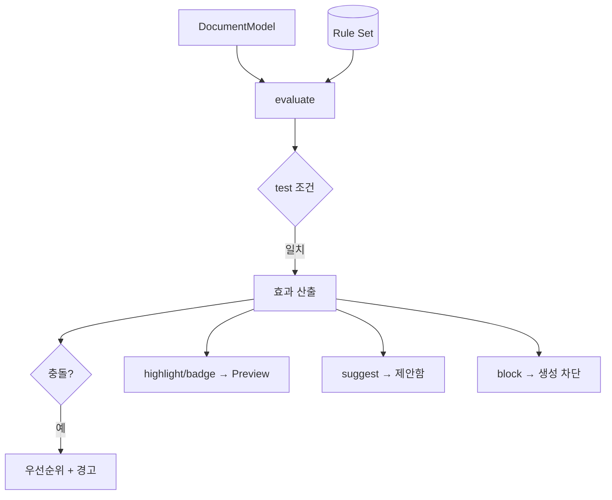

# Rule Engine Spec — 규칙 평가 엔진

> **문서 상태**: 📋 설계만 (v2.5 Technical Specification · 미구현 · MVP 제외)
> **관련 문서**: [../RULE_ENGINE.md](../RULE_ENGINE.md)(개념) · [FORM_ENGINE_SPEC.md](FORM_ENGINE_SPEC.md) · [DOCUMENT_ENGINE_SPEC.md](DOCUMENT_ENGINE_SPEC.md) · v1: [../../VALIDATION_SPEC.md](../../VALIDATION_SPEC.md)
> **한 줄 목적**: 선언적 규칙(조건→효과)의 평가 엔진 계약 — 조건 문법·효과 적용·충돌 해소를 구현 수준으로 정의한다.

---

## 목차

1. [목적](#1-목적) · 2. [책임](#2-책임) · 3. [인터페이스](#3-인터페이스) · 4. [입력](#4-입력) · 5. [출력](#5-출력) · 6. [데이터 흐름](#6-데이터-흐름) · 7. [의존성](#7-의존성) · 8. [확장성](#8-확장성) · 9. [장점](#9-장점) · 10. [단점](#10-단점)

---

## 1. 목적

Rule([../RULE_ENGINE.md](../RULE_ENGINE.md))을 평가하는 엔진. 조건 문법은 v1 Validation 문법을 확장 계승하고, 효과는 표시·강조·제안·차단으로 한정한다. **조건 문법을 FormEngine 조건부 입력과 공유**한다.

## 2. 책임

| 책임 | 규칙 |
|---|---|
| 조건 평가 | `condition` 트리 → boolean (연산자 카탈로그 §3) |
| 효과 산출 | 일치 규칙 → RuleResult[] (highlight/badge/suggest/block) |
| 충돌 해소 | 같은 대상 다중 효과 → 우선순위 필드 + 충돌 경고 |
| 값 참조 | `$경로`로 모델·Provider·(향후 Plugin) 값 접근 |
| 학습 연동 | Rule 후보는 Learning 경유·승인 후 등록(자동 등록 금지 — [../RULE_ENGINE.md](../RULE_ENGINE.md) §2) |

## 3. 인터페이스

| 연산(개념) | 서명 |
|---|---|
| 평가 | `evaluate(documentModel, ruleSet) → RuleResult[]` |
| 조건 검사 | `test(condition, context) → boolean` (FormEngine 조건부와 공유) |
| 연산자 | `op ∈ { >, >=, <, <=, =, !=, contains, changed-by(%) }` (v1 확장) |
| 등록 | `register(rule) → 승인 요청` (learning 출처 필수 승인) |

효과 적용 위치: highlight/badge = Preview 오버레이(문서 데이터 불변) · suggest = 제안함 · block = 생성 차단.

## 4. 입력

DocumentModel(조립 후) · Rule Set(Store) · Provider 값 · 조건 컨텍스트.

## 5. 출력

RuleResult[](Preview·생성 게이트로) · 충돌 경고 · `rule.registered` 이벤트.

## 6. 데이터 흐름

```
조립 완료 → evaluate(model, ruleSet)
  → 각 규칙 test(condition) → 일치분 효과 산출
  → 충돌 감지(같은 대상) → 우선순위 적용 + 경고
  → highlight/badge → Preview 오버레이 / suggest → 제안함 / block → 생성 차단
```



## 7. 의존성

rule-engine(Memory 계층) → document-model(평가 대상) · store(Rule Set) · learning(후보 등록). Document Engine이 조립 후 호출. 조건 문법을 form-engine과 공유.

## 8. 확장성

- 연산자 추가 = 카탈로그 + test 구현 1곳 (규칙 레코드 불변).
- 복합 조건(and/or) = condition 트리 확장 + schemaVersion.
- Graph 참조 조건("관련 CAPA 미종결이면 경고") 📋 차기 ([../KNOWLEDGE_GRAPH.md](../KNOWLEDGE_GRAPH.md)).

## 9. 장점

1. **조건 문법 공유** — Rule과 조건부 입력이 같은 평가기 — DRY.
2. **효과의 비파괴성** — highlight/badge는 오버레이라 문서 데이터 순수.
3. **학습 승인 게이트** — 자동 규칙 생성 없음, 인간 통제.

## 10. 단점

1. **선언적 한계** — 복잡한 판단 미수용. (→ 무리하게 담지 않음 — KISS, 사람 판단 유지)
2. **규칙 충돌·범람** — 규칙 증가 시. (→ 우선순위 + 채택률 기반 정리 제안)
3. **MVP 제외** — 실검증 지연. (→ 조건부 입력이 조건 문법을 MVP에서 먼저 검증 — [FORM_ENGINE_SPEC.md](FORM_ENGINE_SPEC.md))
