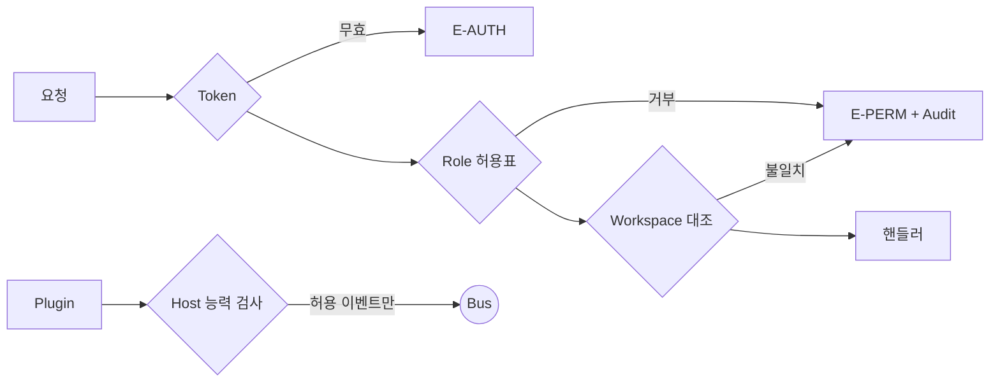

# Security Spec — 보안 모델

> **문서 상태**: 📋 설계만 (v2.5 Technical Specification · 미구현)
> **관련 문서**: [AUTH_SPEC.md](AUTH_SPEC.md) · [API_SPEC.md](API_SPEC.md) · [AUDIT_SPEC.md](AUDIT_SPEC.md) · [PLUGIN_SPEC.md](PLUGIN_SPEC.md) · [../AI_ARCHITECTURE.md](../AI_ARCHITECTURE.md)
> **한 줄 목적**: Token · Permission · Workspace · Role · Session · Plugin Permission · Audit의 7축 보안 모델을 정의한다.

---

## 목차

1. [목적](#1-목적) · 2. [책임](#2-책임) · 3. [인터페이스](#3-인터페이스) · 4. [입력](#4-입력) · 5. [출력](#5-출력) · 6. [데이터 흐름](#6-데이터-흐름) · 7. [의존성](#7-의존성) · 8. [확장성](#8-확장성) · 9. [장점](#9-장점) · 10. [단점](#10-단점)

---

## 1. 목적

원칙 세 가지: ① **서버가 진실** — 클라이언트 검사(가드·비활성 버튼)는 UX일 뿐, 모든 권한은 GAS가 재검증. ② **최소 권한** — 역할·Plugin 능력별 허용표 기반. ③ **문서 데이터의 국지성** — 문서 내용은 생성 과정에서 서버·외부로 나가지 않는다(외부 AI 전송은 오직 사용자의 수동 행위).

## 2. 책임

| 축 | 모델 |
|---|---|
| **Token** | v1 auth.js 토큰 계승 — 서버 검증·만료. 저장은 localStorage `ad2.auth`(XSS 대응은 아래) |
| **Session** | `{userId, role, workspaceId, expiresAt}` — 만료 시 auth.expired → Draft 보존 재로그인 |
| **Role** | user/admin (MVP) — 역할→액션 허용표 ([API_SPEC.md](API_SPEC.md) §2 권한 열이 규범) |
| **Permission** | 액션 허용표(서버) + 라우트 가드(클라 UX) + Catalog 양식 권한(🔒 표시) |
| **Workspace** | 요청 봉투 workspaceId ↔ 토큰 소속 대조 — 불일치 = E-PERM (교차 접근 원천 차단) |
| **Plugin Permission** | manifest capabilities → 이벤트 허용 목록·쓰기 경계 ([PLUGIN_SPEC.md](PLUGIN_SPEC.md) §3) — Host가 집행 |
| **Audit** | 모든 변경·권한 거부·설정 변경을 기록 — 보안 사건의 증거 사슬 ([AUDIT_SPEC.md](AUDIT_SPEC.md)) |

### 위협·대응 요약

| 위협 | 대응 |
|---|---|
| 토큰 탈취(XSS) | 외부 스크립트 미사용(렌더 lib CDN은 SRI 해시 고정) · 붙여넣기 JSON은 텍스트 파싱만(innerHTML 금지 규약) |
| 권한 상승 | 서버 허용표 단일 진실 · 클라 가드 불신 |
| 붙여넣기 주입 | Import Gate: JSON.parse만 · payload 값은 항상 이스케이프 렌더 |
| 시트 직접 변조 | 시트 보호 + Audit 해시 체인으로 변조 감지 |
| 실수 유출 | 백업 파일에 토큰·개인 설정 미포함 · Prompt 내보내기 마스킹 검사 ([../PROMPT_MARKETPLACE.md](../PROMPT_MARKETPLACE.md) §5) |

## 3. 인터페이스

집행 지점 3곳(그 외 지점에서 보안 판단 금지 — 판단 분산이 구멍을 만든다):

| 지점 | 집행 |
|---|---|
| GAS Preamble | 토큰·역할·Workspace·스키마 — 전 API |
| Store 쓰기 권한표 | 컬렉션×모듈 (I2·I5) — [STORAGE_SPEC.md](STORAGE_SPEC.md) §2 |
| Plugin Host | manifest 능력·이벤트 허용 — [PLUGIN_SPEC.md](PLUGIN_SPEC.md) |

## 4. 입력

토큰·요청 봉투·manifest·역할 허용표(Workspace 설정).

## 5. 출력

허용/거부(E-AUTH·E-PERM — [ERROR_SPEC.md](ERROR_SPEC.md)) · 거부 Audit 레코드 · 만료 이벤트.

## 6. 데이터 흐름

```
요청 → GAS Preamble
  토큰 유효? → 아니오: E-AUTH-EXPIRED
  역할이 액션 허용? → 아니오: E-PERM-ROLE (+Audit 기록)
  workspaceId = 토큰 소속? → 아니오: E-PERM-WS (+Audit)
  → 핸들러 (문서 내용은 이 경로에 실리지 않음 — 지식·이력 메타만)
```



## 7. 의존성

본 모델의 집행은 AUTH(토큰)·API(허용표)·STORAGE(쓰기표)·PLUGIN(능력) 문서에 분산 구현되고, 본 문서가 총괄 규범이다.

## 8. 확장성

- 세분 역할 = 허용표 열 추가 (집행 지점 불변).
- 로컬 민감 데이터 암호화 레이어(드라이버 1곳 삽입 — [LOCAL_STORAGE_SPEC.md](LOCAL_STORAGE_SPEC.md) §8) 📋.
- 보안 사건 대응: Audit 해시 체인 + 행위자 조회가 포렌식 기본 도구.

## 9. 장점

1. **집행 3지점 수렴** — 보안 검사가 흩어지지 않아 감사·수정이 국소적.
2. **문서 내용의 국지성** — 최중요 자산(문서 내용)이 아예 서버 경로에 없어 유출면이 작다.
3. **거부도 기록** — 공격 시도·권한 오류가 Audit에 남아 탐지 가능.

## 10. 단점

1. **localStorage 토큰의 XSS 노출** — 저장 위치의 근본 한계. (→ 외부 스크립트 제로·SRI·이스케이프 규약이 방어선 — GAS 제약상 httpOnly 쿠키 불가)
2. **GAS 보안 기능 빈약** — rate limit 등 부재. (→ 쿼터가 자연 제한 + requestId 대장으로 이상 빈도 탐지)
3. **시트 접근권 관리** — 스프레드시트 공유 설정이 사람 실수에 노출. (→ 최소 공유 + 보호 범위 + 배포 체크리스트 항목화)
