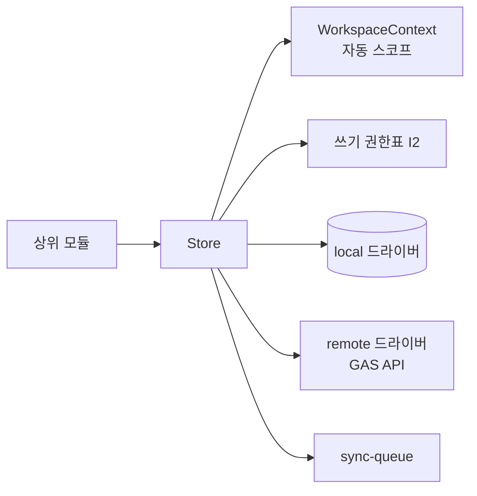

# Storage Spec — Store 추상화

> **문서 상태**: 📋 설계만 (v2.5 Technical Specification · 미구현)
> **관련 문서**: [DATA_MODEL.md](DATA_MODEL.md) · [LOCAL_STORAGE_SPEC.md](LOCAL_STORAGE_SPEC.md) · [GOOGLE_SHEETS_SPEC.md](GOOGLE_SHEETS_SPEC.md) · [../ARCHITECTURE.md](../ARCHITECTURE.md) §4
> **한 줄 목적**: 상위 모듈이 저장 매체(원격 GAS/Sheets · 로컬)를 모르게 하는 단일 Store Interface와 Workspace 격리를 정의한다 (불변식 I5).

---

## 목차

1. [목적](#1-목적) · 2. [책임](#2-책임) · 3. [인터페이스](#3-인터페이스) · 4. [입력](#4-입력) · 5. [출력](#5-출력) · 6. [데이터 흐름](#6-데이터-흐름) · 7. [의존성](#7-의존성) · 8. [확장성](#8-확장성) · 9. [장점](#9-장점) · 10. [단점](#10-단점)

---

## 1. 목적

DNA·KB·Template 접근 코드가 "Sheets"라는 단어를 모르게 한다. Store는 컬렉션 지향 Interface 1개이며, 뒤에 드라이버(remote=GAS API, local=브라우저 저장)가 붙는다.

## 2. 책임

| 책임 | 설명 |
|---|---|
| 컬렉션 매핑 | 컬렉션명(`dna`·`kb`·`templates`…) → 드라이버·탭/키 매핑 테이블 |
| Workspace 격리 | 모든 호출은 WorkspaceContext에서 workspaceId를 얻어 자동 스코프 — 호출자가 타 WS를 지정할 수 없다 |
| 읽기 전략 | local-first: 캐시 → 없으면 remote → 캐시 적재 ([CACHE_SPEC.md](CACHE_SPEC.md)) |
| 쓰기 전략 | 검증(validate) → remote 시도 → 실패/오프라인 = sync-queue 적재 ([OFFLINE_SYNC_SPEC.md](OFFLINE_SYNC_SPEC.md)) |
| 쓰기 권한 | 컬렉션별 허가 모듈 표 — 예: `dna` 쓰기는 learning.apply만 (I2 집행 지점) |

## 3. 인터페이스

| 연산(개념) | 서명 | 비고 |
|---|---|---|
| 읽기 | `get(collection, id, version?)` · `list(collection, filter, cursor?)` | version 생략=최신 |
| 쓰기 | `put(collection, record)` — 자산형은 내부적으로 새 버전 행 | validate 내장 |
| 이력 | `history(collection, id) → versions[]` | |
| 구독 | `watch(collection, handler)` — 원격 변경 반영 시 통지(동기 완료 이벤트 기반) | |

드라이버 Interface(내부): `read/write/query` 3연산 — remote 드라이버는 [API_SPEC.md](API_SPEC.md) 액션으로, local 드라이버는 [LOCAL_STORAGE_SPEC.md](LOCAL_STORAGE_SPEC.md) 키로 번역.

## 4. 입력

상위 모듈의 컬렉션 호출 · WorkspaceContext의 workspaceId · 드라이버 응답.

## 5. 출력

역직렬화·migrate 완료된 레코드([JSON_SCHEMA.md](JSON_SCHEMA.md) §3) · 쓰기 결과(버전) · `sync.queued` 이벤트(오프라인 쓰기).

## 6. 데이터 흐름

```
get(dna) → WorkspaceContext 스코프 → local 캐시 히트? → 반환
                                   → 미스 → remote(v2.dna.get) → migrate → 캐시 → 반환
put(kb, rec) → 쓰기 권한표 검사 → validate → 온라인? → remote(v2.kb.decide) → 캐시 갱신
                                            → 오프라인 → sync-queue + 낙관적 로컬 반영(표시용)
```



## 7. 의존성

Store(Infra) → workspace-context · api 클라이언트 · local 저장 · sync-queue · validate. 상위 전 모듈이 Store에 의존(역방향 없음).

## 8. 확장성

- **드라이버 교체** — Database Plugin 도입 = remote 드라이버 1개 추가 + 컬렉션 매핑 변경. 상위 무수정 (v2.5 저장 전략의 실행 지점).
- 컬렉션 추가 = 매핑 1행 + 권한표 1행.

## 9. 장점

1. **I2·I5의 단일 집행 지점** — 지식 오염·격리 위반이 코드 한 곳에서 방어된다.
2. **local-first 무료 오프라인** — 읽기 경로가 원래 캐시 우선이라 오프라인이 특수 경로가 아니다.
3. **이전 자유** — Sheets 한계 도달 시 상위 코드 무수정 이전.

## 10. 단점

1. **낙관적 반영의 되돌림** — 오프라인 쓰기가 서버에서 거부되면 로컬 표시를 철회해야 한다. (→ 거부 시 사용자 통지 + 원상 복구 규약, [OFFLINE_SYNC_SPEC.md](OFFLINE_SYNC_SPEC.md) §6)
2. **추상화 누수 위험** — Sheets 고유 제약(셀 한도)이 상위로 샐 수 있다. (→ 드라이버가 분할 저장을 흡수 — [GOOGLE_SHEETS_SPEC.md](GOOGLE_SHEETS_SPEC.md) §10)
3. **권한표 유지** — 컬렉션×모듈 표가 늘어난다. (→ MODULE_SPEC과 동일 개정 주기)
