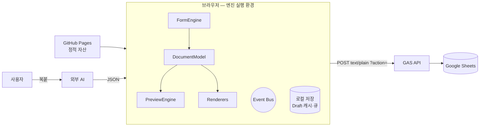

# System Design — 전체 시스템 구성

> **문서 상태**: 📋 설계만 (v2.5 Technical Specification · 미구현)
> **관련 문서**: [TECH_SPEC.md](TECH_SPEC.md) · [MODULE_SPEC.md](MODULE_SPEC.md) · [FILE_STRUCTURE.md](FILE_STRUCTURE.md) · [../ARCHITECTURE.md](../ARCHITECTURE.md)
> **한 줄 목적**: 실행 관점의 시스템 구성 — 정적 호스팅 + 클라이언트 엔진 + GAS 백엔드 + 외부 AI(수동)의 4상자와 그 사이의 모든 통신 경로를 정의한다.

---

## 목차

1. [목적](#1-목적) · 2. [책임](#2-책임) · 3. [인터페이스](#3-인터페이스) · 4. [입력](#4-입력) · 5. [출력](#5-출력) · 6. [데이터 흐름](#6-데이터-흐름) · 7. [의존성](#7-의존성) · 8. [확장성](#8-확장성) · 9. [장점](#9-장점) · 10. [단점](#10-단점)

---

## 1. 목적

Architecture의 논리 계층([../ARCHITECTURE.md](../ARCHITECTURE.md) §2)을 **물리 실행 단위**로 사상한다. 서버 애플리케이션은 없다 — 브라우저가 엔진의 실행 환경이고, GAS는 저장 API다.

## 2. 책임

| 실행 상자 | 책임 | 비고 |
|---|---|---|
| **정적 호스팅** (GitHub Pages) | HTML/CSS/JS/Template JSON 배포 | 빌드 없음 — 저장소 = 배포물 |
| **브라우저 (클라이언트)** | 전 엔진 실행: Form·Preview·Renderer·Learning UI·Event Bus / 로컬 저장(Draft·캐시·큐) | [MODULE_SPEC.md](MODULE_SPEC.md) |
| **GAS 백엔드** | 인증 검증 · Sheets 읽기/쓰기 API · 이력 기록 | [GOOGLE_APPS_SCRIPT_SPEC.md](GOOGLE_APPS_SCRIPT_SPEC.md) |
| **Google Sheets** | 영속 저장소 (Workspace별 스프레드시트) | [GOOGLE_SHEETS_SPEC.md](GOOGLE_SHEETS_SPEC.md) |
| **외부 AI** (앱 밖) | 사용자가 직접 사용 — 시스템 경계 밖 | [../AI_ARCHITECTURE.md](../AI_ARCHITECTURE.md) |

## 3. 인터페이스

| 경로 | 프로토콜 | 정의 |
|---|---|---|
| 브라우저 ↔ GAS | HTTPS POST `text/plain`(preflight 회피) + `?action=` 라우팅 — v1 규약 계승 | [API_SPEC.md](API_SPEC.md) |
| 브라우저 ↔ 로컬 | localStorage/IndexedDB + Cache Storage(SW) | [LOCAL_STORAGE_SPEC.md](LOCAL_STORAGE_SPEC.md) · [CACHE_SPEC.md](CACHE_SPEC.md) |
| 브라우저 ↔ 외부 AI | 없음 — 사람의 복사·붙여넣기 (JSON Contract) | [AI_PLUGIN_SPEC.md](AI_PLUGIN_SPEC.md)(향후 자동화) |
| GAS ↔ Sheets | SpreadsheetApp 내부 호출 | [GOOGLE_SHEETS_SPEC.md](GOOGLE_SHEETS_SPEC.md) |

## 4. 입력

시스템 전체 입력: 사용자 입력(폼·편집·붙여넣기 JSON) · 업로드 파일(학습 원본) · Template/Theme JSON · 인증 토큰.

## 5. 출력

생성 파일(.pptx/.xlsx/.pdf — 클라이언트에서 생성·다운로드) · Sheets 저장 레코드(지식·이력·Audit) · 로컬 산출물(Draft·캐시).

## 6. 데이터 흐름

```
[문서 생성 — 전부 클라이언트]
Template JSON(캐시/Pages) + 사용자 입력
  → FormEngine → Validation → DocumentModel 조립(DNA 주입)
  → PreviewEngine(HTML) / Renderer(pptx·xlsx·pdf) → 브라우저 다운로드
  → 이력 기록 API (비동기 — 실패 시 동기 큐)

[학습 — 클라이언트 + GAS]
붙여넣기 JSON → Import Gate 검증 → Learning 제안 → 승인 → GAS API 쓰기 → Sheets
```



## 7. 의존성

- 브라우저 상자는 GAS 없이도 **작성·Preview·생성이 동작**해야 한다 (오프라인 요건 — [OFFLINE_SYNC_SPEC.md](OFFLINE_SYNC_SPEC.md)). GAS 의존 기능은 지식 동기·이력·인증 갱신뿐.
- 렌더 라이브러리는 CDN 지연 로드 + 로컬 캐시 ([CACHE_SPEC.md](CACHE_SPEC.md) §3).

## 8. 확장성

- **Database Plugin 도입 시**: GAS↔Sheets 상자만 교체 — 브라우저↔API 경계([API_SPEC.md](API_SPEC.md)) 불변.
- **AI Plugin 도입 시**: 외부 AI 상자가 브라우저의 Plugin 모듈로 흡수 — 나머지 경로 불변.
- 다중 Workspace: Sheets 스프레드시트 1개/Workspace 추가 — GAS 라우팅에 workspaceId 축 존재.

## 9. 장점

1. **서버리스 단순성** — 운영할 서버가 없다. Pages+GAS는 v1에서 검증된 조합.
2. **클라이언트 완결 생성** — 문서 데이터가 생성 과정에서 외부로 나가지 않는다(보안·오프라인 동시 충족).
3. **경계 최소** — 통신 경로가 4개뿐이라 장애 지점·보안 검토 지점이 명확.

## 10. 단점

1. **GAS 한계** — 실행 시간(6분)·동시성·쿼터 제약. (→ API는 쓰기 위주 경량 설계, 대량 조회는 스냅샷 다운로드 방식 — [API_SPEC.md](API_SPEC.md) §8)
2. **클라이언트 성능 의존** — 저사양 기기에서 렌더링 부담. (→ [PREVIEW_ENGINE_SPEC.md](PREVIEW_ENGINE_SPEC.md) 부분 갱신)
3. **CDN 의존** — 렌더 라이브러리 CDN 장애 시 생성 불가. (→ 다중 CDN 폴백(v1 패턴) + SW 캐시)
