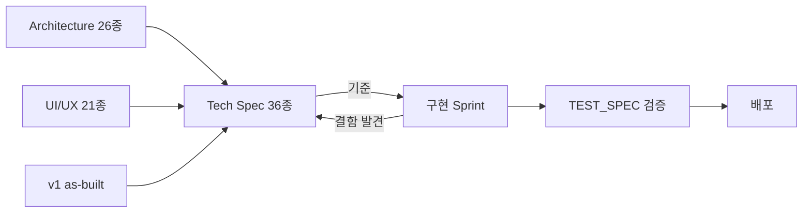

# Tech Spec — 기술 명세 총괄

> **문서 상태**: 📋 설계만 (v2.5 Technical Specification · 미구현)
> **문서 스위트**: [README.md](README.md) — spec 36종의 지도 · 상위: [../DESIGN.md](../DESIGN.md) · [../ui/UI_SPEC.md](../ui/UI_SPEC.md) (무수정)
> **한 줄 목적**: 누가 개발하더라도 동일한 구조로 구현되도록, 기술 스택·전역 불변식·이벤트 카탈로그·규약을 한 문서로 총괄한다.

---

## 목차

1. [목적](#1-목적) · 2. [책임](#2-책임) · 3. [인터페이스](#3-인터페이스) · 4. [입력](#4-입력) · 5. [출력](#5-출력) · 6. [데이터 흐름](#6-데이터-흐름) · 7. [의존성](#7-의존성) · 8. [확장성](#8-확장성) · 9. [장점](#9-장점) · 10. [단점](#10-단점)

---

## 1. 목적

본 스위트는 **설계(Architecture·UI)와 코드 사이의 기준 문서**다. 모든 구현 결정의 근거는 이 스위트를 가리켜야 하며, 스위트에 없는 구조적 결정은 문서 개정 후 구현한다.

### 기술 스택 (v1 제약 계승 — [../../DESIGN.md](../../DESIGN.md) §1)

| 층 | 기술 | 비고 |
|---|---|---|
| Frontend | HTML + CSS + **Vanilla JS(ES Modules)** + PWA | 프레임워크(React/Vue/Node 빌드) 금지 |
| 문서 생성 | PptxGenJS · ExcelJS(SheetJS 폴백) · jsPDF 계열 | CDN 지연 로드 — v1 패턴 재사용 |
| Backend | Google Apps Script (`autodoc_gas.gs` 계열 신규 파일) | [GOOGLE_APPS_SCRIPT_SPEC.md](GOOGLE_APPS_SCRIPT_SPEC.md) |
| 저장 | Google Sheets (Store 추상화 뒤) | [STORAGE_SPEC.md](STORAGE_SPEC.md) |
| 배포 | GitHub Pages(정적) + GAS 배포 | [DEPLOYMENT_SPEC.md](DEPLOYMENT_SPEC.md) |

## 2. 책임

| 책임 | 위임 문서 |
|---|---|
| 시스템 구성·프로세스 | [SYSTEM_DESIGN.md](SYSTEM_DESIGN.md) |
| 모듈 정의·이벤트·에러 소유 | [MODULE_SPEC.md](MODULE_SPEC.md) |
| 폴더 구조 | [FILE_STRUCTURE.md](FILE_STRUCTURE.md) |
| 데이터·계약 | [DATA_MODEL.md](DATA_MODEL.md) · [JSON_SCHEMA.md](JSON_SCHEMA.md) · [API_SPEC.md](API_SPEC.md) |
| 엔진 8종 | DOCUMENT/LAYOUT/RENDERER/PREVIEW/FORM/RULE/WORKFLOW/LEARNING `_SPEC` |
| 운영 | [ERROR_SPEC.md](ERROR_SPEC.md) · [LOGGING_SPEC.md](LOGGING_SPEC.md) · [TEST_SPEC.md](TEST_SPEC.md) · [DEPLOYMENT_SPEC.md](DEPLOYMENT_SPEC.md) |

### 전역 불변식 (구현 리뷰의 체크리스트)

| # | 불변식 | 근거 |
|---|---|---|
| I1 | Core 코드에 특정 AI 이름·엔드포인트 부재 | [../AI_ARCHITECTURE.md](../AI_ARCHITECTURE.md) |
| I2 | 회사 지식 쓰기는 승인된 Learning Proposal 경유만 | [../HUMAN_APPROVAL.md](../HUMAN_APPROVAL.md) |
| I3 | 모듈 간 직접 호출 금지 — Event Bus 경유 | [../EVENT_BUS.md](../EVENT_BUS.md) |
| I4 | 렌더러·Preview는 동일 DocumentModel만 입력 | [PREVIEW_ENGINE_SPEC.md](PREVIEW_ENGINE_SPEC.md) |
| I5 | 저장 접근은 WorkspaceContext + Store 추상화 경유 | [STORAGE_SPEC.md](STORAGE_SPEC.md) |
| I6 | 기존 v1 파일·BAZ CS PWA 무수정 | 전 스위트 공통 |
| I7 | 모든 저장 레코드에 `schemaVersion` 포함 | [JSON_SCHEMA.md](JSON_SCHEMA.md) |

## 3. 인터페이스

### 전역 규약

| 규약 | 정의 |
|---|---|
| 명명 | 파일 kebab-case(`form-engine.js`) · 이벤트 `대상.동사(과거형)` · JSON 키 camelCase |
| ID | 접두사+ULID 형식 문자열 (`tpl-…`, `dna-…`, `lp-…`) — 전 저장소 공통 |
| 시간 | ISO 8601 +09:00 고정 표기, 저장은 UTC epoch 병기 |
| 버전 | 자산 버전 = 정수 단조 증가·불변 / 스키마 버전 = `name.vN` |
| 이벤트 봉투 | `{eventId,name,schemaVersion,workspaceId,causationId,timestamp,payload}` — [../EVENT_BUS.md](../EVENT_BUS.md) §4 |

### 이벤트 카탈로그 총괄 (소유 모듈은 [MODULE_SPEC.md](MODULE_SPEC.md) §3)

`prompt.issued` · `analysis.imported` · `import.rejected` · `learning.proposed` · `learning.applied` · `approval.requested` · `approval.decided` · `dna.updated` · `kb.updated` · `memory.updated` · `rule.registered` · `template.saved` · `golden.promoted` · `document.assembled` · `document.generated` · `document.edited` · `workflow.step.completed` · `workflow.completed` · `flag.changed` · `plugin.error` · `sync.queued` · `sync.completed` · `auth.expired`

## 4. 입력

본 스위트의 입력(작성 근거): Architecture 26종([../README.md](../README.md)) · UI 21종([../ui/README.md](../ui/README.md)) · v1 as-built 20종([../../README.md](../../README.md)) · MVP 범위([../ui/MVP_SCOPE.md](../ui/MVP_SCOPE.md)).

## 5. 출력

구현 팀이 소비하는 산출물: 모듈 경계·인터페이스 표·JSON 계약·API 정의·테스트 기준 — **코드 없음**, Sprint 계획은 [ROADMAP_SPEC.md](ROADMAP_SPEC.md).

## 6. 데이터 흐름

```
설계(Architecture·UI)
   ↓ 구체화
Tech Spec 스위트 (본 36종)  ←— 구현 중 발견된 결함은 문서 개정 먼저
   ↓ 기준
구현 (Sprint — ROADMAP_SPEC.md)
   ↓ 검증
TEST_SPEC 기준 통과 → DEPLOYMENT_SPEC 절차 배포
```



## 7. 의존성

- 본 문서 → 모든 spec 문서(위임) · Architecture/UI 스위트(근거, 무수정 참조).
- spec 문서 간 의존은 각 문서 §7에 선언 — 순환 의존 금지.

## 8. 확장성

- 새 spec 문서 추가 = README 지도 + 본 문서 §2 표 갱신.
- 스키마·이벤트 추가는 해당 소유 문서 개정 + 본 문서 카탈로그(§3) 동기 — 카탈로그가 유일 총람.

## 9. 장점

1. **구현자 독립성** — 누가 개발해도 같은 구조 (문서가 기준, 사람이 기준 아님).
2. **불변식 체크리스트** — 리뷰가 취향이 아니라 I1~I7 대조가 된다.
3. **v1 제약의 명문화** — 스택 이탈(프레임워크 도입 등)을 초기에 차단.

## 10. 단점

1. **문서-코드 이중 유지** — 구현 중 개정 규율이 무너지면 문서가 거짓이 된다. (→ "문서 개정 먼저" 규칙을 PR 체크에 포함)
2. **Vanilla JS 제약의 비용** — 대형 SPA급 UI를 프레임워크 없이 구현하는 난도. (→ [MODULE_SPEC.md](MODULE_SPEC.md)의 얇은 컴포넌트 규약으로 완화)
3. **36종의 탐색 비용** — README 지도·본 문서 위임표가 유일한 완화책이다.
