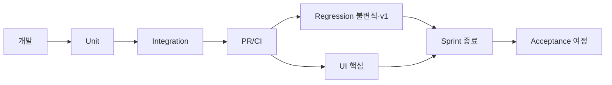

# Test Spec — 테스트 전략

> **문서 상태**: 📋 설계만 (v2.5 Technical Specification · 미구현)
> **관련 문서**: [MODULE_SPEC.md](MODULE_SPEC.md) · [../ui/IMPLEMENTATION_PLAN.md](../ui/IMPLEMENTATION_PLAN.md) · [DEPLOYMENT_SPEC.md](DEPLOYMENT_SPEC.md) · [ERROR_SPEC.md](ERROR_SPEC.md)
> **한 줄 목적**: Unit·Integration·UI·Acceptance·Regression 5종 테스트의 대상·기준·무빌드 실행 방식을 정의한다.

---

## 목차

1. [목적](#1-목적) · 2. [책임 — 테스트 종류](#2-책임--테스트-종류) · 3. [인터페이스](#3-인터페이스) · 4. [입력](#4-입력) · 5. [출력](#5-출력) · 6. [데이터 흐름](#6-데이터-흐름) · 7. [의존성](#7-의존성) · 8. [확장성](#8-확장성) · 9. [장점](#9-장점) · 10. [단점](#10-단점)

---

## 1. 목적

무빌드(Vanilla JS·ES Modules) 환경에서 실행 가능한 테스트 전략을 정의한다. 원칙: **모듈이 3입력·3출력 계약([MODULE_SPEC.md](MODULE_SPEC.md) §4-5)이므로 테스트는 계약 검증으로 환원**된다.

## 2. 책임 — 테스트 종류

| 종류 | 대상 | 기준 |
|---|---|---|
| **Unit** | 순수 함수·단일 모듈 | assemble/projectDNA/validate/score 등 — 결정적 입출력 |
| **Integration** | 모듈 조합·이벤트 흐름 | Import→학습→승인→DNA 반영 왕복 · Store 큐 재전송 멱등 |
| **UI** | 화면·부품 | 부품 6상태·키보드·ARIA · F1 여정 클릭 경로 |
| **Acceptance** | 사용자 여정 F1~F5 | [../ui/USER_FLOW.md](../ui/USER_FLOW.md) 성공 판정(3분·2클릭 등) |
| **Regression** | v1 무수정·불변식 | v1 기능 무영향 · I1~I7 위반 없음 · Replay 재현 해시 일치 |

### 핵심 테스트 케이스 (필수 — 완료 게이트)

| 케이스 | 종류 | 검증 |
|---|---|---|
| 같은 입력 → 같은 DocumentModel | Unit | assemble 순수성(I4·Replay 전제) |
| Preview 구조 = 생성물 구조 | Integration | 3 문서 종류 대조 |
| JSON Contract E1~E3 거부 | Integration | 비 JSON·봉투·payload 위반 각각 |
| 승인 없이는 DNA 미변경 | Integration | I2 — apply 우회 불가 |
| 오프라인 F1 완주 | Acceptance | 생성 포함(캐시 완료 시) |
| 키보드만으로 F1 완주 | UI | [../ui/ACCESSIBILITY.md](../ui/ACCESSIBILITY.md) §4 |
| Replay 재현 해시 일치 | Regression | provenance 좌표 재조립 |

## 3. 인터페이스

| 개념 | 방식 |
|---|---|
| 러너 | 무빌드 — 브라우저 로드형 테스트 페이지 또는 경량 러너(Node 없이) · CI는 헤드리스 브라우저 |
| 목(mock) | Store·bus·api 드라이버를 인메모리 구현으로 교체(모듈이 주입식이라 용이) |
| 픽스처 | Template·DNA·Analyzer 응답 샘플 세트(버전 고정 — 재현성) |

## 4. 입력

모듈 계약·픽스처·여정 시나리오·v1 회귀 기준.

## 5. 출력

통과/실패 리포트 · 커버리지(핵심 케이스 기준) · 회귀 경고.

## 6. 데이터 흐름

```
개발 → Unit(모듈) → Integration(흐름) 로컬 통과
  ↓ PR
CI: 헤드리스 → Unit+Integration+핵심 UI · Regression(불변식·v1)
  ↓ Sprint 종료
Acceptance: 여정 시나리오 수동+자동 → 완료 조건 대조 (IMPLEMENTATION_PLAN)
```



## 7. 의존성

테스트 → 모듈 주입식 설계(목 용이)·픽스처·CI(헤드리스 브라우저 — [DEPLOYMENT_SPEC.md](DEPLOYMENT_SPEC.md)). 완료 게이트는 [../ui/IMPLEMENTATION_PLAN.md](../ui/IMPLEMENTATION_PLAN.md) 각 Sprint.

## 8. 확장성

- 새 모듈 = Unit 계약 테스트 + 핵심 케이스 표에 필요 시 추가.
- MVP 제외 기능(Workflow 등) 활성화 시 해당 Integration/Acceptance 추가.
- 시각 회귀(픽셀)는 "구조 일치"로 대체 — 픽셀 스냅샷은 차기 📋.

## 9. 장점

1. **계약 = 테스트** — 3입출력 설계라 모듈 테스트가 명확·경량.
2. **불변식 회귀** — I1~I7·v1 무영향을 자동 검증해 구조 붕괴 방지.
3. **무빌드 실행** — 프레임워크 없이 브라우저에서 직접.

## 10. 단점

1. **무빌드 러너 한계** — 성숙한 프레임워크 대비 도구 빈약. (→ 경량 러너 + 헤드리스 CI로 필수 커버)
2. **Acceptance 자동화 난도** — 여정은 수동 비중. (→ 핵심 여정만 자동, 나머지 체크리스트)
3. **시각 검증 공백** — 픽셀 회귀 미포함. (→ 구조 일치로 대체, 시각은 파일럿 수동)
