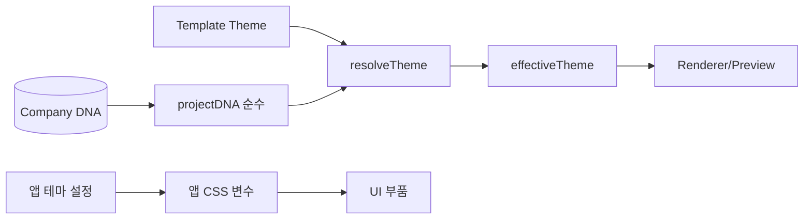

# Theme Engine Spec — Theme Token 시스템

> **문서 상태**: 📋 설계만 (v2.5 Technical Specification · 미구현)
> **관련 문서**: [../ui/DESIGN_SYSTEM.md](../ui/DESIGN_SYSTEM.md) · [COMPONENT_SPEC.md](COMPONENT_SPEC.md) · [../COMPANY_DNA.md](../COMPANY_DNA.md) · v1: [../../THEME_ENGINE.md](../../THEME_ENGINE.md)
> **한 줄 목적**: 두 토큰 체계(앱 UI 토큰 · 문서 Theme 토큰)를 정의하고, Company DNA가 문서 Theme로 사영되는 경로를 구현 수준으로 규정한다.

---

## 목차

1. [목적](#1-목적) · 2. [책임](#2-책임) · 3. [인터페이스](#3-인터페이스) · 4. [입력](#4-입력) · 5. [출력](#5-출력) · 6. [데이터 흐름](#6-데이터-흐름) · 7. [의존성](#7-의존성) · 8. [확장성](#8-확장성) · 9. [장점](#9-장점) · 10. [단점](#10-단점)

---

## 1. 목적

토큰 = 명명된 스타일 값. **두 체계 분리**: ① 앱 UI 토큰(CSS 변수 — 버튼·메뉴, 어느 회사나 동일) ② 문서 Theme 토큰(v1 Theme — 생성 문서, 회사별 = DNA 지배). Theme Engine은 후자를 다루고, DNA→Theme 사영을 담당한다.

## 2. 책임

### 문서 Theme 토큰 (Token · Color · Font · Spacing · Border · Radius · Shadow · Logo · Brand)

| 토큰군 | 내용 | DNA 사영원 |
|---|---|---|
| Color | primary/accent/danger/표 색 | DNA colorRule |
| Font | heading/body/최소 크기 | DNA fontRule |
| Spacing/Border/Radius/Shadow | 여백·테두리·모서리·그림자 | DNA layoutRule + Theme 기본 |
| Logo | 로고 위치·금지 변형 | DNA brandRule/logoRule |
| Brand | 브랜드 문구·색 조합 | DNA brandRule |

**사영 규칙**: `projectDNA(dna) → themeTokens`는 순수 함수 (Replay 전제 — [DOCUMENT_ENGINE_SPEC.md](DOCUMENT_ENGINE_SPEC.md) §3). DNA 없는 항목은 Theme JSON 기본값 사용.

## 3. 인터페이스

| 연산(개념) | 서명 |
|---|---|
| 사영 | `projectDNA(dna) → themeTokens` — 순수 |
| 병합 | `resolveTheme(themeJson, projected) → effectiveTheme` (우선순위: 사용자 명시 Theme > 사영 DNA > Theme 기본) |
| 앱 토큰(별개) | CSS 변수 세트(라이트/다크) — JS 사영 없음, [../ui/DESIGN_SYSTEM.md](../ui/DESIGN_SYSTEM.md) 관리 |
| 대비 검증 | `checkContrast(theme) → violations[]` (접근성 하한 — [../ui/ACCESSIBILITY.md](../ui/ACCESSIBILITY.md)) |

## 4. 입력

Company DNA(colorRule·fontRule·brandRule 등) · Template Theme JSON · 앱 테마 설정(라이트/다크 — 앱 토큰만).

## 5. 출력

effectiveTheme(Renderer·Preview 소비) · 앱 CSS 변수 세트 · 대비 위반 목록.

## 6. 데이터 흐름

```
문서 조립: DNA → projectDNA → themeTokens
  → resolveTheme(Template Theme + 사영) → effectiveTheme → 모델에 주입
  → Renderer/Preview가 소비 (문서 내부 스타일)
앱 UI: 설정(테마) → CSS 변수 세트 교체 → 전 부품 반영 (문서와 무관)
```



## 7. 의존성

theme-engine(Core) → document-model(주입). DNA는 Store로 조회. 앱 토큰은 CSS 파일(JS 무관). 문서/앱 토큰은 **상호 무참조**([../ui/DESIGN_SYSTEM.md](../ui/DESIGN_SYSTEM.md) §1).

## 8. 확장성

- 새 문서 토큰군 = 사영 규칙 + Theme 스키마 확장.
- 앱 테마 추가(고대비) = CSS 변수 세트 1벌.
- 화이트라벨(회사 앱 색) = 앱 primary만 Workspace 값 허용(대비 검증 통과 시 — [../ui/DESIGN_SYSTEM.md](../ui/DESIGN_SYSTEM.md) §6).

## 9. 장점

1. **DNA→문서 자동 반영** — 회사 색·폰트가 사영으로 전 문서에 일관 적용.
2. **순수 사영** — 같은 DNA→같은 Theme, Replay·테스트 결정적.
3. **앱/문서 분리** — "회사 색"이 버튼까지 물들이는 대비 사고 차단.

## 10. 단점

1. **사영 규칙 복잡도** — DNA 항목↔Theme 토큰 매핑 유지비. (→ 매핑표를 §2에 단일 규범화)
2. **대비 위반 가능성** — 회사 색이 접근성 하한 위반 시. (→ checkContrast 강제 + 위반 시 경고, 관리자 확인)
3. **v1 Theme 표현 한계** — 세밀한 스타일 미수용. (→ 문서 스타일은 규칙 수준까지 — 예시는 Memory 보완)
