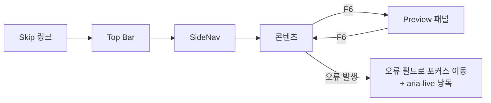

# Accessibility — 접근성 설계

> **문서 상태**: 📋 설계만 (v2.5 UI/UX Edition · 미구현)
> **관련 문서**: [DESIGN_SYSTEM.md](DESIGN_SYSTEM.md) · [COMPONENT_LIBRARY.md](COMPONENT_LIBRARY.md) · [ERROR_HANDLING.md](ERROR_HANDLING.md) · [NAVIGATION.md](NAVIGATION.md)
> **한 줄 목적**: Keyboard · Tab · Screen Reader · Color Contrast · Font Scale · ARIA — 접근성을 화면별 후처리가 아니라 부품·토큰 수준의 계약으로 내장한다.

---

## 목차

1. [목적](#1-목적)
2. [책임](#2-책임)
3. [UX 원칙](#3-ux-원칙)
4. [사용자 흐름 — 키보드 여정](#4-사용자-흐름--키보드-여정)
5. [화면 구성 — 기준표](#5-화면-구성--기준표)
6. [확장성](#6-확장성)
7. [장점](#7-장점)
8. [단점](#8-단점)

---

## 1. 목적

접근성은 특수 기능이 아니라 품질 하한이다. 목표 기준: **WCAG 2.1 AA 상당**. 접근성이 좋은 제품은 모두에게 좋다 — 키보드 파워유저·햇빛 아래 현장 화면·장갑 낀 손까지.

## 2. 책임

| 층 | 책임 |
|---|---|
| 토큰([DESIGN_SYSTEM.md](DESIGN_SYSTEM.md)) | 대비 하한 내장 색 세트 · focus-ring · 모션 감소 대응 · Font Scale 배율 |
| 부품([COMPONENT_LIBRARY.md](COMPONENT_LIBRARY.md)) | role·라벨·키보드 조작·상태 낭독 — **부품 계약에 포함** (화면에서 후처리 금지) |
| 화면 | 랜드마크 구조 · 제목 위계 · 포커스 순서 = 시각 순서 · Skip 링크 |
| 문구 | 아이콘 단독 금지(라벨 병행) · 낭독 텍스트는 시각 정보와 동등 |

## 3. UX 원칙

| 원칙 | 반영 |
|---|---|
| 색은 보조 신호 | 모든 상태는 색+아이콘+텍스트 3중 — Golden 🏆, 오류 ✗ 문구 병행 |
| 키보드로 전부 | 마우스 없이 F1(첫 문서 작성) 전 여정 완주 가능해야 한다 — 완료 조건 |
| 낭독 = 시각 | 스크린리더 사용자가 받는 정보량이 시각 사용자와 동등 (선택 정보·검증 결과·진행률) |
| 사용자 배율 존중 | Font Scale 130%·OS 확대에서 레이아웃 파손 없음 — 넘침은 줄바꿈으로 |

## 4. 사용자 흐름 — 키보드 여정

```
Tab 순서 (전 화면 공통): Skip 링크 → Top Bar → SideNav → 콘텐츠 → 상태바
단축키:  / 검색 · Alt+1~5 메뉴 (NAVIGATION.md §5) · Ctrl+Z/Y 편집 (EDITOR_SYSTEM.md)

F1 여정 키보드 완주:
Dashboard: Tab→"문서 만들기" Enter
Catalog:   화살표로 카드 그리드 이동 → Enter 선택 (🏆 카드가 초기 포커스)
Form:      Tab 필드 순회 · 오류 시 포커스가 오류 필드로 · 제안 칩은 ↓로 진입
Preview:   F6로 폼⇄Preview 패널 전환 · 페이지는 PgUp/PgDn
생성:      Enter → 완료 화면 → 다운로드 링크 포커스
```



## 5. 화면 구성 — 기준표

| 영역 | 기준 |
|---|---|
| Color Contrast | 본문 4.5:1 · 대형 텍스트/아이콘 3:1 · 비활성 제외 — 토큰 검증으로 보장 |
| Font Scale | 100/115/130% 설정([SETTINGS_UX.md](SETTINGS_UX.md)) + OS 배율 병행 허용 — 이중 확대에서도 기능 유지 |
| 포커스 | 모든 상호작용 요소에 focus-ring 2px — 절대 outline 제거 금지 |
| 터치 타깃 | 44×44px 이상 (전 단) |
| ARIA | 부품별 role/aria 계약: Card=button · 승인함 목록=listbox · Toast/검증 결과=aria-live(polite) · 진행률=progressbar · Banner=status |
| 랜드마크 | header/nav/main/footer + 화면당 h1 1개 · 위계 건너뛰기 금지 |
| 모션 | prefers-reduced-motion 시 모든 전환 0ms ([DESIGN_SYSTEM.md](DESIGN_SYSTEM.md) 모션 토큰) |
| 스크린리더 낭독 예 | Template 카드: "주간보고, 회사 표준, 버전 7, 즐겨찾기 128, 버튼" / 편집 선택: "실적 표, 4열 6행, 2단 폭 — 화살표로 이동" |
| 문서 Preview | Preview 내부는 문서 구조를 heading·table 시맨틱으로 렌더 — 스크린리더로 문서 내용 검토 가능 |

## 6. 확장성

- **기준 상향(AAA 등)** = 토큰·부품 계약 갱신으로 전 화면 파급 — 화면별 수정 불필요.
- 새 부품은 §5 ARIA 계약 작성이 카탈로그 등록 조건 ([COMPONENT_LIBRARY.md](COMPONENT_LIBRARY.md) §3).
- 고대비 테마는 토큰 세트 추가로 대응 예약 ([DESIGN_SYSTEM.md](DESIGN_SYSTEM.md) §6).

## 7. 장점

1. **부품 수준 내장** — 접근성이 한 번 구현되고 전 화면에 상속 — 후처리 비용·누락 없음.
2. **전원 수혜** — 키보드 완주·큰 터치 타깃·명확한 포커스는 비장애 사용자 생산성도 올린다.
3. **Enterprise 요건 충족** — 공공·대기업 도입 심사의 접근성 항목에 답변 가능.

## 8. 단점

1. **검증 비용** — 스크린리더·키보드 시나리오 테스트는 자동화가 어렵다. (→ F1 키보드 완주를 Sprint 완료 조건으로 고정 — 최소 1시나리오는 항상 검증)
2. **문서 Preview의 시맨틱 한계** — 자유 배치 문서를 완벽한 낭독 순서로 만들기 어렵다. (→ 구획 순서(Section Order) 기준 낭독 — 시각 배치와 근사)
3. **기준표의 노후화** — WCAG 개정 추적 필요. (→ 기준표 버전 명기, 연 1회 점검)
