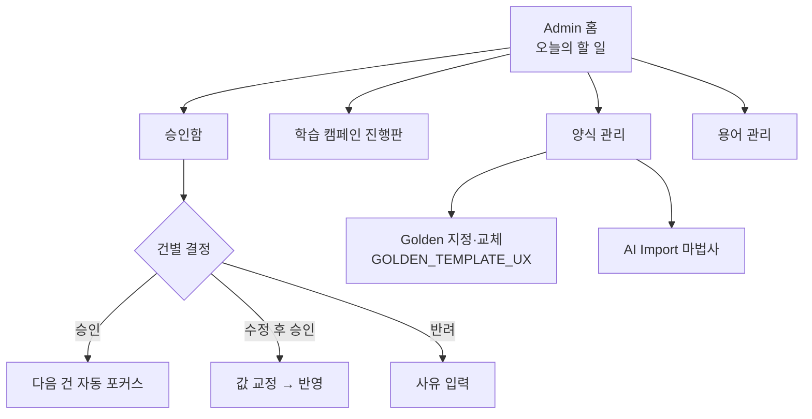

# Admin UX — 관리자 화면 체계

> **문서 상태**: 📋 설계만 (v2.5 UI/UX Edition · 미구현)
> **관련 문서**: [LEARNING_MODE_UX.md](LEARNING_MODE_UX.md) · [AI_IMPORT_UX.md](AI_IMPORT_UX.md) · [SETTINGS_UX.md](SETTINGS_UX.md) · Architecture: [../HUMAN_APPROVAL.md](../HUMAN_APPROVAL.md) · v1: [../../ADMIN_SPEC.md](../../ADMIN_SPEC.md)
> **한 줄 목적**: Template·Prompt·Rule·Workflow·Plugin·Workspace·Company DNA·Knowledge Base·Learning·Audit 10개 관리 영역의 화면 체계를 확정한다.

---

## 목차

1. [목적](#1-목적)
2. [책임 — 관리 영역 10종](#2-책임--관리-영역-10종)
3. [UX 원칙](#3-ux-원칙)
4. [사용자 흐름](#4-사용자-흐름)
5. [화면 구성](#5-화면-구성)
6. [확장성](#6-확장성)
7. [장점](#7-장점)
8. [단점](#8-단점)

---

## 1. 목적

관리자는 파워 유저지만 개발자가 아니다. 관리 화면도 제품이다 — v1 admin([../../ADMIN_SPEC.md](../../ADMIN_SPEC.md))의 "관리자 = 폼 채우는 사람" 사상을 계승하되, v2.5의 학습·승인 중심으로 재편한다.

## 2. 책임 — 관리 영역 10종

| 영역 | 핵심 화면 | MVP | 근거 문서 |
|---|---|---|---|
| Template | 양식 목록·등록·버전·Golden 지정 | ✅ | [GOLDEN_TEMPLATE_UX.md](GOLDEN_TEMPLATE_UX.md) |
| Prompt | Prompt 자산 목록·버전·메타(정확도·사용) | ✅(열람·등록) | [../PROMPT_MARKETPLACE.md](../PROMPT_MARKETPLACE.md) |
| Learning | 학습 상태·승인함·캠페인 진행판 | ✅ | [LEARNING_MODE_UX.md](LEARNING_MODE_UX.md) |
| Company DNA | 구획별 규칙 열람·항목 신뢰도·수동 편집(승인 경유) | ✅(열람 중심) | [../COMPANY_DNA.md](../COMPANY_DNA.md) |
| Knowledge Base | 용어 목록·병합·후보 처리 | ✅ | [../KNOWLEDGE_BASE.md](../KNOWLEDGE_BASE.md) |
| Rule | 규칙 목록·등록·활성 토글 | ❌ 차기 | [../RULE_ENGINE.md](../RULE_ENGINE.md) |
| Workflow | 결재 흐름 정의 | ❌ 차기 | [../WORKFLOW_ENGINE.md](../WORKFLOW_ENGINE.md) |
| Plugin | Plugin 목록·활성 | ❌ 차기 | [../PLUGIN_ARCHITECTURE.md](../PLUGIN_ARCHITECTURE.md) |
| Workspace | Workspace 설정·권한 | ✅(단일 WS 설정만) | [SETTINGS_UX.md](SETTINGS_UX.md) |
| Audit | 변경 연대기 조회 | ❌ 차기 | [../AUDIT_ENGINE.md](../AUDIT_ENGINE.md) |

MVP 컷 근거는 [MVP_SCOPE.md](MVP_SCOPE.md) §2.

## 3. UX 원칙

| 원칙 | 반영 |
|---|---|
| 할 일 우선 | Admin 홈의 첫 화면은 메뉴 트리가 아니라 **오늘의 할 일**(승인 대기·막힌 캠페인·오류) |
| 모든 변경에 근거와 미리보기 | 승인·편집 화면은 전후 비교(DiffView)가 기본 |
| 파괴적 행동의 마찰 | 삭제·교체·롤백은 2단 확인 + 영향 요약 ("이 양식은 지난달 41회 사용됨") |
| 위임을 전제 | 영역별 권한 분리 가능 구조 (용어는 QA팀에게 등) — MVP는 단일 관리자 등급 |

## 4. 사용자 흐름

```
Admin 홈 (할 일 요약)
  ├─ "승인 대기 5건" → 승인함 → 건별 검토(근거·전후) → 승인/수정 후 승인/반려
  ├─ "캠페인: 붙여넣기 대기 3건" → 진행판 → Import 마법사 이어서
  ├─ 양식 관리 → 등록(AI Import 또는 수동) · Golden 지정 · 버전 이력
  └─ 용어 관리 → 후보 처리 · 병합 질문 ("'핸드피스'는 'Handpiece'와 같은 말인가요?" 예/아니오)
```



## 5. 화면 구성

### Admin 홈

```
┌─ 관리 ──────────────────────────────────────────────┐
│ 오늘의 할 일                                          │
│  ● 승인 대기 5건 (추천 3 · 확인 1 · 질문 1)   [처리 →] │
│  ● 학습 캠페인: 붙여넣기 대기 3건            [이어서 →] │
│  ● 오류 1건: Import 실패 반복 (VOC_6월)      [보기 →]  │
├──────────────────────────────────────────────────────┤
│ [양식 관리] [Prompt] [학습 상태] [용어(KB)] [DNA] [설정]│
├──────────────────────────────────────────────────────┤
│ 요약: 양식 23 (🏆12) · 용어 142 · DNA v12 · 최근 변경 3 │
└──────────────────────────────────────────────────────┘
```

### 승인함 (핵심 작업 화면)

```
┌─ 승인함 — 대기 5건 ────────────────────────────────────┐
│ 필터: [전체|추천|확인|질문]  [동일 유형 묶음 승인]        │
├──────────────┬─────────────────────────────────────────┤
│ ▸ 표 머리행 색 │  제안: 표 머리행 = 회사 파랑              │
│   추천 91%    │  ┌ 현재 ─────┐  ┌ 제안 ─────┐            │
│ ▸ 용어 병합 Q │  │ (무색 머리) │  │ (파랑 머리) │           │
│   질문       │  └───────────┘  └───────────┘            │
│ ▸ …          │  근거: 문서 7개에서 관측 · Prompt v3 ⓘ    │
│              │  [승인] [수정 후 승인] [반려(사유)]        │
└──────────────┴─────────────────────────────────────────┘
```

| 요소 | 규칙 |
|---|---|
| 등급 표시 | 추천/확인/질문 배지 + 신뢰도 % + 근거 ⓘ(factors — [../CONFIDENCE_ENGINE.md](../CONFIDENCE_ENGINE.md) §4) |
| 질문형 항목 | 선택지 버튼으로 즉답 ("증상 / 원인 / 모르겠음") |
| 묶음 승인 | 동일 유형만 + 표본 3건 미리보기 강제 ([../HUMAN_APPROVAL.md](../HUMAN_APPROVAL.md) §7 형식화 방지) |
| 처리 리듬 | 결정 즉시 다음 건 포커스 — 목록 왕복 없는 연속 처리 |

## 6. 확장성

- **차기 영역(Rule·Workflow·Plugin·Audit) 활성화** = §2 표의 예약 화면 추가 — Admin 홈 구조 불변, 탭만 증가.
- 승인함은 대상 유형이 늘어도 동일 패턴(근거+전후+3버튼) — 새 학습 대상 자동 수용.
- 다중 Workspace 시 Admin 상단에 Workspace 스코프 표시 추가 (MVP 제외).

## 7. 장점

1. **할 일 중심 홈** — 관리자가 "어디 가서 뭘 해야 하는지" 탐색하지 않는다.
2. **승인 처리량 확보** — 연속 처리 리듬 + 묶음 승인이 학습 병목([../LEARNING_ENGINE.md](../LEARNING_ENGINE.md) §7)을 UX로 완화.
3. **v1 계승** — 기존 admin.html 사상(폼 기반 관리)을 버리지 않고 재편.

## 8. 단점

1. **관리 영역 10종의 폭** — 전부 잘 만들면 제품 하나 분량이다. (→ MVP 컷 + 열람 중심 우선)
2. **묶음 승인의 형식화 위험** — 속도가 신중함을 이길 수 있다. (→ 표본 미리보기 강제·유형 한정) |
3. **단일 관리자 병목(MVP)** — 권한 위임 없는 초기엔 한 사람에 몰린다. (→ 차기 영역별 권한, 캠페인 담당 분배는 MVP에도 포함)
