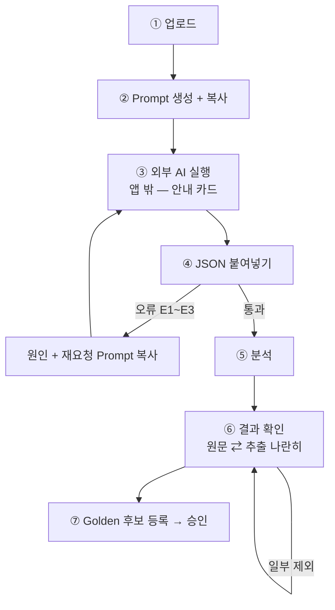

# AI Import UX — 외부 AI 왕복 마법사

> **문서 상태**: 📋 설계만 (v2.5 UI/UX Edition · 미구현)
> **관련 문서**: Architecture: [../AI_ARCHITECTURE.md](../AI_ARCHITECTURE.md)(Import Mode·JSON Contract) · [../PROMPT_ENGINE.md](../PROMPT_ENGINE.md) · [ERROR_HANDLING.md](ERROR_HANDLING.md) · [GOLDEN_TEMPLATE_UX.md](GOLDEN_TEMPLATE_UX.md)
> **한 줄 목적**: 업로드 → Prompt 복사 → 외부 AI → JSON 붙여넣기 → 분석 → 결과 확인 → Golden Template 생성 — 앱 밖을 다녀오는 여정을 길 잃지 않는 마법사로 설계한다.

---

## 목차

1. [목적](#1-목적)
2. [책임](#2-책임)
3. [UX 원칙](#3-ux-원칙)
4. [사용자 흐름](#4-사용자-흐름)
5. [화면 구성](#5-화면-구성)
6. [확장성](#6-확장성)
7. [장점](#7-장점)
8. [단점](#8-단점)

---

## 1. 목적

Import Mode는 아키텍처의 핵심이자 UX의 최대 난관이다 — **여정의 한가운데가 우리 앱 밖**(ChatGPT·Claude·Gemini)이다. 이 문서는 그 단절을 마법사(Wizard) 패턴으로 잇는다. 대상 사용자는 관리자(및 권한 위임자)다.

## 2. 책임

| 책임 | 설명 |
|---|---|
| 7단계 마법사 | 업로드 → Prompt → (외부 AI) → 붙여넣기 → 분석 → 결과 확인 → Golden 후보 등록 |
| 상태 보존 | 어느 단계에서 이탈해도 복귀 시 그 자리 (외부 AI를 다녀오는 여정의 생명선) |
| 검증 표면 | JSON Contract E1~E3 오류를 사람 말로 + 재요청 Prompt 재발급 ([ERROR_HANDLING.md](ERROR_HANDLING.md) §5) |
| 배치 지원 | 문서 여러 개 묶음 처리 (Company Learning 초기 50~500개 — [LEARNING_MODE_UX.md](LEARNING_MODE_UX.md) §4) |
| 하지 않는 것 | AI API 호출(아키텍처 원칙), AI 추천·비교(사용자가 자기 AI 선택) |

## 3. UX 원칙

| 원칙 | 반영 |
|---|---|
| 밖에 나가도 길을 잃지 않는다 | 단계 표시 상시 고정 + 복귀 시 자동 복원 |
| 복사·붙여넣기를 1급 행동으로 | 큰 복사 버튼·큰 붙여넣기 영역 — 부끄러운 우회로가 아니라 설계된 정문 |
| 오류는 다음 행동과 함께 | "JSON이 아닙니다"가 아니라 "AI가 설명을 섞었어요 → 이 재요청 Prompt를 다시 보내세요 [복사]" |
| 결과는 검증 가능하게 | 분석 결과를 원문서와 나란히 — 믿으라 하지 않고 보여준다 |

## 4. 사용자 흐름

```
① 업로드: 파일 드롭 (PPT/Word/Excel/PDF…) → 종류 판별 확인 ("주간보고 PPT로 볼게요 — 맞나요?")
② Prompt: 자동 생성된 Prompt + [전체 복사] + "ChatGPT·Claude·Gemini 아무 데나 붙여넣으세요"
③ (외부) 사용자가 자기 AI에서 실행 — 앱은 이 단계를 카드로 안내만
④ 붙여넣기: JsonPasteBox에 응답 붙여넣기 → 즉시 검증
     ├─ E1~E3 오류 → 원인 설명 + 재요청 Prompt [복사] → ③으로
     └─ 통과 ↓
⑤ 분석: 진행 표시 (붙여넣은 JSON → 학습 제안 변환)
⑥ 결과 확인: 원문서 미리보기 ⇄ 추출 결과 나란히 — 항목별 채택/제외
⑦ 완료: "Golden Template 후보로 등록" → 승인 절차로 (GOLDEN_TEMPLATE_UX.md)
```



## 5. 화면 구성

```
┌─ AI로 양식 가져오기 ────────────────────────────────────┐
│ ① 업로드 → ② Prompt → ③ AI 실행 → ④ 붙여넣기 → ⑤ 분석 → ⑥ 확인 → ⑦ 완료
│ ━━━━━━━━━━●───────────────  (현재: ④)                  │
├─────────────────────────────────────────────────────────┤
│  ④ AI의 답을 여기에 붙여넣으세요                          │
│  ┌───────────────────────────────────────────┐          │
│  │  (JsonPasteBox — 붙여넣기 즉시 검사)         │          │
│  └───────────────────────────────────────────┘          │
│  ✅ 형식 확인됨 · analyzer: ppt-analyzer · v3            │
│              [◂ Prompt 다시 보기]   [다음: 분석 ▸]       │
└─────────────────────────────────────────────────────────┘
```

| 요소 | 규칙 |
|---|---|
| 단계 바 | 7단계 상시 표시 · 완료 단계 클릭으로 회귀 가능 |
| ② 복사 카드 | Prompt 전문 접이식 + [전체 복사] 대형 버튼 + 대상 AI 로고 없는 중립 안내 (특정 AI 홍보 금지) |
| ③ 안내 카드 | "이 창은 그대로 두세요 — 돌아오면 이어집니다" |
| ⑥ 결과 확인 | 좌: 원문서 · 우: 추출 항목 카드(레이아웃/용어/표…) — 항목별 ✓ 채택/✗ 제외 |
| 배치 모드 | 파일 N개 목록 + 파일별 상태(대기/Prompt 복사됨/붙여넣기 대기/완료) — 진행판 형태 |

## 6. 확장성

- **향후 AI Plugin**(자동 왕복)이 켜지면: ②~④가 "자동 처리" 카드로 접히고 나머지 단계는 동일 — 마법사 구조 불변 ([../PLUGIN_ARCHITECTURE.md](../PLUGIN_ARCHITECTURE.md)).
- 분석 목적 확장(문체만·용어만)은 ①에서 목적 선택지 추가 — Prompt Engine 6축에 위임.
- 배치 모드의 묶음 Prompt는 [../PROMPT_ENGINE.md](../PROMPT_ENGINE.md) §5 배치 발급을 그대로 표면화.

## 7. 장점

1. **아키텍처 제약의 정직한 UX화** — API 없음을 숨기지 않고 최상의 수동 경험으로 만든다.
2. **오류 회복 내장** — 실패의 다음 행동(재요청 Prompt)이 항상 한 클릭.
3. **결과 신뢰 형성** — 나란히 비교·항목별 채택이 "AI가 뭘 했는지 모름" 불안을 제거.

## 8. 단점

1. **왕복 피로** — 문서 수백 개면 수백 번의 복사·붙여넣기다. (→ 배치 모드 + 진행판으로 완화가 한계 — 근본 해소는 AI Plugin)
2. **외부 AI 품질 의존** — 사용자가 무료·저성능 AI를 쓰면 실패율이 오른다. (→ 실패 시 "다른 AI로 시도" 안내 문구까지만 — 특정 AI 추천은 하지 않음)
3. **모바일 부적합** — 창 전환·복붙 여정은 Desktop 작업이다. (→ 모바일 진입 시 "PC에서 이어서" 안내 + 링크 보내기)
