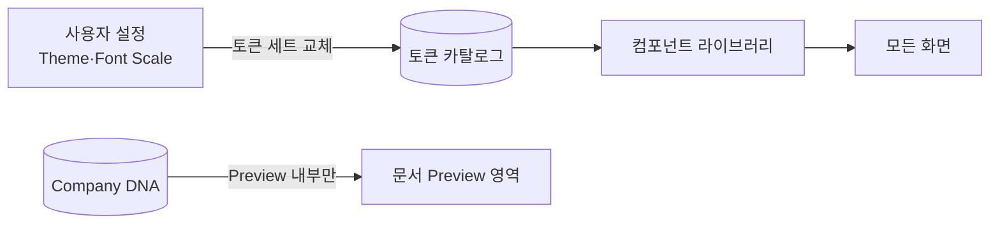

# Design System — 디자인 토큰 · 시각 언어

> **문서 상태**: 📋 설계만 (v2.5 UI/UX Edition · 미구현)
> **관련 문서**: [COMPONENT_LIBRARY.md](COMPONENT_LIBRARY.md) · [ACCESSIBILITY.md](ACCESSIBILITY.md) · Architecture: [../COMPANY_DNA.md](../COMPANY_DNA.md)(Color/Font Rule)
> **한 줄 목적**: 앱 UI의 시각 언어(토큰·타이포·색·간격·상태)를 정의한다 — **문서 스타일(Company DNA)과 앱 스타일(본 문서)은 별개다.**

---

## 목차

1. [목적](#1-목적)
2. [책임](#2-책임)
3. [UX 원칙](#3-ux-원칙)
4. [사용자 흐름](#4-사용자-흐름)
5. [화면 구성 — 토큰 정의](#5-화면-구성--토큰-정의)
6. [확장성](#6-확장성)
7. [장점](#7-장점)
8. [단점](#8-단점)

---

## 1. 목적

두 스타일 체계를 명확히 분리한다:

| 체계 | 지배자 | 예 |
|---|---|---|
| **문서 스타일** | Company DNA ([../COMPANY_DNA.md](../COMPANY_DNA.md)) | 생성되는 PPT의 색·폰트·표 |
| **앱 UI 스타일** | 본 Design System | 버튼·메뉴·카드의 색·폰트 |

앱 UI는 어느 회사에서나 동일한 중립 시스템이다. 문서 Preview 영역 안쪽만 Company DNA가 지배한다 ([PREVIEW_SYSTEM.md](PREVIEW_SYSTEM.md) §5).

## 2. 책임

| 책임 | 설명 |
|---|---|
| 토큰 정의 | 색·타이포·간격·모서리·그림자·모션의 명명된 값 (§5) |
| 상태 문법 | hover/active/disabled/focus/error의 일관 규칙 |
| 다크·라이트 | 테마 2종 — 토큰 교체만으로 전환 ([SETTINGS_UX.md](SETTINGS_UX.md) Theme) |
| 접근성 하한 | 대비 4.5:1(본문)·3:1(대형) 강제 ([ACCESSIBILITY.md](ACCESSIBILITY.md)) |
| 하지 않는 것 | 컴포넌트 구조(→ [COMPONENT_LIBRARY.md](COMPONENT_LIBRARY.md)), 문서 스타일(→ DNA) |

## 3. UX 원칙

| 원칙 | 반영 |
|---|---|
| 조용한 배경, 분명한 행동 | 화면의 95%는 저채도 — 색은 행동(CTA)·상태(성공/오류)에만 |
| 의미 있는 색만 | 색상 6역할 이하: primary/성공/경고/오류/정보/중립 — 장식색 금지 |
| 계층은 크기보다 굵기·간격 | 타이포 스케일 6단 이내, 시각 소음 최소화 |
| 모션은 인과 표현 | 애니메이션은 원인→결과 연결(패널 열림 방향 등)에만, 150~250ms |

## 4. 사용자 흐름

토큰이 사용자 경험에 닿는 경로:

```
디자이너/개발자: 토큰 정의(1곳)
   ↓
컴포넌트: 토큰만 참조 (직접 색상값 금지)
   ↓
사용자: Settings에서 Theme(라이트/다크) · Font Scale 선택
   ↓
전 화면 즉시 일관 반영 — 화면별 예외 없음
```



## 5. 화면 구성 — 토큰 정의

### 색 (라이트 기준 — 다크는 동일 역할의 대응 세트)

| 토큰 | 역할 | 값(제안) |
|---|---|---|
| `--ui-primary` | 1차 행동(문서 만들기·생성) | #2563EB |
| `--ui-success` | 완료·저장됨 | #16A34A |
| `--ui-warning` | 주의·대기 | #D97706 |
| `--ui-danger` | 오류·삭제 | #DC2626 |
| `--ui-info` | 안내 | #0891B2 |
| `--ui-bg / -surface / -border` | 배경·카드·경계 | #F8FAFC / #FFFFFF / #E2E8F0 |
| `--ui-text / -text-weak` | 본문·보조 | #0F172A / #64748B |
| `--ui-golden` | Golden 배지 전용 | #B45309 (🏆와 병용 — 색 단독 의존 금지) |

### 타이포·간격·기타

| 분류 | 토큰 | 값 |
|---|---|---|
| 타이포 | `display/h1/h2/body/caption/mono` | 24/20/17/15/13/14px · 굵기 700/700/600/400/400 — Font Scale 배율 대상 |
| 간격 | `space-1…6` | 4/8/12/16/24/32px — 모든 여백은 6단 중 택1 |
| 모서리 | `radius-s/m/l` | 6/10/16px (카드=m, 모달=l) |
| 그림자 | `elev-1/2` | 카드/떠 있는 패널 — 2단만 |
| 모션 | `motion-fast/base` | 150/250ms · 감속 곡선 · **감소 모션 설정 시 0ms** |
| 포커스 | `focus-ring` | 2px 외곽 링 — 모든 상호작용 요소 공통 ([ACCESSIBILITY.md](ACCESSIBILITY.md) §5) |

### 상태 문법 (전 컴포넌트 공통)

```
기본 → hover(표면 +4% 어둡게) → active(+8%) → focus(focus-ring)
disabled(투명도 45% + 커서 금지) · error(--ui-danger 경계 + 메시지 슬롯)
```

## 6. 확장성

- **테마 추가**(고대비 등) = 토큰 세트 1벌 추가 — 컴포넌트·화면 무수정.
- **브랜드 화이트라벨** 📋: `--ui-primary`만 Workspace 값으로 교체 허용(대비 검증 통과 시) — 나머지 토큰은 고정.
- 토큰 카탈로그는 버전 관리 — 변경 시 영향 컴포넌트 목록과 함께 개정.

## 7. 장점

1. **일관성의 물리적 보장** — 직접 색상값 금지 규칙 하나로 화면별 미세 편차가 사라진다.
2. **테마·접근성 무료 획득** — 다크 모드·Font Scale·고대비가 토큰 교체 문제로 축소된다.
3. **문서/앱 스타일 분리** — "우리 회사 색"이 버튼까지 물들이는 혼란(그리고 대비 사고)을 차단.

## 8. 단점

1. **초기 강제 비용** — 토큰 우회(하드코딩)를 막는 리뷰 규율이 필요하다. (→ 구현 단계에서 lint 규칙 예정 — 설계 범위 밖)
2. **중립 UI의 개성 부족** — 회사들이 "우리 느낌"을 원할 수 있다. (→ §6 화이트라벨 한정 허용)
3. **제안 색상값은 가안** — 실제 값은 구현 전 대비 검증으로 확정한다.
