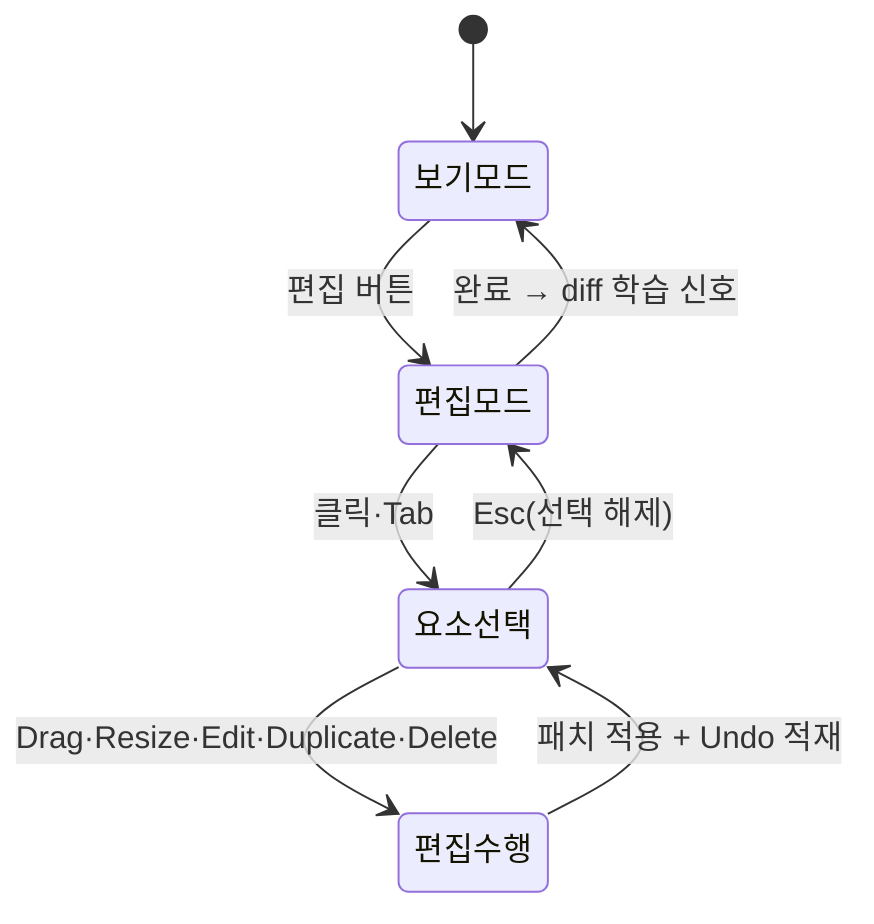

# Editor System — Preview 직접 수정

> **문서 상태**: 📋 설계만 (v2.5 UI/UX Edition · 미구현)
> **관련 문서**: [PREVIEW_SYSTEM.md](PREVIEW_SYSTEM.md) · [FORM_GUIDE.md](FORM_GUIDE.md) · Architecture: [../DOCUMENT_MODEL.md](../DOCUMENT_MODEL.md) · [../LEARNING_ENGINE.md](../LEARNING_ENGINE.md)
> **한 줄 목적**: Preview에서 문서를 직접 수정하는 편집 모드 — Drag · Resize · Edit · Duplicate · Delete · Undo · Redo를 정의한다.

---

## 목차

1. [목적](#1-목적)
2. [책임](#2-책임)
3. [UX 원칙](#3-ux-원칙)
4. [사용자 흐름](#4-사용자-흐름)
5. [화면 구성](#5-화면-구성)
6. [확장성](#6-확장성)
7. [장점](#7-장점)
8. [단점](#8-단점)

---

## 1. 목적

폼으로 90%를 채우고, 마지막 10%(위치 미세 조정·특이 케이스)는 결과물 위에서 직접 고친다. 편집은 **문서 데이터(DocumentModel)의 조작**이지 그림 그리기가 아니다 — 모든 편집은 모델 변경으로 기록되어 생성·재현·학습에 그대로 반영된다.

## 2. 책임

### 편집 동작 7종

| 동작 | 대상 | 규칙 |
|---|---|---|
| Drag | 구획·컴포넌트 | Grid 스냅(v1 [../../LAYOUT_ENGINE.md](../../LAYOUT_ENGINE.md) 좌표계) — 자유 픽셀 이동 아님 |
| Resize | 컴포넌트·표 열 | 핸들 8방향 · Grid 단위 · 최소 크기 하한 |
| Edit | 텍스트·셀 | 더블클릭 인라인 편집 — 폼 값과 양방향 동기 |
| Duplicate | 구획·행·컴포넌트 | 복제 후 바로 아래 삽입·포커스 |
| Delete | 구획·컴포넌트 | 즉시 삭제 + Undo 안내 토스트 (확인 모달 금지 — P5는 Undo로) |
| Undo | 모든 편집 | 세션 내 전 단계 · Ctrl+Z |
| Redo | Undo 취소 | Ctrl+Shift+Z / Ctrl+Y |

### 시스템 책임

| 책임 | 설명 |
|---|---|
| 모델 동기 | 편집 = 모델 패치 — 폼·Preview·생성이 항상 같은 모델을 본다 |
| 편집 이력 | 패치 스택(Undo/Redo의 실체) — 최종 diff는 학습 신호로 방출 ([../LEARNING_ENGINE.md](../LEARNING_ENGINE.md) 사용자 수정) |
| 가드레일 | Golden·DNA 위반 편집(예: 로고 삭제)은 막지 않되 즉시 편차 표시 ([PREVIEW_SYSTEM.md](PREVIEW_SYSTEM.md) 오버레이) |
| 하지 않는 것 | Template 자체의 수정(그건 Admin), 자유 그리기 |

## 3. UX 원칙

| 원칙 | 반영 |
|---|---|
| 직접 조작 | 보이는 것을 잡아서 움직인다 — 속성 패널은 보조 |
| 파괴 없는 실험 | Delete도 Undo 가능 — 두려움 없는 시도 (P5) |
| 구조 존중 | Grid 스냅·최소 크기로 "망가진 문서"를 만들 수 없게 |
| 회사 기준 가시화 | 기준 이탈은 금지가 아니라 표시 — 판단은 사람 |

## 4. 사용자 흐름

```
Preview 보기 모드 → [편집] → 편집 모드 (테두리·핸들 표시)
  ↓ 요소 선택 (클릭 / Tab 순회)
선택 상태: 이동 핸들 + 크기 핸들 + 미니 툴바(복제·삭제)
  ↓ 편집 수행 → 모델 패치 → Preview 즉시 반영 + Undo 스택 적재
  ↓ [완료] → 보기 모드 복귀 → 편집 diff 학습 신호 방출
```



## 5. 화면 구성

```
┌─ 편집 모드 툴바 ──────────────────────────────┐
│ ↶ ↷ │ 복제 ⧉  삭제 🗑 │ Grid 표시 ⊞ │ [완료]   │
├───────────────────────────────────────────────┤
│  ┌──────── 페이지 ────────────┐                │
│  │  ┏━━ 선택된 표 ━━┓ ← 선택 테두리+8핸들      │
│  │  ┃ □□□□□□□□ ┃   [⧉][🗑] ← 미니 툴바    │
│  │  ┗━━━━━━━━━━━┛                        │
│  │  ┆Grid 점선(토글)┆                         │
│  └────────────────────────────┘                │
│  선택 정보: "실적 표 · 4열×6행 · 2단 폭"         │
└───────────────────────────────────────────────┘
```

| 요소 | 규칙 |
|---|---|
| 선택 표시 | 테두리 + 핸들 + 하단 선택 정보(스크린리더 낭독 텍스트와 동일) |
| 미니 툴바 | 선택 요소 옆 — 복제·삭제·(텍스트면) 스타일 없음: 스타일은 DNA 소관 |
| Grid 토글 | 스냅 기준 시각화 |
| 키보드 | 화살표=1칸 이동 · Shift+화살표=크기 · Enter=인라인 편집 · Del=삭제 ([ACCESSIBILITY.md](ACCESSIBILITY.md) §4) |
| 모바일 | 편집 모드 제공하되 이동·크기는 롱프레스+핸들 — 정밀 작업은 Desktop 권장 안내 |

## 6. 확장성

- **새 편집 동작**(예: 정렬 맞춤 📋) = 패치 종류 추가 — Undo 스택·모델 동기 구조는 불변.
- 편집 가능 요소의 범위는 컴포넌트 계약에 `editable` 속성으로 선언 — 요소별 하드코딩 금지.
- 협업 편집(동시 편집)은 명시적 비목표 — 단일 사용자 Draft 모델 유지 (범위 방어).

## 7. 장점

1. **마지막 10%의 자유** — 폼 자동화의 경직성을 직접 조작이 보완한다.
2. **편집이 곧 학습 신호** — 사용자가 고칠수록 다음 문서가 좋아진다 (아키텍처와의 핵심 접점).
3. **망가지지 않는 편집** — Grid·최소 크기·Undo의 3중 안전망.

## 8. 단점

1. **구현 난도 최상** — 본 스위트에서 가장 무거운 화면 기술이다. (→ MVP는 7동작 중 Edit·Duplicate·Delete·Undo/Redo 우선, Drag·Resize는 후순위 스프린트 — [IMPLEMENTATION_PLAN.md](IMPLEMENTATION_PLAN.md) Sprint 4)
2. **폼과의 정합 복잡성** — 인라인 편집과 폼 값의 양방향 동기는 충돌 케이스가 많다. (→ 단일 모델 패치 원칙으로 수렴 — 화면끼리 직접 동기 금지)
3. **모바일 정밀도 한계** — 손가락으로 Grid 조작은 어렵다. (→ 모바일은 Edit 중심, 배치 조정은 Desktop 유도)
