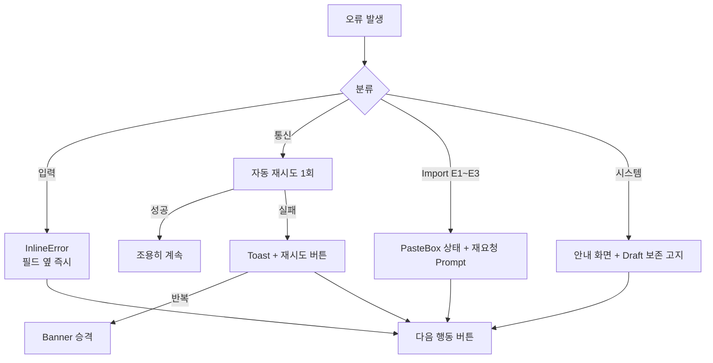

# Error Handling — 오류 UX 문법

> **문서 상태**: 📋 설계만 (v2.5 UI/UX Edition · 미구현)
> **관련 문서**: [COMPONENT_LIBRARY.md](COMPONENT_LIBRARY.md)(Toast·InlineError·Banner) · [AI_IMPORT_UX.md](AI_IMPORT_UX.md) · [OFFLINE_MODE.md](OFFLINE_MODE.md) · Architecture: [../AI_ARCHITECTURE.md](../AI_ARCHITECTURE.md) §4(E1~E3)
> **한 줄 목적**: 모든 오류가 같은 문법(무슨 일 + 왜 + 다음 행동)으로 말하게 하는 오류 UX 표준.

---

## 목차

1. [목적](#1-목적)
2. [책임 — 오류 분류](#2-책임--오류-분류)
3. [UX 원칙](#3-ux-원칙)
4. [사용자 흐름](#4-사용자-흐름)
5. [화면 구성](#5-화면-구성)
6. [확장성](#6-확장성)
7. [장점](#7-장점)
8. [단점](#8-단점)

---

## 1. 목적

오류는 제품이 사용자와 나누는 가장 중요한 대화다. 비개발자에게 오류 코드·기술 용어를 던지지 않고, **모든 오류 메시지가 3요소**(무슨 일이 났는지 / 내 데이터는 안전한지 / 지금 뭘 하면 되는지)를 갖추게 한다.

## 2. 책임 — 오류 분류

| 분류 | 예 | 표면(컴포넌트) | 데이터 안전 문구 |
|---|---|---|---|
| 입력 검증 | 필수 누락·형식 오류 | InlineError (필드 아래) | 불필요 (입력 유지 자명) |
| Import 계약 | E1(JSON 아님)·E2(봉투 위반)·E3(스키마 위반) | JsonPasteBox 내 상태 + 상세 | "붙여넣은 내용은 지워지지 않았어요" |
| 통신 | 저장 실패·시간 초과 | Toast(재시도 포함) → 반복 시 Banner | "입력은 이 기기에 저장되어 있어요" |
| 오프라인 | 네트워크 없음 | 상단 Banner (지속) — [OFFLINE_MODE.md](OFFLINE_MODE.md) | "계속 작성 가능 — 연결되면 자동 반영" |
| 권한 | 잠긴 양식·만료 세션 | 화면 내 안내 패널 | — + 요청/재로그인 경로 |
| 생성 실패 | 렌더러 오류·용량 초과 | 완료 화면 대신 실패 패널 | "입력과 Draft는 그대로예요" |
| 시스템 | 예기치 못한 오류 | 전용 안내 화면 | Draft 보존 안내 + 문의 경로 |

## 3. UX 원칙

| 원칙 | 반영 |
|---|---|
| 3요소 문법 | 무슨 일 + 데이터 안전 + 다음 행동 — 셋 중 하나라도 없으면 메시지 반려 |
| 사람 말 | "E2: envelope mismatch" ❌ → "AI 답변에서 필요한 정보가 빠졌어요" ✅ (등급 코드는 상세 접이식에) |
| 비난 금지 | "잘못 입력하셨습니다" ❌ → "날짜 형식을 이렇게 적어주세요: 2026-07-11" ✅ |
| 다음 행동은 버튼 | 안내로 끝내지 않는다 — [다시 시도]·[재요청 Prompt 복사]·[이어서 작성] |
| 조용한 복구 우선 | 자동 재시도로 해결되면 사용자에게 알리지 않는다 (P6) |

## 4. 사용자 흐름

대표: Import 오류 회복 (가장 빈번한 실질 오류)

```
JSON 붙여넣기 → 검증 실패 (E1: AI가 설명을 섞음)
  ↓
JsonPasteBox 상태: ✗ "AI가 JSON 외의 설명을 함께 보냈어요"
  + "붙여넣은 내용은 그대로 있어요"
  + [재요청 Prompt 복사] ← 교정 지시 포함 (../PROMPT_ENGINE.md §2 reissue)
  + ▸ 자세히 (E1 · 원문 일부 표시)
  ↓ 사용자: 재요청 Prompt를 AI에 → 새 응답 붙여넣기 → 통과
```



## 5. 화면 구성

### 메시지 템플릿 (전 오류 공통)

```
┌──────────────────────────────────────┐
│ (아이콘)  무슨 일이 났는지 — 한 문장     │
│          내 데이터 안전 — 한 문장       │
│          [다음 행동 버튼]  ▸ 자세히     │
└──────────────────────────────────────┘
```

### 표면별 규칙

| 표면 | 지속성 | 용도 |
|---|---|---|
| InlineError | 수정 시까지 | 필드 검증 — blur 시 표시, 입력 재개 시 완화 |
| Toast | 5초 (행동 버튼 있으면 8초) | 일시 실패·복구 완료 알림 |
| Banner | 조건 해소까지 | 오프라인·반복 실패·세션 경고 — 화면 최상단 1개만 |
| 패널/화면 | 사용자 해소까지 | 생성 실패·권한·시스템 — 콘텐츠 영역 대체 |

접근성: 오류 표시는 색+아이콘+텍스트 3중 · aria-live 낭독 ([ACCESSIBILITY.md](ACCESSIBILITY.md) §5).

## 6. 확장성

- **새 오류 유형** = §2 분류표에 행 추가 + 3요소 문구 작성 — 표면 컴포넌트는 재사용.
- 오류 문구는 문구 테이블(데이터)로 관리 — 다국어·톤 수정이 코드 무관 ([UI_SPEC.md](UI_SPEC.md) §6).
- 반복 오류 통계는 차기 Admin 홈 "오류" 카드의 데이터 소스 📋 ([ADMIN_UX.md](ADMIN_UX.md) §5).

## 7. 장점

1. **신뢰 보존** — "데이터 안전" 문구가 오류 순간의 공포(다 날아갔나)를 제거한다.
2. **일관 문법** — 사용자는 오류 읽는 법을 한 번만 배운다.
3. **Import 실패의 생산화** — 가장 흔한 실패(E1)가 재요청 Prompt라는 전진 행동으로 바뀐다.

## 8. 단점

1. **문구 품질 의존** — 문법이 좋아도 번역투 문구면 무용. (→ 문구 테이블 리뷰를 완료 조건에 포함, [IMPLEMENTATION_PLAN.md](IMPLEMENTATION_PLAN.md))
2. **조용한 복구의 불투명성** — 자동 해결을 숨기면 문제 빈도를 사용자가 모른다. (→ 관리자용 오류 통계로 가시화 — 사용자 표면만 조용)
3. **Banner 단일 슬롯 경쟁** — 오프라인+세션 경고 동시 발생 시 우선순위 필요. (→ 우선순위: 데이터 위험 > 오프라인 > 안내)
