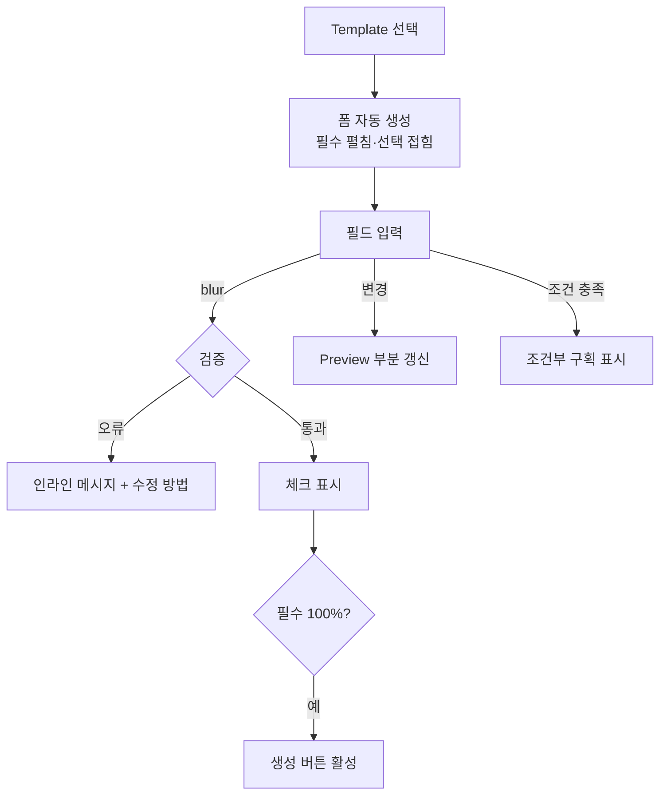

# Form Guide — Form Generator 입력 UX

> **문서 상태**: 📋 설계만 (v2.5 UI/UX Edition · 미구현)
> **관련 문서**: [PREVIEW_SYSTEM.md](PREVIEW_SYSTEM.md) · [COMPONENT_LIBRARY.md](COMPONENT_LIBRARY.md) · v1: [../../JSON_SCHEMA.md](../../JSON_SCHEMA.md)(inputs 스키마) · [ERROR_HANDLING.md](ERROR_HANDLING.md)
> **한 줄 목적**: 문서를 선택하면 자동 생성되는 입력 화면의 UX — 14종 입력 타입·조건부 입력·검증 표시를 확정한다.

---

## 목차

1. [목적](#1-목적)
2. [책임 — 입력 타입 14종](#2-책임--입력-타입-14종)
3. [UX 원칙](#3-ux-원칙)
4. [사용자 흐름](#4-사용자-흐름)
5. [화면 구성](#5-화면-구성)
6. [확장성](#6-확장성)
7. [장점](#7-장점)
8. [단점](#8-단점)

---

## 1. 목적

사용자는 폼을 "만들지" 않는다 — Template의 inputs 스키마([../../JSON_SCHEMA.md](../../JSON_SCHEMA.md))가 입력 화면을 **자동 생성**한다. 본 문서는 그 자동 생성 결과가 어떤 모습·행동이어야 하는지를 정의한다.

## 2. 책임 — 입력 타입 14종

| # | 타입 | UI 부품 | UX 특기사항 |
|---|---|---|---|
| 1 | Text | TextField | 예시값(placeholder)은 실제 회사 예시 — Company Memory 제안 연동 |
| 2 | Number | NumberField | 단위 표시(건·원·%) · 천단위 자동 구분 |
| 3 | Date | DateField | 달력 + 직접 입력 병행 · "오늘/이번 주" 지름길 |
| 4 | Textarea | TextArea | 자동 높이 · 자주 쓰는 문장 제안(Memory) |
| 5 | Table | TableInput | 행 추가/삭제/복제 · 열은 스키마 고정 · 모바일은 카드형 행 |
| 6 | Image | FileDrop(이미지) | 드래그·카메라(모바일) · 자동 리사이즈 안내 |
| 7 | Signature | SignaturePad | 터치/마우스 서명 · 지우고 다시 |
| 8 | Checkbox | Checkbox | 복수 선택 명시 |
| 9 | Radio | Radio | 4개 이하 — 많으면 Select로 자동 전환 |
| 10 | Select | Select | 검색 가능(KB 용어 연동) |
| 11 | File Upload | FileDrop | 형식·크기 제한 사전 표시 |
| 12 | Repeat Block | RepeatBlock | 묶음 반복(예: 방문처 N곳) — 접이식 + "복제" |
| 13 | Dynamic Section | Accordion 그룹 | 스키마가 정의한 구획 동적 표시 |
| 14 | 조건부 입력 | (조합 규칙) | 조건 충족 시에만 표시 — 아래 §4 |

## 3. UX 원칙

| 원칙 | 반영 |
|---|---|
| 필수 먼저, 선택은 접어서 | 첫 화면엔 필수 항목만 — 선택 항목은 "추가 정보" 접이식 (P1) |
| 즉시 검증, 나중에 벌주지 않기 | 필드 이탈 시 검증 — 제출 시 한꺼번에 오류 폭탄 금지 ([ERROR_HANDLING.md](ERROR_HANDLING.md) §3) |
| 입력은 기억된다 | 모든 타이핑은 Draft 자동 저장 (P5·P6) — "저장 버튼" 없음 |
| 회사가 도와준다 | 예시값·문장 제안·용어 자동 표준화 제안은 회사 학습 결과 (P4 — "AI" 언급 없이) |

## 4. 사용자 흐름

```
Template 선택
  ↓ inputs 스키마 로드
폼 자동 생성: 필수 그룹(펼침) + 선택 그룹(접힘)
  ↓ 입력 (필드마다)
  ├─ 이탈 시 검증 → 인라인 오류/통과
  ├─ 값 변경 → Preview 부분 갱신 (PREVIEW_SYSTEM.md §4)
  ├─ Memory 제안 있으면 → 필드 아래 제안 칩 (탭하면 채움)
  └─ 조건부: [출장 여부=예] → 출장 구획 표시
  ↓ 필수 완료 시 [생성] 활성 + 진행률 100%
생성 → 완료 화면
```



## 5. 화면 구성

```
┌─ 폼 패널 (좌) ──────────────┬─ Preview (우) ─────────┐
│ 주간보고 · 7/2주차     72% ▓▓▓░ │                        │
│ ─ 기본 정보 ─────────────    │   (PREVIEW_SYSTEM.md)   │
│ 보고자*   [김기사      ] ✓   │                        │
│ 기간*     [7/6–7/12  📅] ✓   │                        │
│ ─ 실적 ─────────────────    │                        │
│ 처리 건수* [ 24 ] 건    ✓   │                        │
│ 주요 내용* [________]        │                        │
│   💡 "N-care 정기점검 완료…" ← Memory 제안 칩          │
│ ▸ 추가 정보 (선택 5개) 접힘   │                        │
│                    [생성 ▾]  │                        │
└─────────────────────────────┴────────────────────────┘
```

| 요소 | 규칙 |
|---|---|
| 진행률 | 필수 항목 기준 % — 심리적 완주 유도 |
| 필수 표시 | `*` + 미완료 시 그룹 헤더에 잔여 수 |
| 제안 칩 | 최대 2개 · 탭=채움 · 무시하면 다시 안 밀어붙임 |
| 생성 버튼 | SplitButton — 기본 형식 + ▾로 PPT/Excel/PDF 선택 |
| 모바일 | 폼 단독 화면 + [미리보기] 탭 전환 ([RESPONSIVE_GUIDE.md](RESPONSIVE_GUIDE.md) §5) |

## 6. 확장성

- **새 입력 타입** = 부품 1개 + 스키마 타입 등록 — 폼 생성기 구조 불변 (v1 사상: 데이터가 화면을 만든다).
- 조건부 입력의 조건 문법은 v1 Validation 문법을 재사용 ([../../VALIDATION_SPEC.md](../../VALIDATION_SPEC.md)) — 새 문법 발명 금지.
- 제안 칩의 공급원은 Memory 외에 Rule 제안([../RULE_ENGINE.md](../RULE_ENGINE.md) suggest)도 동일 UI로 수용.

## 7. 장점

1. **폼 제작 비용 0** — 관리자가 Template만 등록하면 입력 화면이 따라온다.
2. **입력 부담 최소** — 필수 우선·예시값·제안 칩·자동 저장이 "빈 문서 공포"를 제거.
3. **일관 검증 경험** — 14종 전 타입이 같은 검증·오류 문법을 쓴다.

## 8. 단점

1. **자동 생성 폼의 밋밋함** — 특수 양식의 미묘한 배치 요구를 못 담을 수 있다. (→ Dynamic Section으로 구획 수준까지만 대응 — 그 이상은 Template 설계 문제)
2. **제안 칩 오답 위험** — 잘못된 제안은 신뢰를 깎는다. (→ 채택률 낮은 제안 자동 중단, [../COMPANY_MEMORY.md](../COMPANY_MEMORY.md) §4)
3. **긴 폼 피로** — 항목 30+개 양식은 여전히 길다. (→ 구획 접이식 + 진행률 + Draft로 분할 작성 지원)
