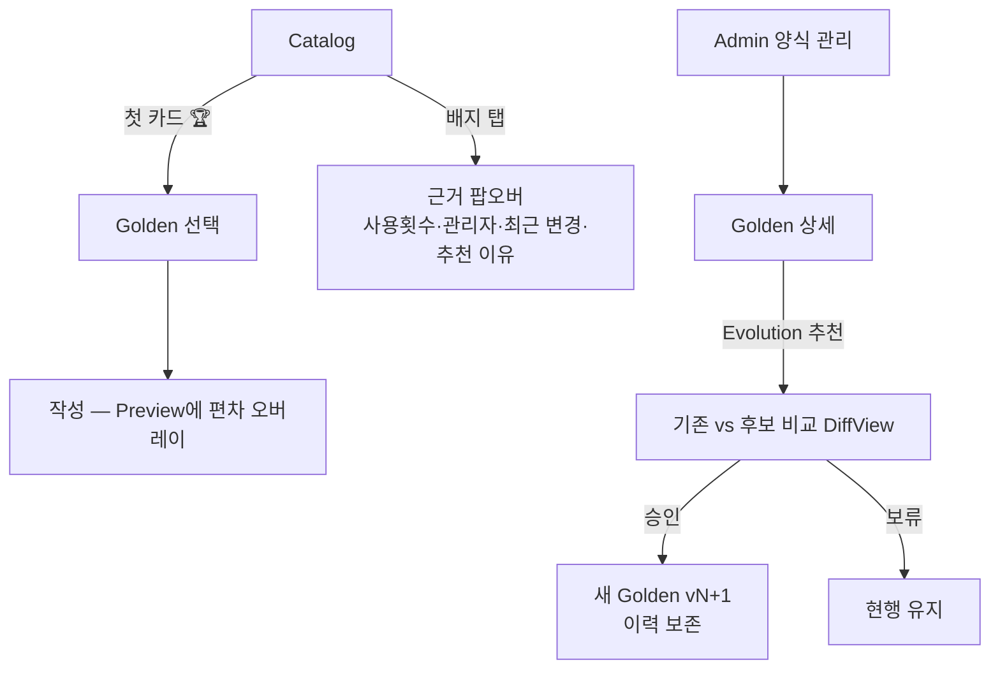

# Golden Template UX — 기준 양식의 표면화

> **문서 상태**: 📋 설계만 (v2.5 UI/UX Edition · 미구현)
> **관련 문서**: Architecture: [../GOLDEN_TEMPLATE.md](../GOLDEN_TEMPLATE.md) · [SCREEN_STRUCTURE.md](SCREEN_STRUCTURE.md)(Catalog) · [ADMIN_UX.md](ADMIN_UX.md) · [PREVIEW_SYSTEM.md](PREVIEW_SYSTEM.md)
> **한 줄 목적**: Golden Template를 카탈로그·에디터·관리 화면에서 어떻게 보여주고(항상 첫 번째), 어떤 정보를 노출하는지 확정한다.

---

## 목차

1. [목적](#1-목적)
2. [책임](#2-책임)
3. [UX 원칙](#3-ux-원칙)
4. [사용자 흐름](#4-사용자-흐름)
5. [화면 구성](#5-화면-구성)
6. [확장성](#6-확장성)
7. [장점](#7-장점)
8. [단점](#8-단점)

---

## 1. 목적

Golden Template([../GOLDEN_TEMPLATE.md](../GOLDEN_TEMPLATE.md))는 회사 문서의 기준이다. UX 관점에서 Golden은 **"뭘 고를지 고민을 끝내주는 기본값"** 이다 — 사용자가 매번 판단하지 않게 한다.

## 2. 책임

| 책임 | 설명 |
|---|---|
| 우선 노출 | Golden은 **항상 첫 번째** — Catalog 카테고리 내 첫 카드, 검색 결과 최상단, Dashboard 추천 |
| 정보 노출 | Golden 여부(🏆) · 버전 · 추천 이유 · 사용 횟수 · 관리자 · 최근 변경 — 카드/상세 2단 노출 |
| 신뢰 표면 | "왜 이게 기준인가"를 답하는 상세 팝오버 (Lab 실험·승인 이력 요약) |
| 편차 표면 | 작성 중 Golden 편차는 Preview 오버레이 담당 ([PREVIEW_SYSTEM.md](PREVIEW_SYSTEM.md) §5) |
| Evolution 표면 | "더 나은 구조 추천"은 **관리자에게만** — 일반 사용자를 개선 논쟁에 끌어들이지 않는다 |
| 하지 않는 것 | Golden 지정·교체 로직(→ Architecture + [ADMIN_UX.md](ADMIN_UX.md)), 비Golden 숨김(선택지는 유지) |

## 3. UX 원칙

| 원칙 | 반영 |
|---|---|
| 기본값의 힘 | 첫 번째 자리 + "회사 표준" 언어 — 고민 없이 이걸 쓰면 된다 |
| 색 아닌 다중 신호 | 🏆 아이콘 + "표준" 라벨 + 전용 색 — 색맹 대응 ([ACCESSIBILITY.md](ACCESSIBILITY.md) §5) |
| 권위에는 근거 | 배지를 탭하면 근거(사용 횟수·승인자·실험 결과)가 나온다 — 맹목적 권위 금지 |
| 기준은 조용히 진화 | Evolution 알림은 관리 영역에만 — 사용자 화면은 항상 확정된 현재 기준만 |

## 4. 사용자 흐름

```
[사용자]
Catalog 진입 → 카테고리 첫 카드 = 🏆 Golden → 선택(고민 없음) → 작성
   └─ 배지 탭 → 팝오버: "회사 표준 · v4 · 128회 사용 · 품질팀 관리 · 6/20 갱신"

[관리자]
Admin → 양식 관리 → Golden 상세
   ├─ Evolution 추천 도착: "새 구조 후보 — 채택률 +23%" → 비교 화면(DiffView) → 승인/보류
   └─ Golden 교체 승인 시: 새 버전 반영 + 이전 버전 이력 유지
```



## 5. 화면 구성

### Catalog 카드 (Golden 변형)

```
┌────────────────┐
│ [썸네일]        │   비Golden 카드와의 차이:
│ 🏆 주간보고      │   · 🏆 + "회사 표준" 라벨
│ 회사 표준 · v4   │   · 카테고리 첫 위치 고정
│ ★128 · PPT/PDF │   · 테두리 --ui-golden 포인트
└────────────────┘
```

### 근거 팝오버 (배지 탭)

| 항목 | 예시 표기 |
|---|---|
| Golden 여부·버전 | 회사 표준 · v4 (2026-06-20 지정) |
| 추천 이유 | "품질팀 검증 — 최근 실험에서 채택률 최고" |
| 사용 횟수 | 128회 (최근 30일 41회) |
| 관리자 | 품질팀 이관리 |
| 최근 변경 | 6/20 — 요약 구획 순서 변경 |
| (관리자에게만) | 버전 이력 보기 · Evolution 추천 1건 |

### 관리자 비교 화면

```
┌─ Golden 교체 검토 ────────────────────────────┐
│  현행 v4              │  후보 (Evolution)      │
│  [미리보기]            │  [미리보기]            │
│  채택률 71%           │  채택률 94% (근거 보기) │
│         [보류]  [후보를 새 표준으로 (승인 절차)] │
└───────────────────────────────────────────────┘
```

## 6. 확장성

- Golden Prompt 정보(연결된 기준 Prompt)는 관리자 상세에만 — 사용자 표면 불필요 ([../GOLDEN_TEMPLATE.md](../GOLDEN_TEMPLATE.md) §1).
- Golden Score 상세 리포트 화면은 MVP에선 Preview 오버레이 + 총점 배지까지, 전체 리포트는 차기 📋.
- 문서 종류별 Golden이 없는 경우: 첫 자리는 "가장 많이 쓰는 양식"이 대신 — 자리 규칙은 불변.

## 7. 장점

1. **선택 마비 제거** — 카탈로그의 첫 번째 = 회사가 정한 답.
2. **권위의 투명성** — 근거 팝오버가 "왜"에 즉답해 기준에 대한 신뢰를 만든다.
3. **사용자·관리자 표면 분리** — 진화 논쟁은 관리 영역에, 사용자에겐 안정된 기준만.

## 8. 단점

1. **첫 자리 고정의 경직** — 특수 상황(임시 양식 캠페인)에서 유연성이 없다. (→ 공지 구획으로 우회 — 자리 규칙은 지킨다)
2. **근거 데이터 초기 빈약** — 도입 초기엔 사용 횟수·실험 근거가 없다. (→ "관리자 지정 표준" 문구로 시작, 데이터 축적 시 자동 풍부화)
3. **🏆 남용 위험** — 관리자가 모든 양식을 Golden으로 지정하면 의미가 죽는다. (→ 문서 종류당 1개 원칙은 아키텍처가 강제)
