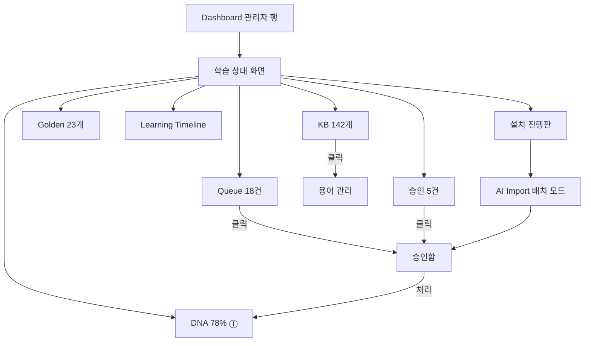

# Learning Mode UX — 학습 상태의 시각화

> **문서 상태**: 📋 설계만 (v2.5 UI/UX Edition · 미구현)
> **관련 문서**: Architecture: [../LEARNING_ENGINE.md](../LEARNING_ENGINE.md) · [../CONFIDENCE_ENGINE.md](../CONFIDENCE_ENGINE.md) · [ADMIN_UX.md](ADMIN_UX.md) · [AI_IMPORT_UX.md](AI_IMPORT_UX.md)
> **한 줄 목적**: "AutoDoc이 회사를 얼마나 배웠는가"를 관리자가 한눈에 보는 학습 상태 화면과, 최초 설치(Company Learning Mode)의 진행 UX를 설계한다.

---

## 목차

1. [목적](#1-목적)
2. [책임](#2-책임)
3. [UX 원칙](#3-ux-원칙)
4. [사용자 흐름](#4-사용자-흐름)
5. [화면 구성](#5-화면-구성)
6. [확장성](#6-확장성)
7. [장점](#7-장점)
8. [단점](#8-단점)

---

## 1. 목적

학습은 눈에 안 보이면 없는 것과 같다. 관리자에게 두 가지를 시각화한다:

1. **현재 상태** — 얼마나 배웠고, 무엇이 대기 중인가 (상시 대시보드)
2. **최초 설치 진행** — 문서 50~500개 학습 캠페인의 진행판 (일회성·장기)

대상은 **관리자 전용**이다 — 일반 사용자는 학습을 결과("회사 표준 반영")로만 만난다 (P4).

## 2. 책임

| 책임 | 설명 |
|---|---|
| 상태 지표 | Company DNA 충실도 · KB 용어 수 · Golden Template 수 · Learning Queue · 승인 대기 (예: 78% / 142개 / 23개 / 18건 / 5건) |
| 추이 표시 | 지표의 시간 추이 (학습이 "진행되고 있음"의 증거) |
| 대기 연결 | 모든 대기 지표는 클릭 = 해당 처리 화면 직행 (보여주고 끝나지 않는다) |
| 설치 진행판 | 업로드 문서 목록 × 단계 상태(대기/Prompt/붙여넣기 대기/분석/승인 대기/완료) |
| Timeline | 큰 변화(마일스톤) 목록 — [../LEARNING_ENGINE.md](../LEARNING_ENGINE.md) §5 Learning Timeline의 표면 |
| 하지 않는 것 | 학습 로직·신뢰도 계산(아키텍처 소관), 일반 사용자 노출 |

## 3. UX 원칙

| 원칙 | 반영 |
|---|---|
| 숫자에는 문 | 모든 지표는 행동으로 이어진다 — "대기 18건" 클릭 = 처리 화면 |
| 진행감 | 설치 캠페인은 %와 남은 개수 — 끝이 보이는 일로 만든다 |
| 정직한 지표 | DNA 78%는 "구획별 신뢰도의 가중 평균" — 지표 옆 ⓘ에 산정 방식 명시. 부풀린 게이지 금지 |
| 위임 가능 | 진행판은 인쇄·공유 가능한 형태 — 학습 작업을 팀에 나눌 수 있게 |

## 4. 사용자 흐름

```
[상시] Dashboard 관리자 행 요약 → 학습 상태 화면
   ├─ 지표 카드 클릭 → 상세 (KB → 용어 목록 / 승인 대기 → 승인함)
   └─ Timeline → 마일스톤·복원은 Admin 심화

[최초 설치 캠페인]
설치 시작 → 문서 일괄 업로드 (50~500개)
   ↓ 진행판 생성 — 문서별 단계 추적
   ↓ 관리자(들): AI Import 마법사 배치 모드로 순차 처리 (AI_IMPORT_UX.md §5)
   ↓ 승인함에서 학습 제안 처리 (묶음 승인)
   ↓ 지표 상승 가시화 — "DNA 12% → 78%"
완료 선언: 요약 리포트 (배운 것 하이라이트)
```



## 5. 화면 구성

### 학습 상태 (상시)

```
┌─ 학습 상태 ──────────────────────────────────────────────┐
│ ┌─────────┐ ┌─────────┐ ┌─────────┐ ┌─────────┐ ┌───────┐│
│ │Company  │ │Knowledge│ │Golden   │ │Learning │ │승인    ││
│ │DNA      │ │Base     │ │Template │ │Queue    │ │대기    ││
│ │  78% ⓘ  │ │ 142개 ↗ │ │  23개   │ │  18건 → │ │ 5건 → ││
│ └─────────┘ └─────────┘ └─────────┘ └─────────┘ └───────┘│
│ 추이 (최근 90일): DNA ▁▂▄▅▆▇  KB ▁▃▄▆▇█                  │
│ ─ Learning Timeline ─────────────────────────────────────│
│  2026-07  보고서 구조 변경 (마일스톤) · v19               │
│  2026-03  최초 학습 완료 — 문서 312개 · v1~v18            │
└──────────────────────────────────────────────────────────┘
```

### 설치 진행판 (캠페인)

```
┌─ 회사 학습 캠페인 — 312/500 완료 (62%) ▓▓▓▓▓▓░░░ ─────────┐
│ 문서              단계                        담당          │
│ 주간보고_6월.pptx  ✅ 완료                     이관리        │
│ VOC_상반기.xlsx   ⏸ 붙여넣기 대기 [이어서 →]   김품질        │
│ SOP-활성탱크.docx ▫ 대기       [시작 →]        —            │
│  … 필터: 전체 / 내 담당 / 막힌 항목                          │
└─────────────────────────────────────────────────────────────┘
```

지표 카드 상태색: 정상(중립) / 대기 누적(warning) — 위기감이 아니라 할 일 신호 ([DESIGN_SYSTEM.md](DESIGN_SYSTEM.md) 상태색).

## 6. 확장성

- **지표 추가**(예: Graph 엣지 수 — MVP 제외 기능 활성 시) = 카드 1장 추가 — 레이아웃 그리드가 수용.
- 진행판은 캠페인 단위 반복 사용 가능 (연 1회 재학습 캠페인 등).
- Timeline 복원 행동은 MVP에선 표시만, 복원 실행은 차기 📋 (파괴적 작업의 신중 도입).

## 7. 장점

1. **투자의 가시화** — 학습 노력(수백 건 승인)이 오르는 지표로 보상된다.
2. **막힌 곳 즉시 발견** — 진행판의 "붙여넣기 대기"가 캠페인 정체 지점을 드러낸다.
3. **행동 연결형 대시보드** — 보기용이 아니라 처리용 — 지표에서 두 클릭 안에 일이 끝난다.

## 8. 단점

1. **DNA % 산정의 자의성** — 단일 숫자는 필연적으로 단순화다. (→ ⓘ 산정 방식 공개 + 구획별 상세로 보완)
2. **캠페인 장기화 피로** — 500개 문서는 몇 주 작업이다. (→ 담당 분배·필터·일일 목표 표시로 분할)
3. **관리자 외 비가시** — 경영진이 학습 성과를 보고 싶어할 수 있다. (→ 요약 리포트 내보내기로 대응 — 화면 권한은 유지)
