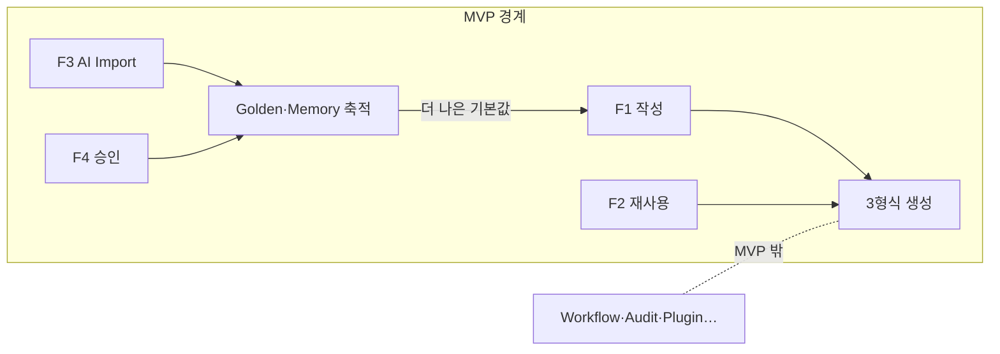

# MVP Scope — MVP 범위 확정

> **문서 상태**: 📋 설계만 (v2.5 UI/UX Edition · 미구현)
> **관련 문서**: [IMPLEMENTATION_PLAN.md](IMPLEMENTATION_PLAN.md) · [SCREEN_STRUCTURE.md](SCREEN_STRUCTURE.md) · Architecture: [../ROADMAP.md](../ROADMAP.md)(S0~S7)
> **한 줄 목적**: MVP에 들어가는 것과 들어가지 않는 것을 표로 확정한다 — 범위 논쟁의 단일 기준.

---

## 목차

1. [목적](#1-목적)
2. [책임 — 포함/제외 확정표](#2-책임--포함제외-확정표)
3. [UX 원칙](#3-ux-원칙)
4. [사용자 흐름 — MVP 완결 여정](#4-사용자-흐름--mvp-완결-여정)
5. [화면 구성 — MVP 화면 세트](#5-화면-구성--mvp-화면-세트)
6. [확장성](#6-확장성)
7. [장점](#7-장점)
8. [단점](#8-단점)

---

## 1. 목적

MVP의 정의: **"현장 직원이 매일 문서를 만들고, 관리자가 AI Import로 회사 양식·기억을 축적할 수 있는 최소 완결 제품."** 이 문장으로 판정되지 않는 기능은 제외다.

## 2. 책임 — 포함/제외 확정표

### MVP 포함

| 기능 | 범위 주석 | 상세 문서 |
|---|---|---|
| Dashboard | 전 구획 (관리자 행 포함) | [SCREEN_STRUCTURE.md](SCREEN_STRUCTURE.md) §5 |
| Template Catalog | 카드·검색·즐겨찾기·권한·Golden·버전 표시 | 〃 |
| Form Generator | 입력 14종 전부 + 조건부 | [FORM_GUIDE.md](FORM_GUIDE.md) |
| Preview | 실시간·페이지·오버레이(Golden 편차·넘침) | [PREVIEW_SYSTEM.md](PREVIEW_SYSTEM.md) |
| PPT 생성 · Excel 생성 · PDF 생성 | v1 렌더러 재사용 (Word는 렌더러 존재하나 MVP 노출 형식은 3종) | v1 [../../RENDERER_SPEC.md](../../RENDERER_SPEC.md) |
| Golden Template | 배지·첫 자리·근거 팝오버·관리자 지정 | [GOLDEN_TEMPLATE_UX.md](GOLDEN_TEMPLATE_UX.md) |
| Company Memory | 제안 칩(문장·표) + 후보 승인 | [FORM_GUIDE.md](FORM_GUIDE.md) §5 · [../COMPANY_MEMORY.md](../COMPANY_MEMORY.md) |
| Prompt Import (Prompt 생성·복사) | 마법사 ①~③ | [AI_IMPORT_UX.md](AI_IMPORT_UX.md) |
| AI JSON Import (붙여넣기·검증·결과 확인) | 마법사 ④~⑦ + E1~E3 오류 UX | 〃 · [ERROR_HANDLING.md](ERROR_HANDLING.md) |
| (지원 요소) 승인함·학습 상태·내 문서·설정(부분)·오프라인 작성·Editor(부분) | 위 기능의 완결에 필요한 최소 | 각 문서 MVP 주석 |

### MVP 제외

| 제외 기능 | 제외 근거 | 복귀 시점 |
|---|---|---|
| Workflow | 생성까지가 MVP — 결재는 후속 | [../ROADMAP.md](../ROADMAP.md) S6 |
| Ontology · Knowledge Graph | KB(용어 목록)로 MVP 학습 충분 | S5 |
| Replay · Audit | 이벤트 기록 구조만 남기고 화면 없음 | S6 |
| Plugin (AI API 포함) | Import Mode가 MVP의 AI 경로 | S7 |
| Feature Flag (관리 화면) | MVP는 코드 상수 수준 토글로 갈음 | S1 완성분 활용 |
| Multi Workspace | 단일 회사로 시작 | 필요 시 |
| ERP · MES · SAP | Plugin 전제 | S7 |

## 3. UX 원칙

| 원칙 | MVP 적용 |
|---|---|
| 완결 우선 | 기능 수보다 여정 완결 — F1·F2·F3이 끊김 없이 끝나야 MVP |
| 자리 예약, 노출 금지 | 제외 기능의 메뉴·버튼을 미리 보여주지 않는다 ([UI_SPEC.md](UI_SPEC.md) §6) |
| 품질 하한 유지 | 접근성·오류 문법·반응형 3단은 MVP에서도 컷 대상이 아니다 (하한이지 기능이 아님) |

## 4. 사용자 흐름 — MVP 완결 여정

```
MVP가 보장하는 여정 (모두 끝까지):
F1 첫 문서 작성  : Dashboard → Catalog → Form ⇄ Preview → PPT/Excel/PDF 생성 → 다운로드
F2 재사용 작성   : Dashboard 1클릭 → 작성 (+Memory 제안 칩)
F3 AI Import    : 업로드 → Prompt 복사 → (외부 AI) → JSON 붙여넣기 → 결과 확인 → Golden 후보
F4 학습 승인     : 승인함 → 승인/수정/반려 (묶음 포함)
F5 열람·재출력   : 내 문서 → 재다운로드
```



핵심 루프: **작성(F1·F2) → 축적(F3·F4) → 더 나은 작성** — 이 루프가 돌면 MVP는 성립.

## 5. 화면 구성 — MVP 화면 세트

| 화면 | MVP 형태 | 전체 설계 대비 컷 |
|---|---|---|
| S1 Dashboard | 전체 | — |
| S2 Catalog | 전체 (썸네일은 정적 등록 이미지) | 자동 썸네일 생성 제외 |
| S3 Editor | 폼+Preview 전체 · 편집 모드는 Edit/Duplicate/Delete/Undo/Redo | Drag·Resize 후순위 ([EDITOR_SYSTEM.md](EDITOR_SYSTEM.md) §8) |
| S4 완료 / S5 내 문서 | 전체 | — |
| S6 Admin | 홈·승인함·학습 상태·양식 관리·용어 관리 | Rule·Workflow·Plugin·Audit 탭 없음 |
| S6-2 AI Import | 마법사 전체 + 배치 모드 | — |
| S7 Settings | 내 설정 전체 · 회사: WS 정보·권한 2등급·백업/복원/입출력 | Plugin·다중 WS 없음 |

## 6. 확장성

- 제외 기능 복귀 = §2 표의 "복귀 시점"에 따라 화면 추가 — MVP 화면의 구조 변경 없음이 각 문서에서 보장됨 (자리 예약 원칙).
- MVP 범위 변경은 본 문서 개정으로만 — 구두 합의 금지 (단일 기준 유지).

## 7. 장점

1. **논쟁 종결 장치** — "그거 MVP인가요?"의 답이 항상 이 표에 있다.
2. **완결 루프** — 작게 시작해도 학습 루프가 돌아 제품 가치가 자란다.
3. **아키텍처 정합** — 제외 목록이 [../ROADMAP.md](../ROADMAP.md) 단계와 1:1 — 버려진 게 아니라 예정된 것.

## 8. 단점

1. **Editor 부분 컷의 아쉬움** — Drag·Resize 없는 편집은 반쪽으로 느껴질 수 있다. (→ Edit·복제·삭제만으로 실사용 80% 커버 가정 — 파일럿에서 검증)
2. **Feature Flag 없는 토글** — MVP의 상수 토글은 운영 유연성이 없다. (→ 단일 Workspace라 실해 적음)
3. **Word 생성 미노출** — v1에 렌더러가 있는데 노출 안 하는 결정은 혼란 소지. (→ 형식 추가는 노출 토글 수준 — 파일럿 수요 시 즉시 개방)
