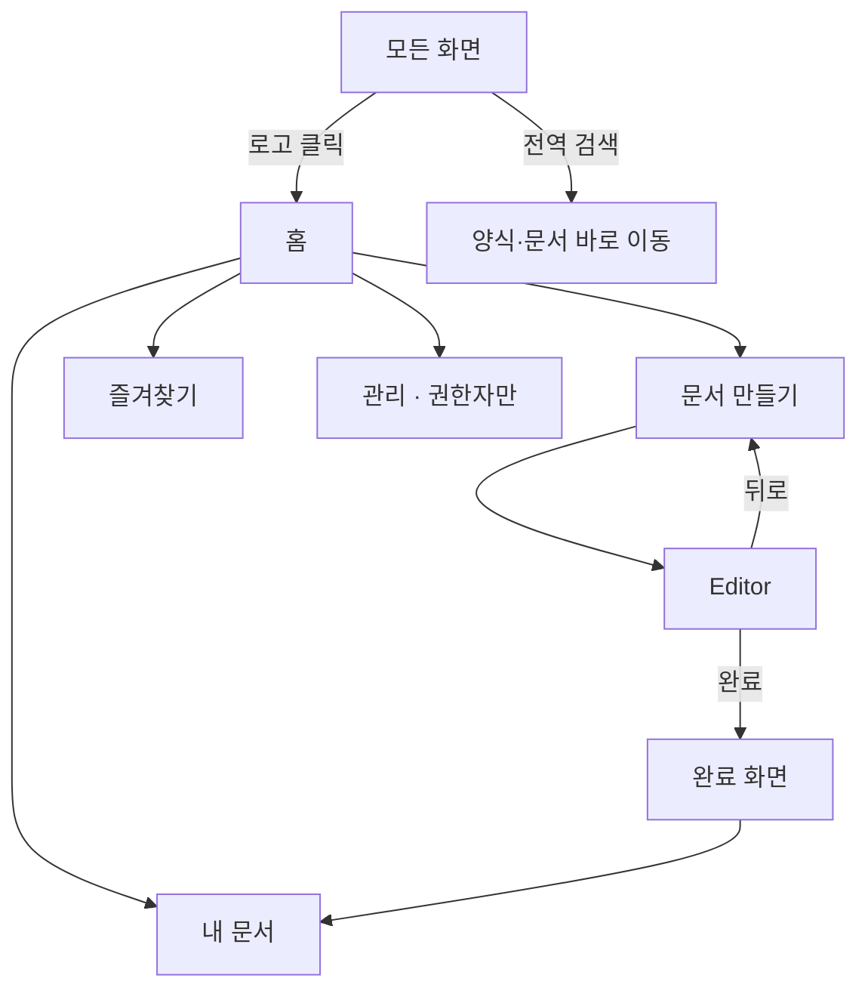

# Navigation — 이동 구조 · 정보 구조(IA)

> **문서 상태**: 📋 설계만 (v2.5 UI/UX Edition · 미구현)
> **관련 문서**: [SCREEN_STRUCTURE.md](SCREEN_STRUCTURE.md) · [UI_SPEC.md](UI_SPEC.md) · [RESPONSIVE_GUIDE.md](RESPONSIVE_GUIDE.md)
> **한 줄 목적**: 5개 이하의 1차 메뉴, 예측 가능한 뒤로 가기, 권한별 메뉴 노출 규칙을 확정한다.

---

## 목차

1. [목적](#1-목적)
2. [책임](#2-책임)
3. [UX 원칙](#3-ux-원칙)
4. [사용자 흐름](#4-사용자-흐름)
5. [화면 구성](#5-화면-구성)
6. [확장성](#6-확장성)
7. [장점](#7-장점)
8. [단점](#8-단점)

---

## 1. 목적

비개발자 사용자는 메뉴를 "학습"하지 않는다. **어디에 있든 3가지를 즉시 알 수 있어야 한다**: 내가 어디에 있는지, 어떻게 시작 화면으로 돌아가는지, 다음에 무엇을 누르는지.

## 2. 책임

### 정보 구조 (IA)

```
홈(S1)
문서 만들기(S2 Catalog) ── S3 Editor ── S4 완료
내 문서(S5) ── 문서 상세 ── 재다운로드·복제
즐겨찾기 (S2의 필터 뷰)
관리 (관리자만)
 ├─ 승인함(S6-3)
 ├─ 학습 상태(S6-4)
 ├─ 양식 관리 / AI로 양식 가져오기(S6-2)
 └─ 설정(S7 — 관리 항목)
설정(S7 — 개인 항목: 테마·언어)
```

| 규칙 | 내용 |
|---|---|
| 1차 메뉴 | 최대 5개: 홈 · 문서 만들기 · 내 문서 · 즐겨찾기 · 관리(권한) |
| 깊이 | 어떤 화면도 홈에서 3단계 이내 |
| 권한 노출 | 권한 없는 1차 메뉴는 **미노출** (Catalog의 잠긴 카드와 달리, 메뉴는 숨김 — 관리 기능은 존재 인지 불필요) |
| 현재 위치 | Side Nav 활성 표시 + 브레드크럼(2단계 이상 화면) |

## 3. UX 원칙

| 원칙 | 반영 |
|---|---|
| 예측 가능한 뒤로 가기 | 브라우저 뒤로 = 화면 이동 취소, **입력값은 보존**(Draft) — 데이터 손실 없는 뒤로 가기 (P5) |
| 작성 중 보호 | S3에서 이탈 시 자동 저장 후 이동 — 차단 모달 금지(P6), 대신 상태바 "저장됨 ✓" |
| 어휘 | 시스템 용어 금지 — "Template Catalog"가 아니라 "문서 만들기" |
| 단축 진입 | 전역 검색(Top Bar)은 양식·내 문서를 한 입력으로 — 메뉴 트리를 몰라도 도달 가능 |

## 4. 사용자 흐름



브레드크럼 예: `관리 › 승인함 › 항목 상세`, `문서 만들기 › 주간보고 (작성 중)`.

## 5. 화면 구성

### Desktop — 고정 Side Nav (아이콘+라벨)

```
┌────┬──────────────
│ ⌂  │ 홈
│ ＋ │ 문서 만들기      ← 강조 스타일 (1차 CTA와 동일 색)
│ 🗂 │ 내 문서
│ ★  │ 즐겨찾기
│ ⚙  │ 관리 (권한자)
└────┴──────────────
```

### Tablet — 접힌 레일(아이콘) / Mobile — 하단 탭 바

```
Mobile 하단 탭:  [⌂ 홈] [＋ 만들기] [🗂 내 문서] [☰ 더보기(즐겨찾기·관리·설정)]
```

| 브레이크포인트별 | 형태 | 근거 |
|---|---|---|
| Desktop ≥1024 | 좌측 고정 Nav + 브레드크럼 | 상시 위치 감각 |
| Tablet 600~1023 | 아이콘 레일(탭하면 라벨 확장) | 콘텐츠 폭 확보 |
| Mobile <600 | 하단 탭 4개 + 더보기 | 엄지 도달 범위 ([RESPONSIVE_GUIDE.md](RESPONSIVE_GUIDE.md)) |

키보드: `Alt+1~5` 1차 메뉴, `/` 전역 검색 포커스 ([ACCESSIBILITY.md](ACCESSIBILITY.md) §4).

## 6. 확장성

- MVP 제외 기능이 켜질 때: 1차 메뉴는 늘리지 않고 **관리 하위** 또는 기존 화면의 탭으로 수용 (Workflow → 내 문서의 "결재 중" 탭 📋).
- 다국어: 메뉴 라벨은 문구 테이블 참조 ([SETTINGS_UX.md](SETTINGS_UX.md) Language).
- Workspace 다중화 시 Top Bar에 Workspace 전환기 추가 자리 예약 (MVP 제외).

## 7. 장점

1. **얕고 좁은 트리** — 5개 메뉴·3단계 깊이는 교육 없이 체득된다.
2. **손실 없는 이동** — 뒤로 가기·이탈이 두렵지 않아 탐색이 활발해진다.
3. **기기별 최적 형태** — 같은 IA를 기기 문법(사이드/레일/탭바)으로만 번역 — 학습 이전 가능.

## 8. 단점

1. **1차 메뉴 5개 상한의 압박** — 기능이 늘면 "더보기"가 비대해진다. (→ 사용 빈도 기반 재배치 주기 운영)
2. **숨긴 관리 메뉴** — 신임 관리자가 기능 존재를 모를 수 있다. (→ 권한 부여 시 온보딩 안내 1회 노출)
3. **브레드크럼 모바일 생략** — 깊은 화면에서 위치 감각 약화. (→ 화면 제목에 상위 맥락 병기: "승인함 · 항목 3/18")
