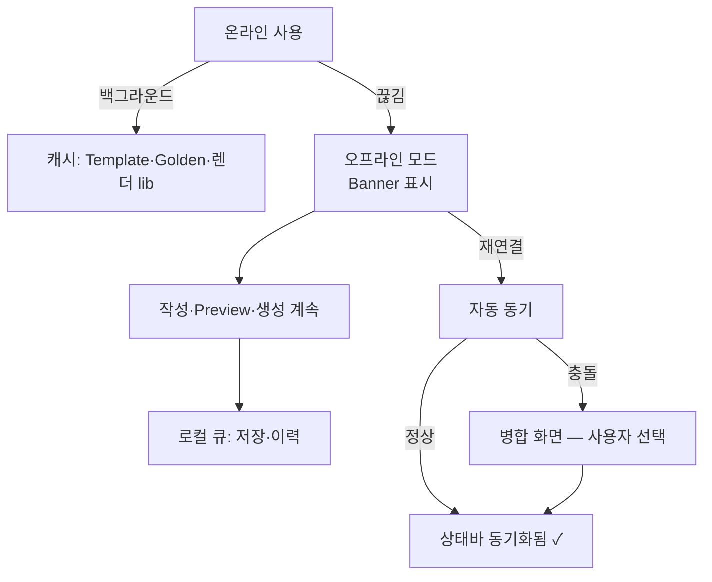

# Offline Mode — PWA 오프라인 UX

> **문서 상태**: 📋 설계만 (v2.5 UI/UX Edition · 미구현)
> **관련 문서**: [ERROR_HANDLING.md](ERROR_HANDLING.md) · [PREVIEW_SYSTEM.md](PREVIEW_SYSTEM.md) · v1: `autodoc/sw.js`(기존 PWA — 무수정) · [../../DESIGN.md](../../DESIGN.md)(PWA 전제)
> **한 줄 목적**: PWA 기준으로 오프라인에서도 문서 작성 · Preview · Template · Golden Template 사용이 가능한 UX를 설계한다.

---

## 목차

1. [목적](#1-목적)
2. [책임 — 오프라인 가능/불가 매트릭스](#2-책임--오프라인-가능불가-매트릭스)
3. [UX 원칙](#3-ux-원칙)
4. [사용자 흐름](#4-사용자-흐름)
5. [화면 구성](#5-화면-구성)
6. [확장성](#6-확장성)
7. [장점](#7-장점)
8. [단점](#8-단점)

---

## 1. 목적

1차 사용자(현장 CS 엔지니어)는 병원 지하·이동 중 등 **연결이 불안정한 곳에서 일한다.** 오프라인은 예외 상황이 아니라 정상 사용 조건이다 (P6 "끊기지 않는다").

## 2. 책임 — 오프라인 가능/불가 매트릭스

| 기능 | 오프라인 | 방식 |
|---|---|---|
| 문서 작성 (폼 입력) | ✅ | Draft 로컬 저장 — 항상 로컬 우선 |
| Preview | ✅ | 렌더링은 클라이언트 — 네트워크 불필요 |
| Template 열람·선택 | ✅ | 사용한 Template 로컬 캐시 |
| Golden Template | ✅ | Golden은 **우선 캐시 대상** (가장 쓰는 양식이므로) |
| Draft 저장·이어서 작성 | ✅ | 로컬 — 연결 시 서버 동기 |
| 문서 생성 (PPT/Excel/PDF) | ⚠ 조건부 | 렌더 라이브러리 캐시 완료 시 ✅ / 이력 서버 기록은 지연 동기 |
| AI Import | ❌ | 외부 AI 필요 — 진행 상태만 보존 |
| 학습·승인·Admin | ❌ | 서버 데이터 — 열람 캐시만(스냅샷 표시) |
| 최초 로그인 | ❌ | 인증 필요 — 로그인 후 세션은 오프라인 유지 |

## 3. UX 원칙

| 원칙 | 반영 |
|---|---|
| 로컬 우선 | 저장은 항상 로컬 먼저 — 온라인이어도 같은 경로 (오프라인이 특수 코드 경로가 아님) |
| 상태는 알리되 막지 않기 | 오프라인 Banner 1개 — 기능 차단 팝업 금지. 안 되는 버튼은 이유와 함께 비활성 |
| 자동 동기, 조용한 성공 | 재연결 시 자동 동기 — 성공은 상태바 "동기화됨 ✓"로 조용히 |
| 충돌은 사람이 결정 | 같은 Draft가 두 기기에서 수정되면 병합 화면 — 자동 덮어쓰기 금지 (P5) |

## 4. 사용자 흐름

```
[온라인] 앱 사용 → Template·Golden·렌더 라이브러리 자동 캐시 (백그라운드)
   ↓ (지하 이동 — 연결 끊김)
Banner: "오프라인 — 계속 작성할 수 있어요"
   ↓ 작성 계속 · Preview 정상 · 생성 가능(캐시 완료 시)
   ↓ 저장·이력·제안 요청은 로컬 큐 적재
   ↓ (재연결)
자동 동기: 큐 처리 → 상태바 "동기화됨 ✓"
   └─ 충돌 감지 → "두 버전이 있어요" 병합 화면 (내 기기 / 다른 기기 / 항목별 선택)
```



## 5. 화면 구성

```
┌──────────────────────────────────────────────┐
│ ⓘ 오프라인 — 계속 작성할 수 있어요. 연결되면 자동 반영 │ ← Banner (info, 지속)
├──────────────────────────────────────────────┤
│  (Editor — 평소와 동일)                        │
│  폼 입력 ⇄ Preview 모두 정상                    │
│  [생성 ▾]  ← 캐시 완료: 활성                    │
│  [AI로 양식 가져오기]  ← 비활성 + "연결 후 가능"  │
├──────────────────────────────────────────────┤
│ 상태바: 로컬 저장됨 ✓ · 대기 중인 동기 3건        │
└──────────────────────────────────────────────┘
```

| 요소 | 규칙 |
|---|---|
| Banner | info 톤(경고 아님) — 오프라인은 정상 상태 |
| 비활성 기능 | 회색 + 짧은 이유 — 눌러보고 실망하게 하지 않는다 |
| 동기 대기 수 | 상태바에 대기 건수 — 투명성 |
| 캐시 미완 생성 | "이 형식은 첫 온라인 사용 후 오프라인 가능" 안내 |
| 병합 화면 | DiffView 재사용 ([COMPONENT_LIBRARY.md](COMPONENT_LIBRARY.md)) — 항목별 선택 |

## 6. 확장성

- **캐시 대상 확대**(예: KB 용어 오프라인 검사 📋) = 캐시 정책 테이블에 항목 추가 — UX 구조 불변.
- v1 sw.js(기존 PWA 스코프)는 무수정 — v2 화면의 캐시 정책은 구현 단계에서 별도 SW 스코프로 설계 (본 문서는 UX 계약만).
- 저장 용량 한계 대응: 캐시 우선순위(Golden > 최근 사용 > 나머지) 정책 정의됨 — 정리 알림은 차기.

## 7. 장점

1. **현장 신뢰** — "지하에서도 된다"가 1차 사용자층의 채택을 결정한다.
2. **로컬 우선의 단순성** — 온/오프라인이 같은 저장 경로라 상태 분기 버그가 적다.
3. **투명한 동기** — 대기 건수·동기 표시로 "저장됐나?" 불안 제거.

## 8. 단점

1. **충돌 UX의 난이도** — 병합 화면은 비개발자에게 어렵다. (→ 기본 권장안 제시("최신 것 사용") + 항목별은 선택 사항)
2. **캐시 신선도** — 오프라인 중 Template이 개정될 수 있다. (→ 동기 시 "양식이 새 버전으로 바뀜" 고지 + 작성본은 구버전 유지 명시)
3. **저장 용량 관리** — 렌더 라이브러리·썸네일 캐시가 크다. (→ 우선순위 정책 + 사용 통계 기반 정리)
