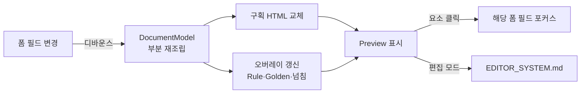

# Preview System — 실시간 HTML Preview

> **문서 상태**: 📋 설계만 (v2.5 UI/UX Edition · 미구현)
> **관련 문서**: [FORM_GUIDE.md](FORM_GUIDE.md) · [EDITOR_SYSTEM.md](EDITOR_SYSTEM.md) · v1: [../../DOCUMENT_MODEL.md](../../DOCUMENT_MODEL.md) · [../DOCUMENT_MODEL.md](../DOCUMENT_MODEL.md)(v2 확장)
> **한 줄 목적**: 입력하면서 실시간으로 변하는 HTML Preview — 실제 생성 결과와 **100% 동일한 구조**를 목표로 하는 미리보기 체계.

---

## 목차

1. [목적](#1-목적)
2. [책임](#2-책임)
3. [UX 원칙](#3-ux-원칙)
4. [사용자 흐름](#4-사용자-흐름)
5. [화면 구성](#5-화면-구성)
6. [확장성](#6-확장성)
7. [장점](#7-장점)
8. [단점](#8-단점)

---

## 1. 목적

사용자가 결과를 **상상하지 않게** 한다 (P3). Preview의 신뢰 근거는 v1 아키텍처 그 자체다: HTML Preview와 파일 렌더러(PPT/Excel/PDF)가 **같은 DocumentModel을 입력**받으므로([../../DOCUMENT_MODEL.md](../../DOCUMENT_MODEL.md) — "모든 렌더러와 미리보기는 같은 DocumentModel만 입력받는다"), 구조적 일치가 설계로 보장된다.

| 일치 수준 | 목표 |
|---|---|
| 구조(구획·표·순서·내용) | **100%** — 같은 모델이므로 |
| 시각(폰트 렌더링·픽셀) | 최대 근사 — 포맷 엔진 차이는 존재를 인정하고 §8에서 관리 |

## 2. 책임

| 책임 | 설명 |
|---|---|
| 실시간 반영 | 입력 변경 → 해당 부분만 갱신 (300ms 디바운스) |
| 충실 렌더 | DocumentModel → HTML — Company DNA 스타일( [../COMPANY_DNA.md](../COMPANY_DNA.md) )이 Preview 내부를 지배 |
| 페이지 감각 | 실제 페이지 경계·비율(A4/16:9) 표시 — "몇 장짜리인지" 즉시 인지 |
| 상태 표시 | Rule 배지·Golden Score 편차 하이라이트를 **오버레이 층**으로 (문서 내용과 시각 분리) |
| 편집 진입점 | Preview 요소 클릭 → 해당 폼 필드로 포커스 이동(양방향) · 직접 수정은 [EDITOR_SYSTEM.md](EDITOR_SYSTEM.md) |
| 하지 않는 것 | 파일 포맷별 렌더링 흉내(구조 동일성으로 승부), 모델 데이터 변경 |

## 3. UX 원칙

| 원칙 | 반영 |
|---|---|
| 결과가 곧 화면 | Preview는 장식이 아니라 **제품의 본체** — 화면의 절반 이상을 차지 |
| 지연은 짧게, 끊김 없이 | 갱신은 부분·비동기 — 타이핑을 막지 않는다 |
| 오버레이는 끌 수 있다 | 배지·하이라이트 토글 — 인쇄될 모습 그대로 보기 모드 |
| 페이지가 진실 | 넘침(overflow)은 즉시 시각화 — 생성 후에 알게 하지 않는다 |

## 4. 사용자 흐름

```
폼 입력 변경
  ↓ (300ms 디바운스)
DocumentModel 부분 재조립 (변경 필드 → 바인딩 구획만)
  ↓
해당 구획 HTML 교체 (전체 리렌더 금지)
  ↓
오버레이 갱신: Rule 배지 · Golden 편차 · 페이지 넘침 경고
  ↓ (사용자가 Preview 요소 클릭)
해당 폼 필드로 스크롤·포커스 (역방향 연결)
```



## 5. 화면 구성

```
┌─ Preview 패널 ────────────────────────────────┐
│ [페이지 1/3 ◂▸] [배율 ▾] [오버레이 👁 on]  [편집]│ ← 툴바
├───────────────────────────────────────────────┤
│   ┌───────────── A4 페이지 ─────────────┐      │
│   │  (Company DNA 스타일의 문서 렌더)     │      │
│   │  ⚠ ← Rule 배지(오버레이)             │      │
│   │  ~~~ ← Golden 편차 밑줄(오버레이)     │      │
│   └─────────────────────────────────────┘      │
│   ┄┄ 페이지 경계 ┄┄  ▼ 넘침 경고: "표가 2쪽으로" │
└───────────────────────────────────────────────┘
```

| 요소 | 규칙 |
|---|---|
| 페이지 네비 | 다중 페이지 문서의 쪽 이동 + 썸네일 스트립(Desktop) |
| 배율 | 맞춤/100%/150% — 모바일은 핀치 줌 |
| 오버레이 토글 | 배지·하이라이트 일괄 on/off — 기본 on, 인쇄 미리보기 감각은 off |
| 편집 버튼 | [EDITOR_SYSTEM.md](EDITOR_SYSTEM.md) 편집 모드 진입 — 보기와 편집을 모드로 분리 |
| 스타일 격리 | Preview 내부는 DNA, 외부 툴바는 앱 토큰 ([DESIGN_SYSTEM.md](DESIGN_SYSTEM.md) §1) |

## 6. 확장성

- **새 문서 종류** = Template 추가만으로 Preview 자동 지원 (모델 기반이므로).
- **오버레이 층 추가**(예: 차기 Workflow 코멘트 📋) = 오버레이 스택에 층 추가 — 문서 렌더 무수정.
- 성능 한계 문서(수십 페이지)용 가상 스크롤은 구현 단계 최적화 여지로 예약.

## 7. 장점

1. **구조 일치의 설계적 보장** — "미리보기 따로, 결과 따로" 문제가 원천적으로 없다.
2. **양방향 연결** — Preview에서 폼으로, 폼에서 Preview로 — 긴 문서에서 길을 잃지 않는다.
3. **오버레이 분리** — 품질 정보(Rule·Golden)를 보여주되 문서의 인쇄 모습을 오염시키지 않는다.

## 8. 단점

1. **픽셀 완전 일치는 불가** — HTML과 PPT/PDF 엔진의 폰트·줄바꿈 미세 차이는 남는다. (→ "구조 100%, 시각 근사" 기준을 완료 조건에 명시, [IMPLEMENTATION_PLAN.md](IMPLEMENTATION_PLAN.md) Sprint 3)
2. **저사양 기기 부담** — 실시간 재조립은 모바일에서 무겁다. (→ 부분 갱신 + 모바일은 탭 전환형이라 백그라운드 갱신 보류)
3. **오버레이 학습 비용** — 배지·밑줄의 의미를 처음엔 모른다. (→ 오버레이 요소 탭 시 설명 팝오버)
