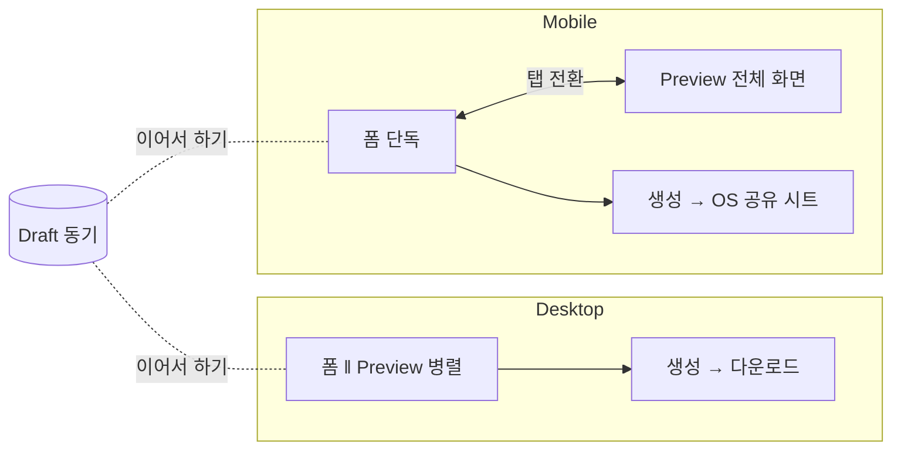

# Responsive Guide — Desktop · Tablet · Mobile 3단 설계

> **문서 상태**: 📋 설계만 (v2.5 UI/UX Edition · 미구현)
> **관련 문서**: [NAVIGATION.md](NAVIGATION.md) · [SCREEN_STRUCTURE.md](SCREEN_STRUCTURE.md) · [FORM_GUIDE.md](FORM_GUIDE.md) · [PREVIEW_SYSTEM.md](PREVIEW_SYSTEM.md)
> **한 줄 목적**: 같은 IA·같은 데이터를 기기 문법에 맞게 번역한다 — Desktop(병렬 작업) · Tablet(터치 열람) · Mobile(현장 입력) 3가지 화면을 별도로 설계한다.

---

## 목차

1. [목적](#1-목적)
2. [책임 — 브레이크포인트·기기 역할](#2-책임--브레이크포인트기기-역할)
3. [UX 원칙](#3-ux-원칙)
4. [사용자 흐름](#4-사용자-흐름)
5. [화면 구성 — 화면별 3단 변형](#5-화면-구성--화면별-3단-변형)
6. [확장성](#6-확장성)
7. [장점](#7-장점)
8. [단점](#8-단점)

---

## 1. 목적

반응형은 "줄어드는 화면"이 아니라 **기기마다 다른 일**이다. 각 기기의 주 용도를 정의하고, 그 용도에 최적인 별도 레이아웃을 설계한다.

## 2. 책임 — 브레이크포인트·기기 역할

| 단 | 폭 | 주 용도 | 대표 사용자 상황 |
|---|---|---|---|
| Desktop | ≥1024px | 병렬 작업 (폼⇄Preview 동시) · Admin · AI Import | 사무실 보고서 작성·관리 |
| Tablet | 600~1023px | 열람·검토 + 가벼운 입력 | 회의 중 문서 확인·승인 |
| Mobile | <600px | 현장 즉시 입력 · 재다운로드 | AS 현장에서 보고 초안 |

공통 규칙: 터치 타깃 최소 44×44px(전 단 공통 — Desktop도 터치 스크린 존재) · 브레이크포인트는 이 3개뿐(중간 미세 조정은 유동 그리드가 흡수).

## 3. UX 원칙

| 원칙 | 반영 |
|---|---|
| 기능 동등, 형태 상이 | 어떤 단에서도 기능을 빼지 않는다 — 단, 권장 기기 안내는 한다(AI Import→Desktop) |
| 이어서 하기 | 기기 간 Draft 동기 — 현장 폰에서 시작, 사무실 PC에서 마무리 ([OFFLINE_MODE.md](OFFLINE_MODE.md) 동기) |
| 엄지 우선(Mobile) | 핵심 행동은 하단 1/3 — 탭 바·생성 버튼·다음 버튼 |
| 콘텐츠 우선(Tablet) | 크롬(메뉴·툴바) 최소화 — 아이콘 레일·자동 숨김 툴바 |

## 4. 사용자 흐름

같은 여정 F2(재사용 작성)의 단별 차이:

```
Desktop: Dashboard → 최근 Template 클릭 → [폼 ‖ Preview 병렬] → 생성 → 다운로드
Mobile:  Dashboard → 최근 Template 탭 → [폼 단독] → (미리보기 탭 전환) → 생성 → 공유 시트
             ↑ 단계 수 +1 (탭 전환) — USER_FLOW.md §8에서 예고한 차이
```



## 5. 화면 구성 — 화면별 3단 변형

| 화면 | Desktop | Tablet | Mobile |
|---|---|---|---|
| 앱 프레임 | 좌 SideNav + 브레드크럼 | 아이콘 레일 | 하단 탭 4개 ([NAVIGATION.md](NAVIGATION.md) §5) |
| S1 Dashboard | 카드 그리드 3열 | 2열 | 1열 — 우선순위: Draft > 만들기 > 최근 Template > 최근 문서 (공지·통계는 접힘) |
| S2 Catalog | 카드 4열 + 좌측 카테고리 | 카드 2~3열 + 상단 필터 칩 | 카드 1열(가로형) + 검색 우선 |
| S3 Editor | **폼 ‖ Preview 병렬(50:50 조절)** | 폼 위주 + Preview 접이 패널 | **탭 전환** [입력]/[미리보기] |
| Preview | 페이지 썸네일 스트립 + 배율 | 핀치 줌 | 핀치 줌 · 페이지 스와이프 |
| 편집 모드 | 전체 기능 | 전체(터치 핸들 확대) | Edit 중심 — 배치 조정은 Desktop 권장 ([EDITOR_SYSTEM.md](EDITOR_SYSTEM.md) §5) |
| 승인함 | 목록 ‖ 상세 2열 | 목록→상세 전환 | 카드 스와이프(승인/반려) + 상세 탭 |
| AI Import | 마법사 전체 | 동일 | 안내 화면: "PC에서 이어서" + 링크 보내기 ([AI_IMPORT_UX.md](AI_IMPORT_UX.md) §8) |
| Settings | 단일 페이지 | 동일 | 그룹 아코디언 |

### Mobile Editor 상세

```
┌────────────────────┐
│ 주간보고 · 72% ▓▓░  │
│ [입력] [미리보기]    │ ← 상단 세그먼트
│ ─────────────────  │
│ 보고자* [김기사  ]   │
│ 기간*   [7/6-12 📅] │
│ 처리*   [ 24 ] 건   │
│  💡 제안 칩         │
│                    │
│ ┌────────────────┐ │
│ │   [생성 ▾]      │ │ ← 하단 고정 (엄지 존)
│ └────────────────┘ │
│ [⌂][＋][🗂][☰]      │ ← 탭 바
└────────────────────┘
```

## 6. 확장성

- **새 화면 추가 시** 본 문서 §5 표에 3단 행을 의무 작성 — "Desktop만 설계된 화면"의 유입을 막는 체크리스트 역할.
- 폴더블·초광폭 등 신규 폼팩터는 기존 3단 매핑(펼침=Tablet 등)으로 우선 대응 — 4번째 단 신설은 실사용 근거 축적 후.
- 인쇄(Print) 스타일은 Preview 오버레이 off 상태 기준 📋.

## 7. 장점

1. **기기별 진짜 최적화** — "줄어든 Desktop"이 아니라 현장 입력(Mobile)·검토(Tablet)에 맞는 별도 설계.
2. **여정의 연속성** — Draft 동기로 기기 전환이 자연스럽다 (현장→사무실 실사용 패턴).
3. **3단 상한의 단순성** — 브레이크포인트 2개만 관리 — 테스트 조합 최소.

## 8. 단점

1. **설계·검증 3배** — 화면마다 3벌 명세·테스트. (→ §5 표 형식으로 명세 비용 절감, 공통 부품이 반응형 계약 내장 — [COMPONENT_LIBRARY.md](COMPONENT_LIBRARY.md) §2)
2. **Tablet의 모호함** — 중간 단은 용도 정의가 흐리기 쉽다. (→ "열람·검토 우선" 단일 정체성 고정)
3. **Mobile 기능 동등의 비용** — 편집 모드 터치 대응 등 난도 높은 항목 존재. (→ 기능은 제공하되 권장 기기 안내로 기대 관리)
