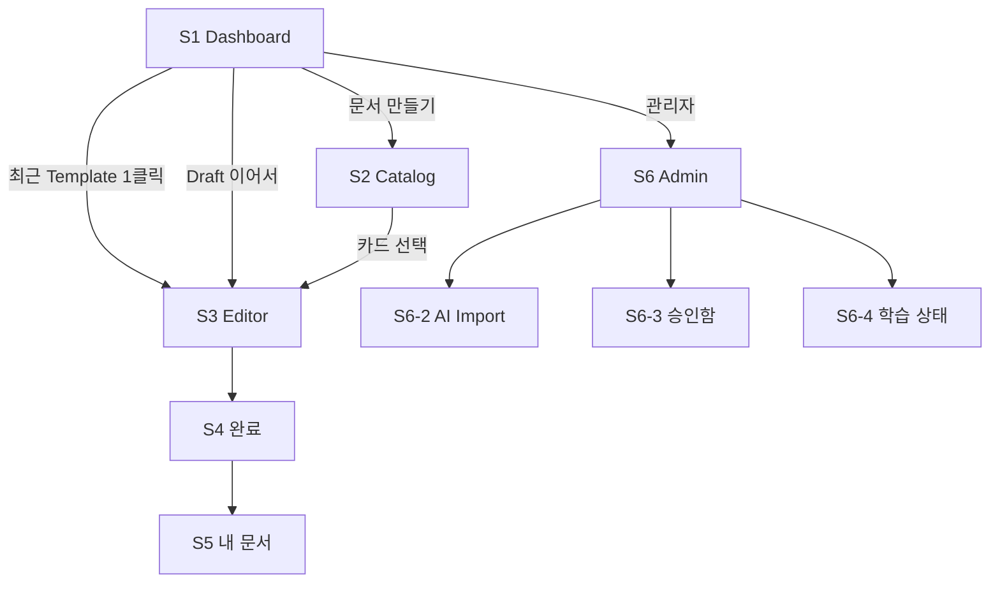

# Screen Structure — 화면 목록 · Dashboard · Template Catalog

> **문서 상태**: 📋 설계만 (v2.5 UI/UX Edition · 미구현)
> **관련 문서**: [UI_SPEC.md](UI_SPEC.md) · [NAVIGATION.md](NAVIGATION.md) · [USER_FLOW.md](USER_FLOW.md) · [GOLDEN_TEMPLATE_UX.md](GOLDEN_TEMPLATE_UX.md)
> **한 줄 목적**: 전체 화면 인벤토리를 확정하고, 시작 화면(Dashboard)과 Template Catalog의 구성을 상세 설계한다.

---

## 목차

1. [목적](#1-목적)
2. [책임 — 화면 인벤토리](#2-책임--화면-인벤토리)
3. [UX 원칙](#3-ux-원칙)
4. [사용자 흐름](#4-사용자-흐름)
5. [화면 구성 — Dashboard · Catalog](#5-화면-구성--dashboard--catalog)
6. [확장성](#6-확장성)
7. [장점](#7-장점)
8. [단점](#8-단점)

---

## 1. 목적

"어떤 화면이 존재하는가"의 단일 목록을 만들고, 사용 빈도가 가장 높은 두 화면(Dashboard·Catalog)을 상세 확정한다.

## 2. 책임 — 화면 인벤토리

| ID | 화면 | 1차 사용자 | MVP | 상세 문서 |
|---|---|---|---|---|
| S1 | Dashboard (시작 화면) | 전원 | ✅ | 본 문서 §5 |
| S2 | Template Catalog | 전원 | ✅ | 본 문서 §5 |
| S3 | Document Editor (Form ⇄ Preview) | 전원 | ✅ | [FORM_GUIDE.md](FORM_GUIDE.md) · [PREVIEW_SYSTEM.md](PREVIEW_SYSTEM.md) · [EDITOR_SYSTEM.md](EDITOR_SYSTEM.md) |
| S4 | 생성 완료 | 전원 | ✅ | [USER_FLOW.md](USER_FLOW.md) F1 |
| S5 | 내 문서 (이력·Draft) | 전원 | ✅ | — |
| S6 | Admin 홈 | 관리자 | ✅(부분) | [ADMIN_UX.md](ADMIN_UX.md) |
| S6-2 | AI Import 마법사 | 관리자 | ✅ | [AI_IMPORT_UX.md](AI_IMPORT_UX.md) |
| S6-3 | 승인함 | 관리자 | ✅ | [ADMIN_UX.md](ADMIN_UX.md) §5 |
| S6-4 | 학습 상태 | 관리자 | ✅ | [LEARNING_MODE_UX.md](LEARNING_MODE_UX.md) |
| S7 | Settings | 권한별 | ✅(부분) | [SETTINGS_UX.md](SETTINGS_UX.md) |
| S8 | Workflow 보드 | 전원 | ❌ MVP 제외 | 📋 차기 |
| S9 | Audit·Replay 뷰 | 관리자 | ❌ MVP 제외 | 📋 차기 |

## 3. UX 원칙

| 원칙 | 화면 반영 |
|---|---|
| P1 3분 첫 문서 | S1의 최상단은 항상 "문서 만들기" — 통계보다 행동이 먼저 |
| P2 빈칸만 채우면 | S2 카드에 디자인 선택지 없음 — 양식은 회사가 정한 모습 그대로 |
| P4 AI는 조용한 조수 | S1 학습 상태는 관리자에게만, 사용자에겐 결과 언어("회사 표준 v12 적용 중") |
| 빈도 우선 | 매일 쓰는 것(S1→S2→S3)은 얕게, 가끔 쓰는 것(S7)은 깊게 배치 |

## 4. 사용자 흐름

```
S1 Dashboard ── "문서 만들기" ──→ S2 Catalog ── 카드 선택 ──→ S3 Editor ──→ S4 완료
   │  최근 사용 Template (지름길) ──────────────────────────↗
   │  Draft "이어서 작성" ─────────────────────────────────↗
   └─ (관리자) 승인 배지 ──→ S6-3 승인함
```



## 5. 화면 구성 — Dashboard · Catalog

### S1 Dashboard — 회사의 시작 화면

```
┌─────────────────────────────────────────────────────────────┐
│  좋은 아침입니다, 김기사님            [＋ 문서 만들기]        │
├──────────────────────────────┬──────────────────────────────┤
│ 이어서 작성 (Draft)           │ 공지                          │
│  ▸ 주간보고 7/2주차 · 어제    │  ▸ 7월 보고 양식 변경 안내     │
├──────────────────────────────┴──────────────────────────────┤
│ 최근 사용 Template            즐겨찾기 ★                     │
│ [주간보고🏆] [AS보고] [출장]   [회의록] [점검표]               │
├──────────────────────────────────────────────────────────────┤
│ 최근 생성 문서                                                │
│  ▸ 주간보고_0705.pptx · 7/5   ▸ AS보고_112.pdf · 7/3  …      │
├──────────────────────────────────────────────────────────────┤
│ (관리자 전용 행) 학습 상태 요약 · 승인 대기 5건 → 바로가기     │
└──────────────────────────────────────────────────────────────┘
```

| 구성 요소 | 규칙 |
|---|---|
| 문서 만들기 CTA | 항상 우상단 고정 — 최다 행동 |
| 이어서 작성(Draft) | Draft 존재 시 최상단 — 이탈 복구 (F1 방어) |
| 최근 사용 Template | 1클릭으로 S3 직행 (F2) |
| 즐겨찾기 | 사용자가 ★한 Template |
| Golden Template | 카드에 🏆 배지 — 별도 구획이 아니라 배지로 통합 표시 |
| 공지 | 관리자 등록 — 양식 변경 등 |
| 최근 생성 문서 | 재다운로드 즉시 가능 (F5 지름길) |
| 학습 상태·Quick Action | **관리자에게만** 노출 (P4) — 상세는 [LEARNING_MODE_UX.md](LEARNING_MODE_UX.md) |

### S2 Template Catalog

```
┌─────────────────────────────────────────────────────────────┐
│ [검색: 양식 이름·용도…]     카테고리: 전체▾  정렬: 추천순▾    │
├─────────────────────────────────────────────────────────────┤
│ ┌───────────┐ ┌───────────┐ ┌───────────┐ ┌───────────┐     │
│ │ 🏆 주간보고 │ │ AS 보고서  │ │ 회의록     │ │ 점검표 🔒  │     │
│ │ 미리보기썸네일│ │           │ │           │ │           │     │
│ │ v7 · ★128 │ │ v3 · ★44  │ │ v5        │ │ 권한 필요  │     │
│ │ PPT·PDF   │ │ PDF       │ │ Word      │ │           │     │
│ └───────────┘ └───────────┘ └───────────┘ └───────────┘     │
│  … 카테고리 섹션별 반복 (보고 / 품질 / 교육 / 회의 …)          │
└─────────────────────────────────────────────────────────────┘
```

| 카드 요소 | 내용 |
|---|---|
| 카드 형태 | 썸네일(양식 미리보기) + 이름 + 메타 — 목록이 아니라 **카드 그리드** |
| 카테고리 | 보고/품질/교육/회의… 섹션 구분 + 필터 |
| 검색 | 이름·용도·용어(KB 동의어 포함) 매칭 |
| 즐겨찾기 | 카드 ★ 토글 — Dashboard에 반영 |
| 최근 사용 | "최근 사용" 정렬·상단 섹션 |
| 권한 표시 | 권한 없는 양식은 🔒 + 흐림 — 숨기지 않고 존재를 알림(요청 경로 제공) |
| Golden 표시 | 🏆 배지 + **카테고리 내 항상 첫 번째** ([GOLDEN_TEMPLATE_UX.md](GOLDEN_TEMPLATE_UX.md)) |
| 버전 표시 | vN — 상세 팝오버에 최근 변경·관리자 |

## 6. 확장성

- **화면 추가** = §2 인벤토리에 행 추가 + NAVIGATION 진입점 — 기존 화면 무영향.
- MVP 제외 화면(S8·S9)은 ID를 선점해 두어 차기 확장 시 문서 개정 최소화.
- Dashboard 구획은 카드 단위라 Workspace 설정으로 구획 on/off 확장 가능 📋.

## 7. 장점

1. **단일 인벤토리** — 화면 존재 여부 논쟁이 사라진다. MVP 컷도 이 표로 판정.
2. **빈도 기반 배치** — 매일의 여정(F2)이 최단 경로(1클릭)를 갖는다.
3. **권한의 가시성** — 잠긴 양식을 숨기지 않아 "있는데 못 쓰는" 혼란과 "없는 줄 아는" 손실을 모두 방지.

## 8. 단점

1. **Dashboard 과밀 위험** — 구획 8종이 작은 화면에서 경쟁한다. (→ 모바일 우선순위 컷: [RESPONSIVE_GUIDE.md](RESPONSIVE_GUIDE.md) §5)
2. **썸네일 생성 비용** — 카드 썸네일은 양식 렌더링 결과가 필요하다. (→ MVP는 정적 등록 이미지, 자동 생성은 차기)
3. **관리자·사용자 혼합 화면** — S1의 관리자 행은 권한 분기 복잡도를 만든다. (→ 구획 단위 권한 규칙 하나로 통일)
