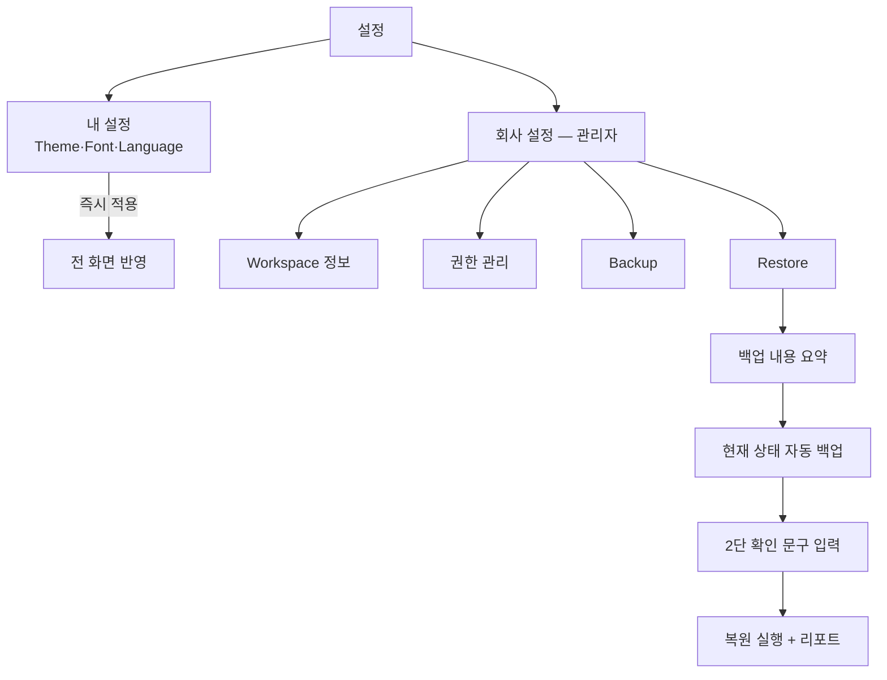

# Settings UX — 설정 화면

> **문서 상태**: 📋 설계만 (v2.5 UI/UX Edition · 미구현)
> **관련 문서**: [ADMIN_UX.md](ADMIN_UX.md) · [DESIGN_SYSTEM.md](DESIGN_SYSTEM.md)(Theme·Font Scale) · Architecture: [../ARCHITECTURE.md](../ARCHITECTURE.md) §5(Workspace)
> **한 줄 목적**: Workspace · Theme · Language · Permission · Plugin · Backup · Restore · Import · Export 설정의 화면 체계 — 개인 설정과 회사 설정을 분리한다.

---

## 목차

1. [목적](#1-목적)
2. [책임 — 설정 카탈로그](#2-책임--설정-카탈로그)
3. [UX 원칙](#3-ux-원칙)
4. [사용자 흐름](#4-사용자-흐름)
5. [화면 구성](#5-화면-구성)
6. [확장성](#6-확장성)
7. [장점](#7-장점)
8. [단점](#8-단점)

---

## 1. 목적

설정은 두 세계다: **내 설정**(개인 — 즉시 적용, 나만 영향)과 **회사 설정**(관리자 — 신중 적용, 전원 영향). 이 경계를 화면 구조로 드러내 실수를 막는다.

## 2. 책임 — 설정 카탈로그

| 설정 | 구역 | MVP | 내용 |
|---|---|---|---|
| Theme | 내 설정 | ✅ | 라이트/다크/시스템 — 즉시 적용 ([DESIGN_SYSTEM.md](DESIGN_SYSTEM.md)) |
| Font Scale | 내 설정 | ✅ | 100/115/130% ([ACCESSIBILITY.md](ACCESSIBILITY.md) §5) |
| Language | 내 설정 | ✅(ko) | UI 언어 — MVP는 한국어, 구조만 다국어 대비 |
| Workspace | 회사 설정 | ✅(단일) | 회사 이름·로고·기본 문서 형식 — 다중 WS는 MVP 제외 |
| Permission | 회사 설정 | ✅(2등급) | 사용자/관리자 — 세분 권한은 차기 |
| Plugin | 회사 설정 | ❌ 차기 | Plugin 활성 — [../PLUGIN_ARCHITECTURE.md](../PLUGIN_ARCHITECTURE.md) |
| Backup | 회사 설정 | ✅ | 자산(Template·Prompt·KB·DNA) JSON 내보내기 묶음 |
| Restore | 회사 설정 | ✅(신중) | 백업 복원 — 2단 확인 + 현재 상태 자동 백업 후 진행 |
| Import / Export | 회사 설정 | ✅ | 개별 자산 단위 가져오기/내보내기 (Template 1개 등) |

## 3. UX 원칙

| 원칙 | 반영 |
|---|---|
| 영향 범위 표시 | 회사 설정 항목엔 "모든 사용자에게 적용" 라벨 상시 |
| 즉시 vs 신중 | 내 설정 = 토글 즉시 적용 · 회사 설정 = [적용] 버튼 + 변경 요약 |
| 되돌릴 수 있는 복원 | Restore는 실행 전 현재 상태를 자동 백업 — 복원의 복원 가능 (P5) |
| 설정 검색 | 항목이 늘어도 설정 내 검색으로 도달 |

## 4. 사용자 흐름

```
[개인] 설정 → 내 설정 → Theme 토글 → 즉시 전 화면 반영
[관리자] 설정 → 회사 설정 → Backup: [백업 만들기] → 파일 다운로드 (autodoc-backup-날짜.json)
[관리자] Restore:
   파일 선택 → 내용 요약 표시 ("Template 23·용어 142·DNA v12 — 2026-07-01 백업")
   → 경고: 현재와의 차이 요약 → 1단 확인
   → "현재 상태를 먼저 백업합니다" 자동 실행
   → 2단 확인(문구 입력) → 복원 → 완료 리포트
```



## 5. 화면 구성

```
┌─ 설정 ──────────────────────────────────────┐
│ [검색: 설정 찾기…]                            │
│ ── 내 설정 ─────────────────────────────────│
│ 테마          ( 라이트 ● 다크 ○ 시스템 ○ )    │
│ 글자 크기      ( 100% ● 115% ○ 130% ○ )      │
│ 언어          [한국어 ▾]                      │
│ ── 회사 설정 (관리자 · 모든 사용자에게 적용) ──│
│ Workspace     회사명·로고·기본 형식  [편집]    │
│ 권한          사용자 12 · 관리자 2   [관리]    │
│ 백업          최근: 7/10 09:00     [백업 만들기]│
│ 복원          백업 파일에서 복원    [복원…] ⚠  │
│ 가져오기/내보내기  개별 자산 단위   [열기]      │
└──────────────────────────────────────────────┘
```

| 요소 | 규칙 |
|---|---|
| 구역 구분 | 내/회사 설정을 시각적으로 분리 + 회사 구역 경고 라벨 |
| 위험 행동 | Restore는 ⚠ 아이콘 + danger 색 버튼 아님(오클릭 방지 — 진입은 중립, 실행 단계에서 경고) |
| 백업 이력 | 최근 백업 시각 상시 표시 — "백업 안 한 지 오래" 상태는 warning |
| 권한 관리 | 사용자 목록 + 등급 토글 (MVP 2등급) — 변경은 즉시·Audit 기록 |

## 6. 확장성

- **차기 설정(Plugin·다중 Workspace·세분 권한)** = 회사 설정 구역에 항목 추가 — 2구역 구조 불변.
- Language 추가 = 문구 테이블 언어 세트 추가 ([UI_SPEC.md](UI_SPEC.md) §6).
- 설정 항목이 20+ 되면 좌측 카테고리 내비 도입 예약 — 그 전까지 단일 페이지 + 검색 (KISS).

## 7. 장점

1. **실수 구조 방지** — 내/회사 경계가 화면 구조라서 "나만 바꾼 줄 알았는데 전사 적용" 사고가 없다.
2. **복원의 안전망** — 자동 사전 백업으로 최악의 관리 실수(잘못된 복원)가 복구 가능하다.
3. **자산 이동성** — Import/Export가 Workspace 온보딩·이전([../PROMPT_MARKETPLACE.md](../PROMPT_MARKETPLACE.md) 백업)과 같은 형식을 공유.

## 8. 단점

1. **MVP 권한 2등급의 한계** — 팀별 위임이 안 된다. (→ 차기 세분 권한 — [ADMIN_UX.md](ADMIN_UX.md) §8과 동일 이슈)
2. **백업 수동 의존** — 관리자가 잊으면 백업이 없다. (→ 오래됨 경고 + 차기 자동 백업 주기 설정 📋)
3. **복원 마찰의 양면** — 2단 확인은 긴급 복구를 느리게 한다. (→ 의도된 트레이드오프 — 복원은 드물고 위험한 작업)
