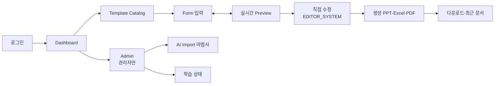

# UI Spec — AutoDoc 제품 UI 총괄 명세

> **문서 상태**: 📋 설계만 (v2.5 UI/UX Edition · 미구현)
> **문서 스위트**: [README.md](README.md) — UI 문서 21종의 지도 · Architecture: [../DESIGN.md](../DESIGN.md) (무수정)
> **관련 문서**: [SCREEN_STRUCTURE.md](SCREEN_STRUCTURE.md) · [USER_FLOW.md](USER_FLOW.md) · [DESIGN_SYSTEM.md](DESIGN_SYSTEM.md) · [MVP_SCOPE.md](MVP_SCOPE.md)
> **한 줄 목적**: AutoDoc을 개발자 도구가 아니라 **비개발자 직원이 매일 쓰는 Enterprise SaaS 제품**으로 만드는 UI 총괄 명세.

---

## 목차

1. [목적](#1-목적)
2. [책임](#2-책임)
3. [UX 원칙](#3-ux-원칙)
4. [사용자 흐름](#4-사용자-흐름)
5. [화면 구성](#5-화면-구성)
6. [확장성](#6-확장성)
7. [장점](#7-장점)
8. [단점](#8-단점)

---

## 1. 목적

| 항목 | 내용 |
|---|---|
| 제품 정의 | "양식 고르고 → 빈칸 채우면 → 회사 문서가 나온다"를 3분 안에 체감시키는 제품 |
| 1차 사용자 | **비개발자 현장 직원** (CS 엔지니어·품질·영업) — 매일 보고서를 쓰는 사람 |
| 2차 사용자 | 관리자 (Template·학습·승인 운영) — [ADMIN_UX.md](ADMIN_UX.md) |
| 품질 기준 | Enterprise SaaS 수준 — 일관된 디자인 시스템, 반응형 3단, 접근성, 오프라인 |
| 이번 단계 | **설계 문서만.** HTML/CSS/JS 등 구현 산출물 절대 금지 |

## 2. 책임

본 문서는 총괄이며, 상세는 아래로 위임한다.

| 영역 | 문서 |
|---|---|
| 화면 목록·Dashboard·Template Catalog | [SCREEN_STRUCTURE.md](SCREEN_STRUCTURE.md) |
| 흐름(작성·승인·학습) | [USER_FLOW.md](USER_FLOW.md) · 이동 구조: [NAVIGATION.md](NAVIGATION.md) |
| 시각 언어(토큰·타이포·색) | [DESIGN_SYSTEM.md](DESIGN_SYSTEM.md) · 부품: [COMPONENT_LIBRARY.md](COMPONENT_LIBRARY.md) |
| 입력·미리보기·수정 | [FORM_GUIDE.md](FORM_GUIDE.md) · [PREVIEW_SYSTEM.md](PREVIEW_SYSTEM.md) · [EDITOR_SYSTEM.md](EDITOR_SYSTEM.md) |
| AI Import·Golden·학습 | [AI_IMPORT_UX.md](AI_IMPORT_UX.md) · [GOLDEN_TEMPLATE_UX.md](GOLDEN_TEMPLATE_UX.md) · [LEARNING_MODE_UX.md](LEARNING_MODE_UX.md) |
| 관리·설정 | [ADMIN_UX.md](ADMIN_UX.md) · [SETTINGS_UX.md](SETTINGS_UX.md) |
| 품질 공통 | [ERROR_HANDLING.md](ERROR_HANDLING.md) · [OFFLINE_MODE.md](OFFLINE_MODE.md) · [RESPONSIVE_GUIDE.md](RESPONSIVE_GUIDE.md) · [ACCESSIBILITY.md](ACCESSIBILITY.md) |
| 범위·계획 | [MVP_SCOPE.md](MVP_SCOPE.md) · [IMPLEMENTATION_PLAN.md](IMPLEMENTATION_PLAN.md) |

## 3. UX 원칙

전 문서가 공유하는 7원칙:

| # | 원칙 | 의미 |
|---|---|---|
| P1 | **3분 첫 문서** | 신규 사용자가 로그인 후 3분 안에 첫 문서를 생성한다 |
| P2 | **빈칸만 채우면 된다** | 사용자는 레이아웃·색·폰트를 결정하지 않는다 — 회사(DNA·Golden)가 이미 결정했다 |
| P3 | **항상 보이는 결과** | 입력과 Preview는 언제나 나란히 — 결과를 상상하게 하지 않는다 |
| P4 | **AI는 조용한 조수** | AI·학습 용어를 전면에 내세우지 않는다. "회사 표준 반영됨" 같은 결과 언어로 말한다 |
| P5 | **되돌릴 수 있다** | 모든 파괴적 행동은 Undo 또는 확인 절차 — 사용자는 실험을 두려워하지 않는다 |
| P6 | **끊기지 않는다** | 오프라인·저속망에서도 작성은 계속된다 ([OFFLINE_MODE.md](OFFLINE_MODE.md)) |
| P7 | **모두가 쓴다** | 키보드만으로, 스크린리더로, 모바일 현장에서도 ([ACCESSIBILITY.md](ACCESSIBILITY.md) · [RESPONSIVE_GUIDE.md](RESPONSIVE_GUIDE.md)) |

## 4. 사용자 흐름

최상위 흐름 (상세: [USER_FLOW.md](USER_FLOW.md)):

```
로그인 → Dashboard(시작 화면) → Template Catalog → Form 입력 ⇄ 실시간 Preview
   → (필요 시 Preview 직접 수정) → 생성(PPT/Excel/PDF) → 다운로드·이력
관리자: Dashboard → Admin(승인함·학습 상태·Template 관리)
```



## 5. 화면 구성

### 공통 앱 프레임 (Desktop 기준)

```
┌────────────────────────────────────────────────────────┐
│ ⌂ AutoDoc   [검색…]              알림🔔  사용자▾  ⚙    │ ← Top Bar (고정)
├──────────┬─────────────────────────────────────────────┤
│ 홈       │                                             │
│ 문서 만들기│              콘텐츠 영역                    │
│ 내 문서   │        (화면별 — SCREEN_STRUCTURE.md)        │
│ 즐겨찾기  │                                             │
│ ───────  │                                             │
│ 관리(권한)│                                             │
├──────────┴─────────────────────────────────────────────┤
│ 상태바: 저장됨 ✓ · 오프라인 표시 · 학습 배지(관리자)      │
└────────────────────────────────────────────────────────┘
```

| 프레임 요소 | 규칙 |
|---|---|
| Top Bar | 전 화면 고정. 전역 검색은 Template·내 문서 통합 검색 |
| Side Nav | 5개 이하 1차 메뉴 ([NAVIGATION.md](NAVIGATION.md)) — 비개발자 기준 어휘("문서 만들기", "내 문서") |
| 콘텐츠 | 화면별 정의. 최대 폭 제한으로 가독성 유지 |
| 상태바 | 저장 상태·오프라인·(관리자) 승인 대기 수 — 시스템 상태 항상 가시화 |

Tablet·Mobile 변형은 [RESPONSIVE_GUIDE.md](RESPONSIVE_GUIDE.md) §5.

## 6. 확장성

- **화면 추가** = SCREEN_STRUCTURE에 화면 정의 + NAVIGATION에 진입점 — 프레임 불변.
- **MVP 제외 기능**(Workflow·Audit·Plugin 등)의 자리는 미리 잡되 메뉴에 노출하지 않는다 — 켜질 때 메뉴만 추가 ([MVP_SCOPE.md](MVP_SCOPE.md) §6).
- **어휘 사전**: UI 문구는 문구 테이블(데이터)로 관리 — 다국어(Language 설정) 확장 대비 ([SETTINGS_UX.md](SETTINGS_UX.md)).

## 7. 장점

1. **일관성** — 21종 문서가 같은 7원칙·같은 프레임을 공유해 화면마다 새로 배울 것이 없다.
2. **비개발자 어휘** — "Template JSON" 대신 "양식", "Import Gate" 대신 "AI 결과 붙여넣기".
3. **Architecture와의 정합** — 모든 화면이 v2 설계의 계약(이벤트·승인·Golden 우선)을 UI로 번역한 것 — 임의 기능 없음.

## 8. 단점

1. **문서 분산** — 상세가 20개 문서에 나뉘어 전체 조망에 학습 비용. (→ [README.md](README.md) 지도·읽기 순서로 완화)
2. **Enterprise 수준의 비용** — 접근성·오프라인·반응형 3단을 처음부터 갖추면 초기 개발량이 크다. (→ [MVP_SCOPE.md](MVP_SCOPE.md)에서 수준별 컷 정의)
3. **어휘 이중화** — 아키텍처 용어와 UI 용어의 번역표를 유지해야 한다. (→ 본 스위트 각 문서 §5에 병기)
