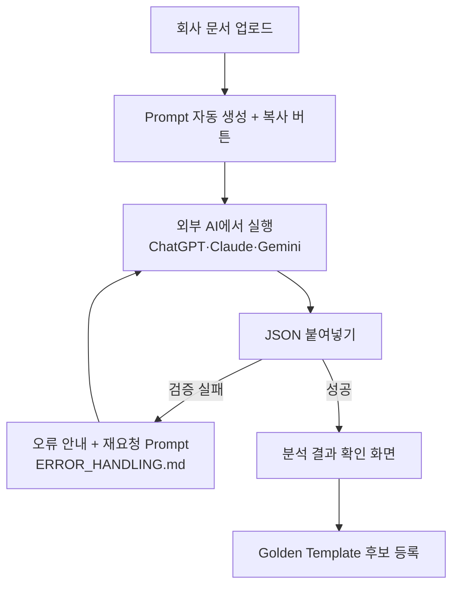
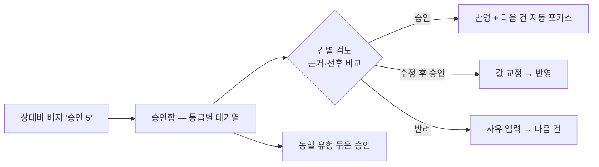

# User Flow — 핵심 사용자 흐름 정의

> **문서 상태**: 📋 설계만 (v2.5 UI/UX Edition · 미구현)
> **관련 문서**: [UI_SPEC.md](UI_SPEC.md) · [NAVIGATION.md](NAVIGATION.md) · [SCREEN_STRUCTURE.md](SCREEN_STRUCTURE.md) · [AI_IMPORT_UX.md](AI_IMPORT_UX.md)
> **한 줄 목적**: 페르소나별 핵심 여정(문서 작성·재사용·AI Import·승인)을 단계·분기·이탈 지점까지 확정한다.

---

## 목차

1. [목적](#1-목적)
2. [책임](#2-책임)
3. [UX 원칙](#3-ux-원칙)
4. [사용자 흐름](#4-사용자-흐름)
5. [화면 구성](#5-화면-구성)
6. [확장성](#6-확장성)
7. [장점](#7-장점)
8. [단점](#8-단점)

---

## 1. 목적

화면(정적 구조)이 아니라 **여정(동적 경로)** 을 설계한다. 각 흐름은 목표·단계·분기·실패 경로·성공 판정 기준을 가진다.

### 페르소나

| 페르소나 | 설명 | 핵심 여정 |
|---|---|---|
| **현장 직원** (김기사) | CS 엔지니어. 주간보고·AS 보고 매주 작성. 모바일 비중 높음 | F1 첫 작성 · F2 재사용 작성 |
| **팀 리더** (박팀장) | 보고서 취합·검토 | F2 · F5 열람 |
| **관리자** (이관리) | Template·학습·승인 운영 | F3 AI Import · F4 승인 |

## 2. 책임

| 흐름 ID | 이름 | 성공 판정 |
|---|---|---|
| F1 | 첫 문서 작성 (신규 사용자) | 로그인 → 다운로드까지 **3분·6클릭 이내** (P1) |
| F2 | 재사용 작성 (복귀 사용자) | Dashboard에서 **2클릭**으로 입력 화면 도달 |
| F3 | AI Import로 Template 만들기 (관리자) | 업로드 → Golden 후보 등록까지 이탈 없이 완주 |
| F4 | 학습 승인 처리 (관리자) | 대기 10건을 5분 내 처리 |
| F5 | 문서 열람·재출력 | 과거 문서 검색 → 재다운로드 1분 내 |

## 3. UX 원칙

[UI_SPEC.md](UI_SPEC.md) §3의 7원칙 중 흐름 설계에 직결되는 적용:

| 원칙 | 흐름 반영 |
|---|---|
| P1 3분 첫 문서 | F1의 모든 단계에 기본값 제공 — 빈 화면에서 시작하지 않는다 |
| P3 항상 보이는 결과 | F1·F2에서 입력 시작과 동시에 Preview 병렬 표시 |
| P5 되돌릴 수 있다 | 모든 흐름에서 뒤로 가기 = 데이터 보존 (Draft 자동 저장) |
| P6 끊기지 않는다 | F1·F2는 오프라인에서도 완주 가능(생성 제외) — [OFFLINE_MODE.md](OFFLINE_MODE.md) |

## 4. 사용자 흐름

### F1 · 첫 문서 작성

```
Dashboard 진입 (첫 방문 — 안내 카드 노출)
  ↓ "문서 만들기"
Template Catalog — Golden Template가 첫 번째 (GOLDEN_TEMPLATE_UX.md)
  ↓ 카드 선택 (1클릭)
Form 화면 — 필수 항목만 펼침, 예시값 표시 ⇄ 실시간 Preview
  ↓ 입력 (자동 저장 Draft)
[생성] 버튼 — 형식 선택 (PPT / Excel / PDF)
  ↓
완료 화면: 다운로드 + "내 문서에 저장됨" + 다음 행동 제안
```

### F2 · 재사용 작성 (가장 빈번한 여정)

```
Dashboard → "최근 사용 Template" 카드 (1클릭)
  ↓
Form 화면 — 지난 입력 구조 기억(반복 항목 미리 채움 제안 — Company Memory)
  ↓ 수정 입력 → 생성
```

### F3 · AI Import (관리자) — 상세는 [AI_IMPORT_UX.md](AI_IMPORT_UX.md)



### F4 · 학습 승인 (관리자)



### 이탈 지점과 방어

| 이탈 위험 | 방어 장치 |
|---|---|
| F1: 카탈로그에서 뭘 고를지 모름 | Golden 첫 표시 + "이 팀이 많이 씀" 배지 |
| F1/F2: 입력 중 창 닫음 | Draft 자동 저장 → Dashboard "이어서 작성" |
| F3: 외부 AI 다녀오다 길 잃음 | 마법사 단계 고정 표시 + 돌아오면 같은 단계 복원 |
| F4: 대기열 방치 | 상태바 상시 배지 + 묶음 승인 |

## 5. 화면 구성

흐름 ↔ 화면 매핑 (화면 상세: [SCREEN_STRUCTURE.md](SCREEN_STRUCTURE.md)):

| 흐름 | 경유 화면 | UI 용어(사용자에게 보이는 말) |
|---|---|---|
| F1·F2 | S1 Dashboard → S2 Catalog → S3 Editor(Form+Preview) → S4 완료 | "문서 만들기" (Template·Analyzer 용어 미노출) |
| F3 | S6 Admin → S6-2 AI Import 마법사 | "양식 가져오기(AI 도움)" |
| F4 | S6 Admin → S6-3 승인함 | "확인할 항목" |
| F5 | S5 내 문서 | "내 문서" |

## 6. 확장성

- **새 여정 추가**(예: Workflow 결재 여정 — MVP 제외)는 흐름 ID(F6+)로 본 문서에 증보 — 기존 흐름 무수정.
- 흐름별 성공 판정 기준(§2)은 출시 후 실사용 지표로 재조정한다 — 기준 자체가 버전 관리 대상.
- 페르소나 추가(예: 외부 감사인 열람 전용) 시 권한 축과 함께 정의.

## 7. 장점

1. **측정 가능한 UX** — 모든 흐름에 성공 판정 수치가 있어 "좋아졌다"를 검증할 수 있다.
2. **이탈 방어의 명세화** — 위험 지점과 방어 장치가 짝으로 문서화되어 구현 누락을 막는다.
3. **아키텍처 정합** — F3·F4는 [../AI_ARCHITECTURE.md](../AI_ARCHITECTURE.md) Import Mode·[../HUMAN_APPROVAL.md](../HUMAN_APPROVAL.md) 상태 머신의 UI 번역이다.

## 8. 단점

1. **행복 경로 중심** — 드문 예외 경로(권한 변경 중 작성 등)는 [ERROR_HANDLING.md](ERROR_HANDLING.md)에 위임 — 두 문서를 함께 읽어야 완전하다.
2. **수치 기준의 가정** — "3분·6클릭"은 실측 전 가정치다. (→ MVP 파일럿에서 보정)
3. **모바일 흐름 별도 검증 필요** — 동일 흐름이라도 모바일 단계 수가 다르다 ([RESPONSIVE_GUIDE.md](RESPONSIVE_GUIDE.md) §4).
