# 보고 모드 화면 검증 캡처 (PR #98)

리뷰용 증빙입니다. **병합 전에 이 폴더째로 지워도 됩니다.**

```bash
git rm -r docs/review/executive-dashboard-pc
```

- 캡처 환경: Chromium 1194 (Playwright) · 900건 합성 데이터
- GAS 응답을 가로채 결정적 데이터로 렌더한 화면입니다
- **세 해상도 모두 브라우저 콘솔 오류 0건**

| 해상도 | 문서 세로 스크롤 | 가로 스크롤 | 콘솔 오류 |
|---|---|---|---|
| 1920×1080 | 0 (한 화면) | 0 | 0건 |
| 1366×768 | 0 (한 화면) | 0 | 0건 |
| 390×844 (iPhone 세로) | 세로 스크롤 레이아웃 | 0 | 0건 |

---

## 1920×1080

### ① 주간 핵심보고
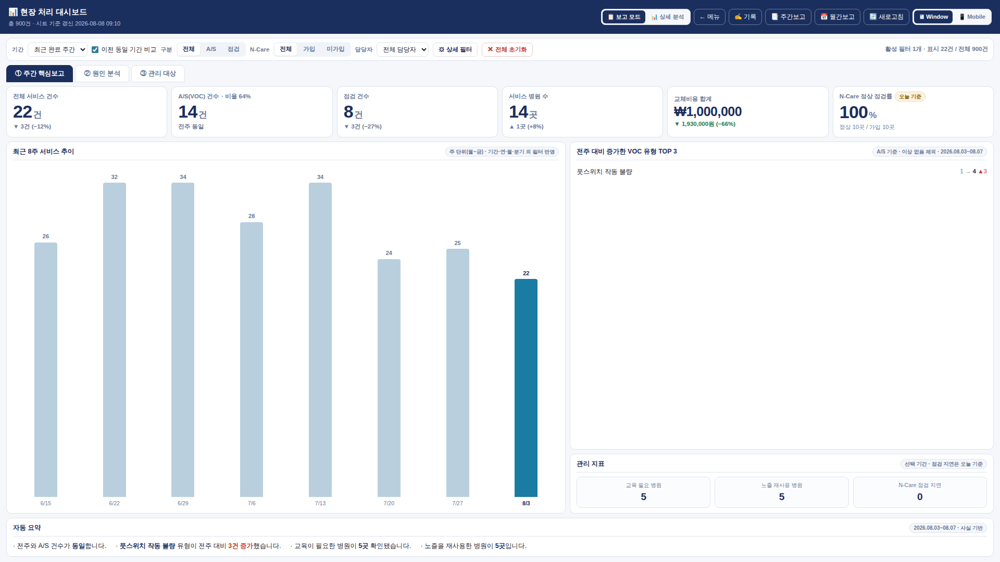

### ② 원인 분석
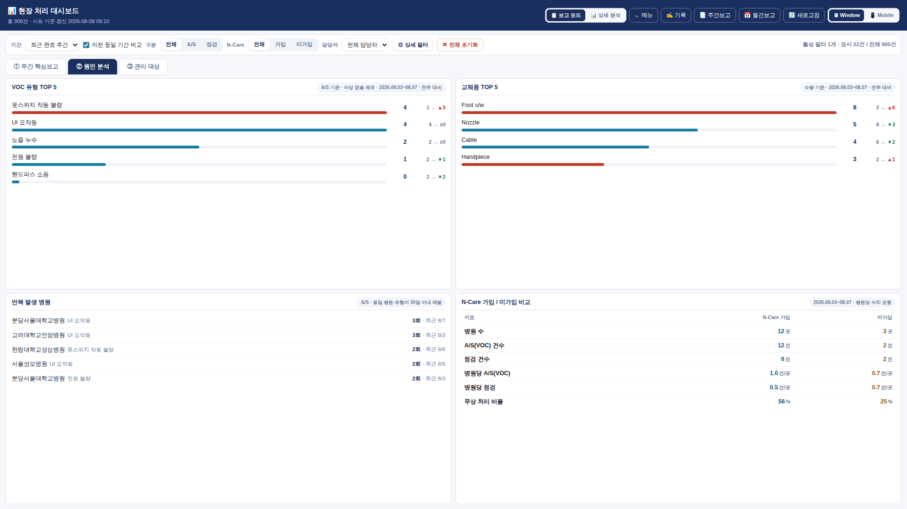

### ③ 관리 대상
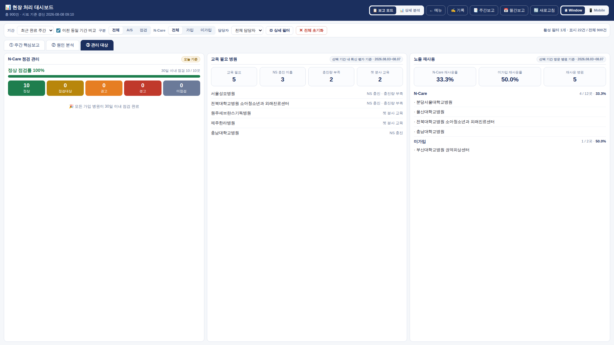

### 상세 분석 모드 (기존 대시보드 그대로)
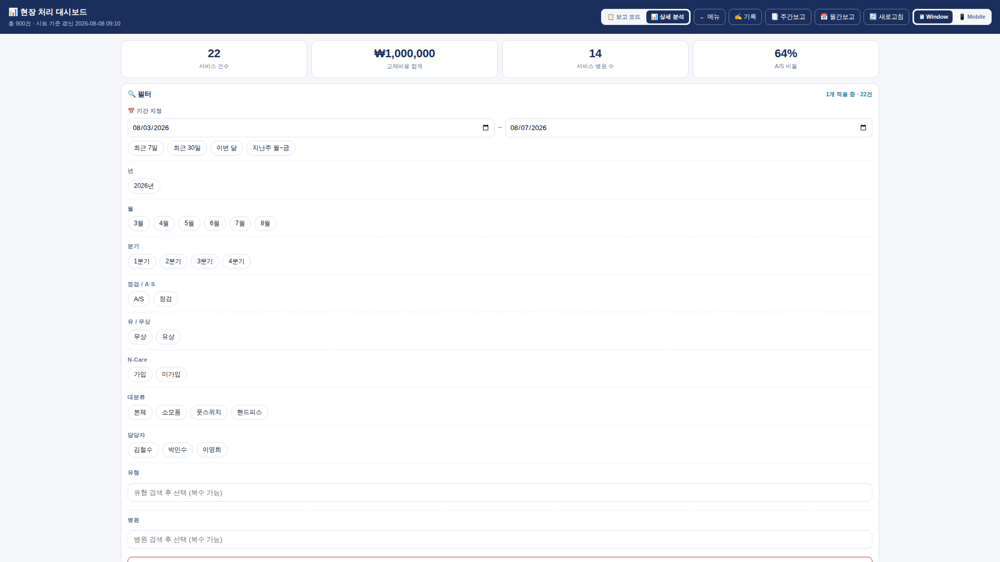

---

## 1366×768

### ① 주간 핵심보고
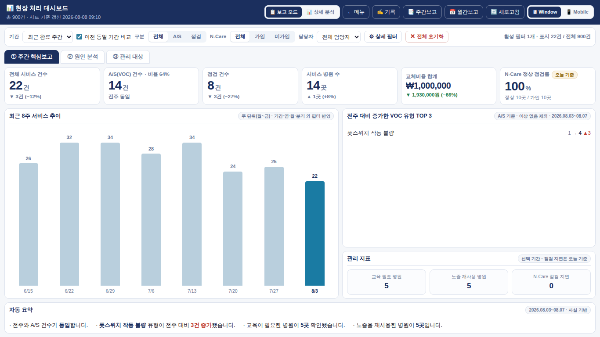

### ② 원인 분석
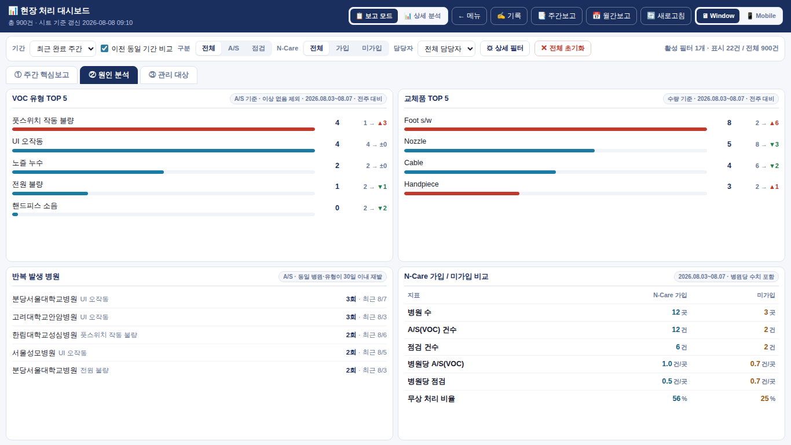

### ③ 관리 대상
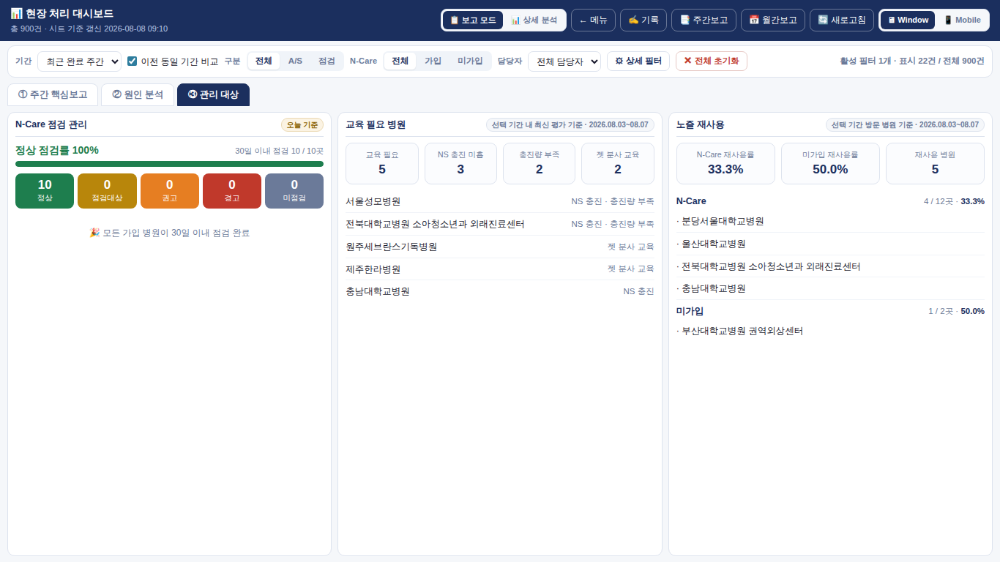

### 상세 분석 모드
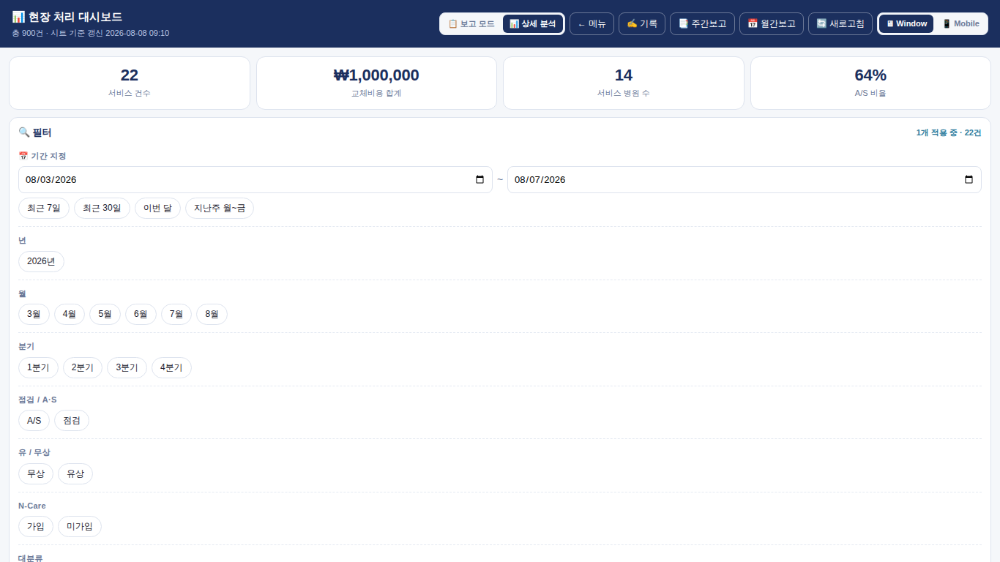

### Mobile 보기 전환 (PC에서 Window → Mobile)
KPI 2열 · 폭 560px · 세로 스크롤 레이아웃으로 바뀝니다.

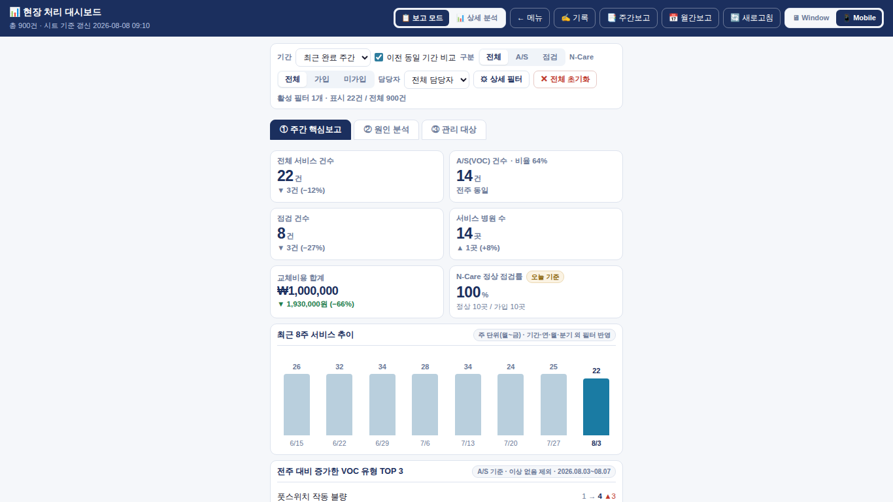

### 전체 명단 모달 (내부 스크롤만)
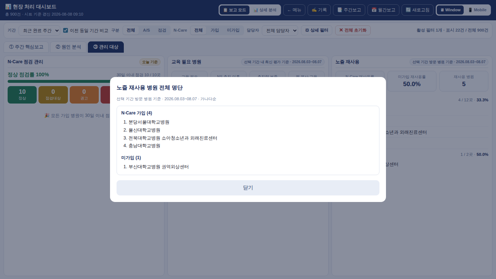

---

## 390×844 (iPhone 세로)

### ① 주간 핵심보고
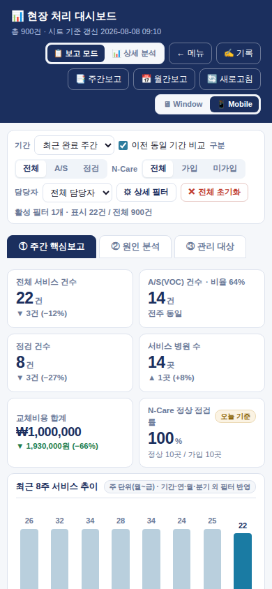

### ② 원인 분석
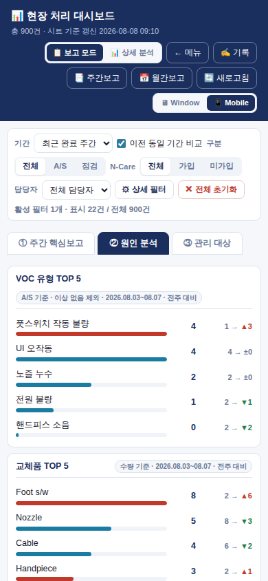

### ③ 관리 대상
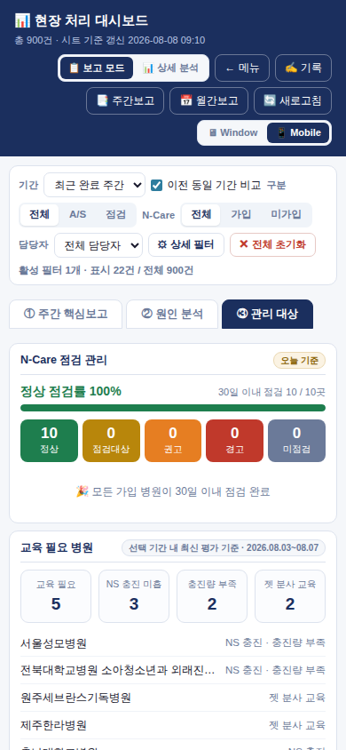

### 상세 분석 모드 (폰 기본값)
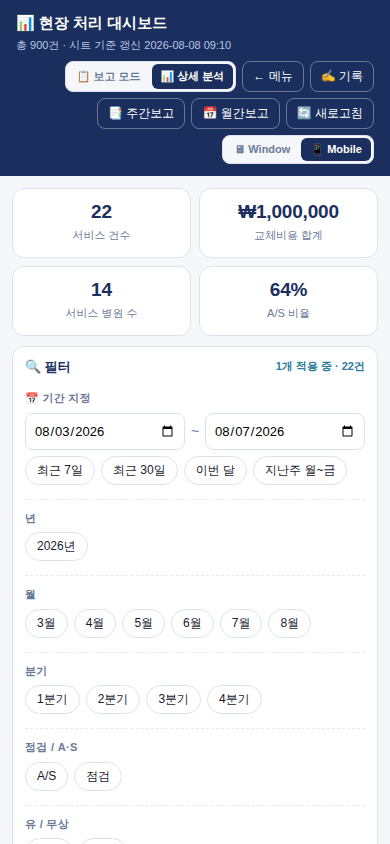
